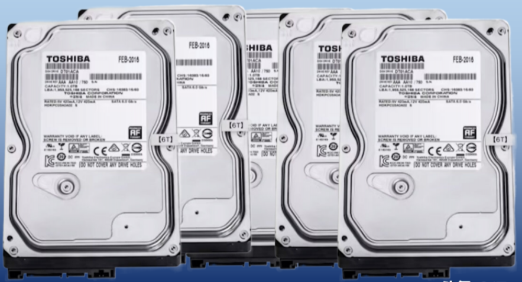
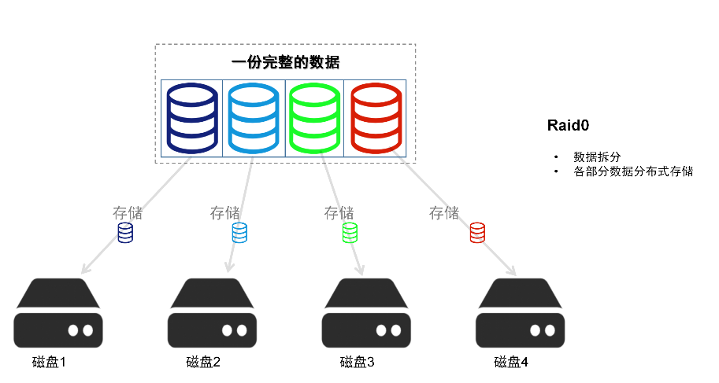
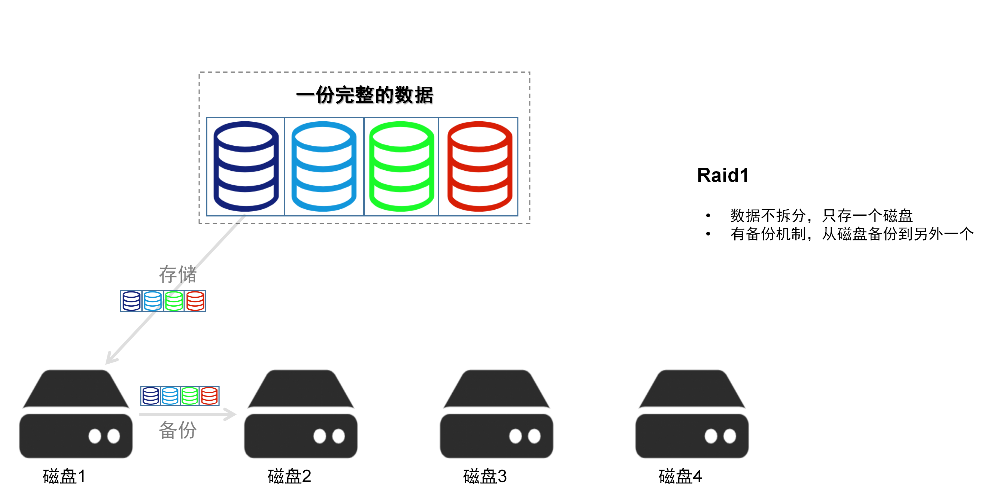
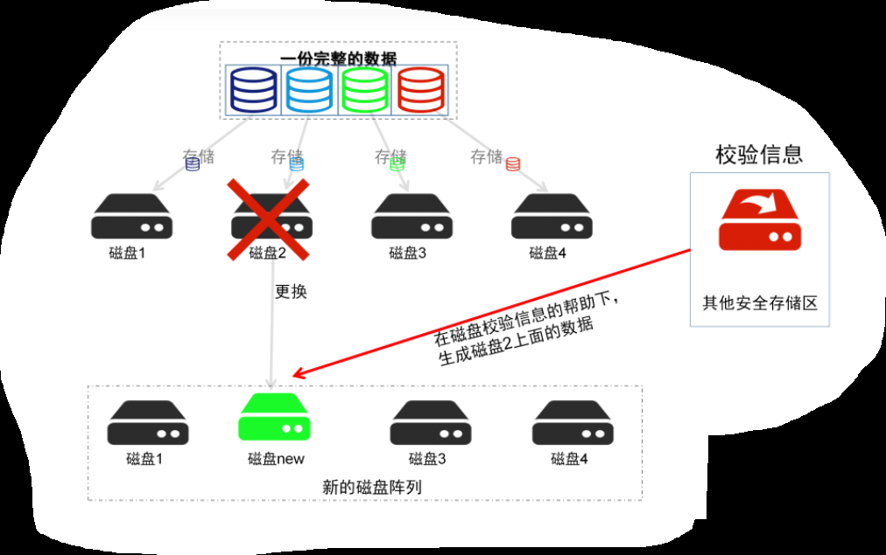
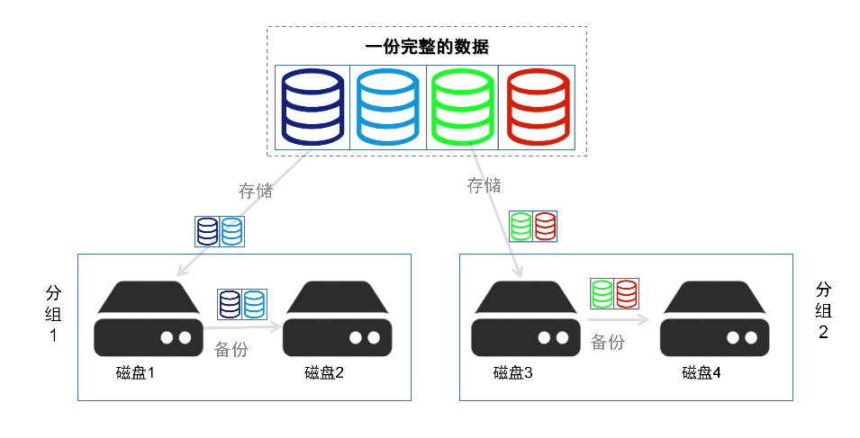

# 服务器RAID磁盘阵列
我们知道，服务器可以插入多个磁盘。如果每个磁盘是独立的、没有一个协同机制，只能是跟电脑插入多个U盘一样，在存储效率，数据安全性方面不会有良好的保证。  
为了实现服务器中多个磁盘的协同配合，让数据存储既高效又安全，就用了磁盘阵列的概念。  
  

RAID磁盘阵列(Redundant Arrays of Independent Disks)是由很多块独立的磁盘组合成一个容量巨大的磁盘组,利用个别磁盘提供数据所产生加成效果提升整个磁盘系统效能  
  - RAID(Redundant Array of Independent Disks)即独立磁盘冗余阵列，通常简称为磁盘阵列  
  - RAID是由多个独立的高性能磁盘驱动器组成的磁盘子系统，从而提供比单个磁盘更高的存储性能和数据冗余的技术  
  - RAID是一类多磁盘管理技术，其向主机环境提供了成本适中、数据可靠性高的高性能存储  
  - RAID的两个关键目标是提高数据可靠性和I/O性能  

**目前RAID磁盘阵列的常用的创建模式包括：RAID0、RAID1、RAID5、RAID1+0**

# RAID0
RAID0 的原理是将多块磁盘组合在一起形成一个大容量的存储。当我们要写数据的时候，的写到磁盘中，因此执行性能非常的高。  
  
**优点**  
  * 数据分部署存储，读写速度快，磁盘的利用率100%

**缺点**  
  * 不够安全，因为被分割的数据没有做备份，N个磁盘里面如果有一个损坏，那么整个数据就会遭到不可逆的损坏，不适合用于数据安全性要求高的场合。  

**适用场景**   
  * 普通个人用户居多,还有一些图形工作站（对读写性能要求高，安全性要求稍低的场景）等。  

# RAID1
RAID1的原理是数据不拆分的基础上，将完整的数据存储在一个磁盘中。并且，将存储的文件进行备份。  
  
**优势**  
  * 有数据备份机制、存储的安全性高。当一个磁盘发生不可逆的损坏时,可以将这个磁盘更换一个新的,服务器会将备份磁盘的数据重新写回到这个新磁盘中  

**缺点**  
  * 数据的存储速度比较慢，磁盘的利用率为50%，因为每一份数据都要存两份

**适用场景**  
  * RAID1常用在对数据安全性要求比较高的场景中
  * 用于存放重要数据、如服务器和数据库存储等重要领域

# RAID5
RAID5是一种存储性能、数据安全和存储成本兼顾的存储解决方案，也就是RAID0和RAID1的折中方案。在存储数据时，先把硬盘设备的数据奇偶校验信息保存到其他硬盘设备中。  
raid5磁盘阵列组中数据的奇偶校验信息并不是单独保存到某一个磁盘设备中，而是存储到除自身以外的其他每一块对应设备上，这样的好处是其中任何一个设备损坏后不至于出现致命缺陷。  
 
当硬盘设备出现问题后，通过奇偶校验技术来尝试重建损坏的数据。Raid5兼顾了硬盘设备的读写速度、数据安全性与存储成本问题。  

**优点**  
  * RAID5可以为系统提供数据安全保障 
  * RAID5具有和RAID0相近似的数据读取速度,只是多了一个奇偶校验信息,写入数据的速度比对单个磁盘进行写入操作稍慢。同时由于多个数据对应一个奇偶校验信息 
  * RAID5的磁盘空间利用率要比RAID1高，存储成本相对较低，是运用较多的一种解决方案 

**缺点**  
  * 只能允许同时损坏一张磁盘，超过一个磁盘，则数据不可恢复  

**适用场景**  
  xxxx

# RAID10
Raid10是Raid1和Raid0的组合体，Raid10技术至少需要4块硬盘组建。
-  先分别两两制成Raid1磁盘阵列，以保证数据的安全性。
-  然后再对两个Raid1磁盘按阵列实施Raid0技术，进一步提高硬盘设备的读写速度。  

这样从理论上讲，只要坏的不是同一组中的所有磁盘,那么最多可以损坏50%的硬盘设备而不丢失数据  

**优点**  
  * Raid10技术击继承了Raid0的高速写速度和Raid1的数据安全性,在不考虑成本的情况下Raid10的性能都超过Raid5,因此当前成为广泛使用的一种存储技术  

**缺点**  
  * 成本高、磁盘的利用率低  

# 总结
以上是常见的RAID模式除了RAID0、RAID1、RAID5和RAID10之外;还有RAID6、RAID07、RAID50、RAID60、RAID100等等，这些都不常用。。。  

