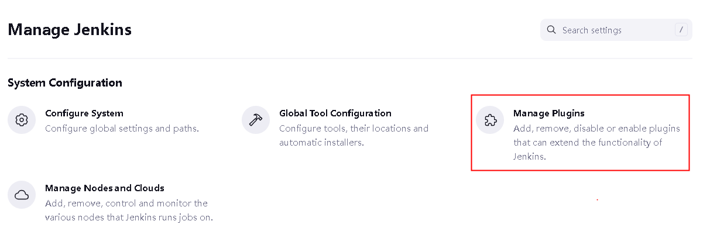
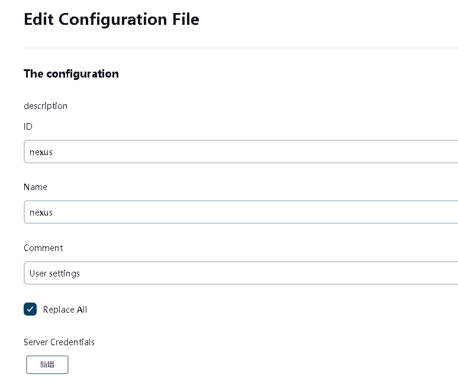

# Jenkins部署
**部署包：JDK11、Jenkins、Maven、Node等**  

https://www.oracle.com/java/technologies/downloads/archive/  
https://www.oracle.com/java/technologies/javase/jdk11-archive-downloads.html   

http://www.jenkins.io/download/ #war包  
https://mirrors.tuna.tsinghua.edu.cn/jenkins/war-stable/2.387.3/jenkins.war

https://maven.apache.org/download.cgi  

https://nodejs.org/download/release/  
https://nodejs.org/download/release/v14.17.5/  

# 一 部署包安装
将所有安装包上传到/data目录下  
```
tar zxf jdk-11.0.18_linux-x64_bin.tar.gz
tar zxf jdk-8u361-linux-x64.tar.gz
tar zxf node-v14.17.5-linux-x64.tar.gz
tar zxf apache-maven-3.8.8-bin.tar.gz
```
## 1.1 环境系统配置
```
#1、yumconfig
cat <<EOF > /etc/yum.repos.d/docker-ce.repo
[docker-ce-stable]
name=Docker CE Stable - \$basearch
baseurl=https://mirrors.aliyun.com/docker-ce/linux/centos/\$releasever/\$basearch/stable
enabled=1
gpgcheck=1
gpgkey=https://mirrors.aliyun.com/docker-ce/linux/centos/gpg
EOF


#2、优化内核参数
cat >> /etc/sysctl.conf <<EOF
vm.swappiness = 0
net.ipv4.ip_forward = 1
EOF

sysctl --system

#3、安装必要的软件包
yum install fontconfig git docker-ce gcc gcc-c++ python3 -y

#4、配置docker加速器
mkdir -p /etc/docker
tee /etc/docker/daemon.json <<-'EOF'
{
  "registry-mirrors": [
    "https://8e3pea7v.mirror.aliyuncs.com"
  ]
}
EOF

```

## 1.2 部署Jenkins
```
mkdir /data/jenkins
创建启动脚本 vi /usr/lib/systemd/system/jenkins.service
[Unit]
Description=Jenkins
After=network-online.target
[Service]
Environment="JAVA_HOME=/data/jdk1.8.0_361"
Environment="JENKINS_HOME=/data/jenkins"
Environment="PATH=$PATH:/bin:/usr/bin:$JAVA_HOME/bin:/data/apache-maven-3.8.8/bin:/data/node-v16.14.2-linux-x64/bin"
WorkingDirectory=/data/jenkins
User=root
Group=root
LimitMEMLOCK=infinity
LimitNOFILE=65536
LimitNPROC=65536
LimitAS=infinity
LimitFSIZE=infinity
TimeoutSec=0
RestartSec=2
Restart=always
ExecStart=/data/jdk-11.0.19/bin/java -jar /data/jenkins.war --logfile=/data/jenkins/jenkins.log --httpPort=8080 --httpListenAddress=0.0.0.0
ExecReload=/usr/bin/kill -HUP $MAINPID
ExecStop=/usr/bin/kill -SIGTERM $MAINPID
[Install]
WantedBy=multi-user.target

systemctl enable jenkins.service && systemctl start jenkins.service

```

## 1.3 Jenkins页面配置
浏览器访问打开Jenkins部署页面 http://x.x.x.x:8080  
```
cat /data/jenkins/secrets/initialAdminPassword
```
   
如果没有特殊要求，安装推荐的插件即可  

创建管理员用户  
   

配置Jenkins访问地址  
  

# 二 Jenkins管理
## 2.1 管理插件
  
   

安装以下插件  
```
Git Parameter
Build With Parameters
Config File Provider
```

## 2.2 管理Jenkins-Managed files
  
## 2.2.1 添加一个新的Config - Maven settings.xml  
  
指定配置文件id  
  
配置Maven settings.xml的内容，需要指定nexus私有仓库地址的同时，配置公共仓库地址，以便maven为java项目打包时能够拉取到对应的依赖包。  
```
    <mirror>
      <id>nexus</id>
      <mirrorOf>*</mirrorOf>
      <name>私服内部Nexus</name>
      <url>http://172.16.0.217/repository/maven-public</url>
    </mirror>
    <mirror>
      <id>public</id>
      <mirrorOf>*</mirrorOf>
      <name>公共仓库</name>
      <url>http://maven.aliyun.com/nexus/content/groups/public/</url>
    </mirror>

```
  
还需要注意nexus默认情况下是需要认证的，配置认证信息。  
  

## 2.2.2 创建用于构建后端java项目docker镜像的dockerfile模板  
  
文件内容  
```
FROM 10.114.233.12/baisc/kmbtjdk:v1
ARG PROJECT_PATH=/
WORKDIR ${PROJECT_PATH}
COPY <jar-file> ${PROJECT_PATH}/app.jar
ENV JAVA_OPTS="-Duser.timezone=GMT+08 -Dfile.encoding=utf-8"
ENTRYPOINT ["sh", "-c", "java $JAVA_OPTS -Djava.security.egd=file:/dev/./urandom -jar app.jar"]

```
  


## 2.2.3  创建用于构建前段vue项目docker镜像的dockerfile模板
文件内容  
```
FROM nginx:1.16.1-alpine
ARG HTML_PATH=/usr/share/nginx/html
WORKDIR ${HTML_PATH}
RUN rm ${HTML_PATH}/*
COPY dist/ ${HTML_PATH}/
COPY default.conf /etc/nginx/conf.d/default.conf
RUN ln -sf /usr/share/zoneinfo/Asia/Shanghai /etc/localtime && echo "Asia/Shanghai" > /etc/timezone
ENV PATH /usr/local/nginx/sbin:$PATH
CMD ["nginx", "-g", "daemon off;"]
EXPOSE 80

```
  

## 2.2.4  创建vue项目的nginx配置文件  
  
文件内容  
```
server {
    listen       80;
    server_name  localhost;
    location / {
        root   /usr/share/nginx/html;
        index  index.html;
        try_files $uri $uri/ /index.html;
    }
}

```
## 2.3 配置凭据
   
点击 System - 全局凭据  
  
  
 
## 2.3.1 添加凭据-gitlab认证凭据
添加用于拉取代码的gitlab认证凭据  
  

## 2.3.2 添加凭据-harbor(push images)  
添加用于向harbor推送docker镜像的认证凭据  
  

## 2.3.3 添加凭据-harbor
添加用于访问k8s集群认证的凭据  
  
这里的Secret file是从k8s集群的master节点（如果是多个master节点，选择任意一个即可）的/root/.kube/config获取。  
注意该文件里面的server项为k8s的apiserver地址，确保可以正常访问。此外还需要将master节点的/usr/bin/kubectl拷贝到Jenkins服务器/usr/bin/kubectl位置  


## 2.4 创建JOB
为了便于统一管理，job一律采用pipeline流水线的方式配置。  

## 2.4.1 创建基于java的后端服务job
   
配置构建保留的数量，节省磁盘空间  
  
流水线脚本内容如下  

```
env.GIT_URL = "https://172.16.0.208/nohup/applife_nohup.git" // 代码git仓库地址
env.JAR_FILE = "trunk/ydmall-service/orders/target/orders.jar" // 构建结果jar路径
env.IMAGE = "${JOB_NAME}" // 镜像名称
env.IMAGETAG = "dev-${new Date().format('yyyyMMddHHmmss')}" // 镜像tag
env.NAMESPACE = "dev" // 在k8s上部署的命名空间
env.RegistryUrl = "172.16.0.219" // habor仓库地址
properties([
    parameters([
        gitParameter(
            branch: '',
            branchFilter: 'origin/(.*)',
            defaultValue: 'master',
            name: 'GIT_BRANCH',
            quickFilterEnabled: false,
            selectedValue: 'NONE',
            sortMode: 'DESCENDING_SMART',
            tagFilter: '*',
            type: 'PT_BRANCH_TAG'
        )
    ])
])
node {
    stage('拉取代码') {
        echo "1.拉取代码"
        git credentialsId: 'gitlab', url: "$GIT_URL", branch: "${params.GIT_BRANCH}", changelog: true, poll: false
    }
    
    stage('Maven编译打包') {
        try {
            echo "2. Maven编译打包"
            configFileProvider([configFile(fileId: 'nexus', targetLocation: 'settings.xml')]) {
    // 打包命令，根据实际情况改写
                sh """
                    mvn -am -pl ydmall-service/orders \
                    clean package -T 1C \
                    -Dmaven.test.skip=true \
                    -Dmaven.compile.fork=true \
                    -f trunk/pom.xml \
                    --settings settings.xml
                """
            }
        } catch (exc) {
            println "Maven构建失败 - ${currentBuild.fullDisplayName}"
            throw(exc)
        }
    }
    stage('构建 Docker 镜像') {
        withCredentials([usernamePassword(
            credentialsId: 'harbor',
            usernameVariable: 'DOCKER_HUB_USER',
            passwordVariable: 'DOCKER_HUB_PASSWORD')]) {
                echo "3. 构建 Docker 镜像"
                configFileProvider([configFile(fileId: 'dockerfile-java', targetLocation: 'Dockerfile')]) {
                    sh """
                        sed -i "s#<jar-file>#${JAR_FILE}#g" Dockerfile
                        docker login ${RegistryUrl} -u ${DOCKER_HUB_USER} -p ${DOCKER_HUB_PASSWORD} && \
                        docker build -t ${RegistryUrl}/项目名称/${IMAGE}:${IMAGETAG} . && \
                        docker push ${RegistryUrl}/项目名称/${IMAGE}:${IMAGETAG} && \
                        docker logout ${RegistryUrl}
                    """
                }
            }
    }
    
    stage('使用kubectl部署') {
        withCredentials([file(credentialsId: 'kubeconfig', variable: 'KUBECONFIG')]) {
            echo "4. 部署到Kubernetes"
            sh """
                cat ${KUBECONFIG} > kconfig
                kubectl --kubeconfig kconfig patch -n ${NAMESPACE} deployment ${IMAGE} -p '{"spec":{"template":{"spec":{"containers":[{"name":"${IMAGE}","image":"${RegistryUrl}/项目名称/${IMAGE}:${IMAGETAG}"}]}}}}'
                rm -f kconfig
            """
        }
    }
}

```
>> 注意：  
1、由于代码分支采用git参数化动态指定，根据其插件规则，项目首次构建需要使用默认分支构建一次来初始化项目，后续则可以自由选择分支来进行构建；  
2、pipeline脚本内容这里作为参考，需要根据实际情况进行修改。  


## 2.4.2 创建基于vue的前端服务job
流水线脚本内容如下
```
env.GIT_URL = "https://172.16.0.208/frontpage/admin.git"
env.IMAGE = "${JOB_NAME}"
env.IMAGETAG = "dev-${new Date().format('yyyyMMddHHmmss')}"
env.NAMESPACE = "dev"
env.RegistryUrl = "172.16.0.219"
properties([
    parameters([
        gitParameter(
            branch: '',
            branchFilter: 'origin/(.*)',
            defaultValue: 'master',
            name: 'GIT_BRANCH',
            quickFilterEnabled: false,
            selectedValue: 'NONE',
            sortMode: 'DESCENDING_SMART',
            tagFilter: '*',
            type: 'PT_BRANCH_TAG'
        )
    ])
])
node {
    stage('拉取代码') {
        echo "1.拉取代码"
        git credentialsId: 'gitlab', url: "$GIT_URL", branch: "${params.GIT_BRANCH}", changelog: true, poll: false
    }
    
    stage('Node编译打包') {
        try {
            echo "2. Node编译打包"
            sh """
                PATH=/bin:/usr/bin:/usr/local/bin:/data/node-v14.17.5-linux-x64/bin  # 使用变量来指定node版本
                npm install
                npm run build:dev
            """
        } catch (exc) {
            println "Node构建失败 - ${currentBuild.fullDisplayName}"
            throw(exc)
        }
    }
    stage('构建 Docker 镜像') {
        withCredentials([usernamePassword(
            credentialsId: 'harbor',
            usernameVariable: 'DOCKER_HUB_USER',
            passwordVariable: 'DOCKER_HUB_PASSWORD')]) {
                echo "3. 构建 Docker 镜像"
                configFileProvider([configFile(fileId: 'vue-nginx.conf', targetLocation: 'default.conf'), configFile(fileId: 'dockerfile-vue', targetLocation: 'Dockerfile')]) {
                    sh """
                        docker login ${RegistryUrl} -u ${DOCKER_HUB_USER} -p ${DOCKER_HUB_PASSWORD} && \
                        docker build -t ${RegistryUrl}/dev/${IMAGE}:${IMAGETAG} . && \
                        docker push ${RegistryUrl}/dev/${IMAGE}:${IMAGETAG} && \
                        docker logout ${RegistryUrl}
                    """
                }
            }
    }
    
    stage('使用kubectl部署') {
        withCredentials([file(credentialsId: 'kubeconfig', variable: 'KUBECONFIG')]) {
            echo "4. 部署到Kubernetes"
            sh """
                cat ${KUBECONFIG} > kconfig
                kubectl --kubeconfig kconfig patch -n ${NAMESPACE} deployment ${IMAGE} -p '{"spec":{"template":{"spec":{"containers":[{"name":"${IMAGE}","image":"${RegistryUrl}/dev/${IMAGE}:${IMAGETAG}"}]}}}}'
                rm -f kconfig
            """
        }
    }
}

```
**示例**  
  

## 2.4.3 配置自签ca证书
如果gitlab采用的是https协议且为自签名证书，则需要将其ca证书添加到 /etc/pki/tls/certs/ca-bundle.crt文件  
  

如果harbor采用的是自签名证书，则需要将其ca证书添加到 /etc/docker/certs.d/服务器名称目录下   
 

  


 
 


  
