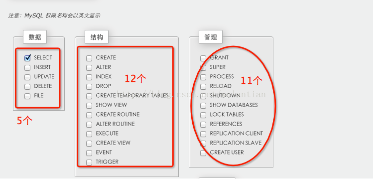

See https://www.geeksforgeeks.org/sql-ddl-dql-dml-dcl-tcl-commands/  for details.  

SQL-Commands-Architecture
  
 
 
# [MySQL-DDL](https://blog.csdn.net/qq_51978429/article/details/126649681?share_token=6986400D-0A70-4239-88AB-001C9BF67F29&tt_from=copy_link&utm_source=copy_link&utm_medium=toutiao_ios&utm_campaign=client_share)
## 1、什么是DDL
数据定义语(DDL：Data Definition Language)其语句包括动词CREATE,ALTER和DROP;  
在数据库中创建新表或修改、删除表(CREATE TABLE 或 DROP TABLE)为表加入索引等   
 
DDL只操作数据库、表、视图、索引，但是不操作表中的数据  


# MySQL-DML
## 1、什么是DML
DML:数据库操作语言（Data Mainpulation Language）其语句包括动词INSERT、UPDATE和DELETE，分别用于添加修改删除
## 2、INSERT
```bash
NSERT INTO <表名> （字段1，字段2，...）VALUES (字段1的值，字段2的值，...);

--语法2
INSERT INTO <表名> VALUES (字段1的值，字段2的值，...);

--语法3：批量插入
INSERT INTO <表名> （字段1，字段2，...）VALUES (字段1的值，字段2的值，...)，(字段1的值，字段2的值，...),...;


-- 选择性插入
INSERT INTO t_user (id,NAME,sex)VALUES(1,'张三','男')
INSERT INTO t_user (NAME,sex)VALUES('张三1','男')
-- 全字段插入
INSERT INTO t_user VALUES(NULL,'李四','男')
-- 批量插入
INSERT INTO t_user (NAME,sex)VALUES('jack','男'),('rose','女')

```
## 3、UPDATE
```bash
   语法：update 表名 set 字段1=值 ,字段2 =值,…[where 条件]
   注意：在更新操作建议要加where子句，否则会导致全表更新
   DROP TABLE IF EXISTS t_user;
CREATE TABLE t_user
(
 id INT PRIMARY KEY AUTO_INCREMENT,
 NAME VARCHAR(20),
 sex VARCHAR(10)
)
-- 选择性插入
INSERT INTO t_user (id,NAME,sex)VALUES(1,'张三','男')
INSERT INTO t_user (id,NAME,sex)VALUES(2,'张三1','男')

-- 更新
UPDATE t_user SET NAME='李四'  -- 整张表全改

UPDATE t_user SET NAME = '张三' WHERE id =1

UPDATE t_user SET NAME = 'jack' , sex='女' WHERE id =1

SELECT * FROM t_user;

```
## 4、DELETE
```bash
   DELETE FROM 表名 [where]
   注意：删除时建议加where子句，避免全表删除
   DROP TABLE IF EXISTS t_user;
CREATE TABLE t_user
(
 id INT PRIMARY KEY AUTO_INCREMENT,
 NAME VARCHAR(20),
 sex VARCHAR(10)
)
-- 选择性插入
INSERT INTO t_user (id,NAME,sex)VALUES(1,'张三','男');
INSERT INTO t_user (id,NAME,sex)VALUES(2,'张三1','男')

-- 删除
DELETE FROM t_user WHERE NAME = '张三'

SELECT * FROM t_user;

```


# MySQL-DCL
## 1、什么是DCL
数据控制语言DCL(Data Control Language)它的语句通过GRANT或REVOKE实现权限控制，确定单个用户和用户组对数据库对象的访问。某些RDBMS可用GRANT或REVOKE控制对表单个列的访问。
```bash

-- 创建用户(只有root用户才有权限创建)
CREATE USER jack IDENTIFIED BY '123456'

-- 授权
GRANT SELECT ON companydb.departments TO jack
GRANT INSERT ON companydb.departments TO jack
GRANT SELDCLECT  ON companydb.departments TO jack


-- 取消权限
REVOKE INSERT ON  companydb.departments FROM jack
REVOKE SELECT  ON companydb.departments FROM  jack


-- 删除用户
DROP USER jack

```


# 总结
```bash
SQL语句主要可以分为三个类别，分别如下：  

1、DDL(Data Definition Languages)语句：数据定义语言，这些语句定义了不同的数据段、数据库、表、列和索引等数据库对象。简单来说，就是对数据内部的对象进行创建、删除、修改的操作语言。它和下面要谈的DML语句最大的区别是DML只是对表内部数据的操作，而不涉及表的定义、结构的修改等，更不会涉及其他对象。DDL语句主要是被DBA所使用。常用的DDL语句关键字主要包括： create、drop、alter等。

***DDL主要是用在定义或改变表（TABLE）的结构，数据类型，表之间的链接和约束等初始化工作上，他们大多在建立表时使用

2、DML(Data Manipulation Language)语句：数据操作语句，用于添加、删除、更新和查询数据库记录，并检查数据完整性。DML的操作主要是对数据库中表记录的操作，是开发人员日常使用最频繁的操作。常用的DML语句关键字主要有：insert、delete、update和select等。

3、DCL(Data Control Language)：数据控制语言，用于控制不同数据段直接的许可和访问级别的语句。这些语句定义了数据库、表、字段、用户的访问权限和安全级别。用于语句主要是DBA用来管理系统中的对象权限时使用的，一般开发人员很少使用。主要的语句关键字包括：grant、revoke等。在默认状态下，只有sysadmin,dbcreator,db_owner或db_securityadmin等人员才有权力执行DCL。
```

--- 
# MySQL权限 

 

[MySQL权限](https://blog.csdn.net/O0o_Or_not/article/details/109468242) 
  
[MySQL grant用户权限总结](https://blog.csdn.net/wulantian/article/details/38230635)  
  


