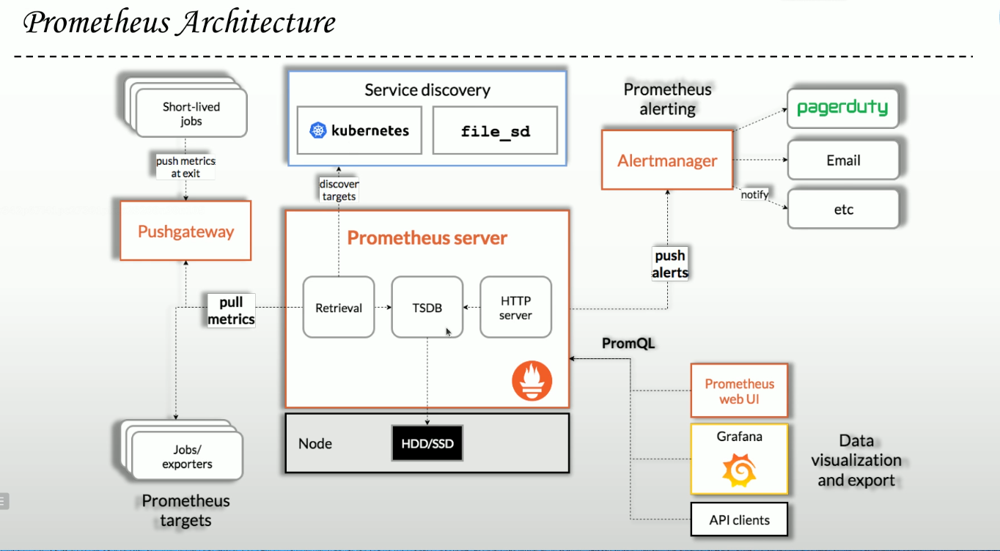

# 监控体系  
**打造一个高可用、高稳定的系统、监控体系是其中非常关键的一个环节**  
- 1、资源监控
  ```
  包括CPU、MEM、Disk等等。开源的软件有Zabbix
  ``` 
- 2、系统监控
  ```
  有一些通用的监控指标:如响应时间、失败率、慢SQL、JVM(Yong-GC、Full-GC)等等。
  常用的开源软件有Apache SkyWalking、CAT、PinPoint等等
  ```
- 3、业务监控
  ```
  要监控哪些指标,需要根据具体业务进行分析,比如订单支付成功率、下单量、注册客户数等等
  ```
# 日志报警
- 日志的作用之一是针对线上问题,通过查找日志快速定位问题,这是一个被动解决问题的过程
- 日志更重要的作用是主动报警、主动解决。通过对日志等级进行分类,发现有ERROR,进行监控并主动报警
- 一个日志到底是WARNING还是ERROR,需要根据自己的业务决定,并且可以调整
>注意：日志不是摆设,而是专门用来解决问题


# 监控
**应用系统三维监控**
- 业务指标(Metric)
  ```
  Metric是带统计量的事件,支持自定义业务监控指标，统计指定时间段的业务数据。开源解决方案有Prometheus+Grafana
  ```
- 分布式追踪(Trace)
  ```
  Trace是带请求追踪的事件,例如一次调用远程服务的RPC执行过程、一次实际的SQL查询语句、一次HTTP请求等等。开源解决方案有Skywalking、Pinpoint、Cat等等
  ```
- 日志(Log)
  ```
  Log是离散的事件,记录debug或error信息。开源解决方案ELK和EFK。ELK生态提供了日志IDE记录、滚动和查询等等
  ```
  


# CPU_usagerate_total
```bash
https://www.cnblogs.com/Hackerman/p/16084360.html  #常规
https://www.cnblogs.com/t-road/p/15604040.html  
https://wu.run/posts/promql-calculate-cpu-utilization/   #公式计算
https://zhuanlan.zhihu.com/p/511620387
https://blog.csdn.net/qing_dan_mo_cai/article/details/123938464 
```

# Prometheus监控系统概念  
 
  

**监控系统的功能**  
**采集(周期性)** 
  - snmp 
  - agent 
  - http 
  - icmp
  - ....  
**存储(存储系统)**
   - 关系型数据库: MySQL、PostgreSQL、...... 
   - TiDB、...... 
   - RRD (cacti) 
   - TSDB: Time Series DB 
   - NoSQL: KV、Document、......   
**展示**   
  - Web 
  - GUI     
**告警**  
    - 告警媒介    
      - email 
      - sms 
      - wechat 
      - dingtalk   
    - 告警升级  
      - 告警路由  

**Prometheus系统的组件**    
- Prometheus Server   
  - TSDB 
  - Retrieval(Scraper) <-- Target 
    - Exporters 
    - Instrumentation   
  - Service Discovery  
      - Kubernetes: Node、Pod、Endpoints、Service、Ingress   
      - Consul 
      - File 
      - DNS ......   
- Grafana   
- AlertManager  
- PushGateway     

**Prometheus指标类型**   
- Counter 计数器 用于保存单调递增型数据(站点访问次数;不能为负值、也不支持减少、但可发重置回0)  
- Gauge   仪表盘 用于存储有着起伏特征的指标数据(如内存空闲大小)  
    - Gauge是Counter的超集,但存在指标数据丢失的可能时,Counter能让用户确切了指标随时间的变化状态,而Gauge则可能随时间流逝而精准度越来越低
- Histogram 直方图 它会在一段时间范围内对数据进行采样,并将其计入可配置的bucket之中;  
    Histogram能够存储更多的信息,包括样本值分布在每个bucket(bucket自身的可配置)中的数量、所有样本值之和以及总的样本数量,从而Prometheus能够使用内置的函数进行如下操作：
    - 计算样本平均值：以值的总和除以值的数量;
    - 计算样本分位值：分位数有助于了解符合特定标准的数据个数;例如评估响应时长超过1秒钟的请求比例,若超过20%即发送告警等;
- Summary 摘要,
    Histogram的扩展类型,但它是直接由被监测端自行聚合计算出分位数,并将计算结果响应给Prometheus-Server的样本采集请求;因而,其分位数计算是由由监控端完成;


**作业(Job)和实例(Instance)**  
  - Instance: 能够接收Prometheus-Server数据Scrape操作的每个网络端点(endpoint),即为一个Instance(实例);
  - 通常,具有类似功能的Instance的集合称为一个Job,例如一个MySQL主从复制集群中的所有MySQL进程;
  ```bash
  cpu_usage {job="redis", instance="128.0.0.1"} 14.04
  cpu_usage {job="mysql", instance="128.0.0.2"} 12.01
  cpu_usage {job="kafka", instance="128.0.0.3"} 16.03
  ```

**PromQL**   
  - Prometheus提供了内置的数据查询语言PromQL(全称为Prometheus Query Language),支持用户进行实时的数据查询及聚合操作; 
  - PromQL支持处理两种向量,并内置提供了一组用于数据处理的函数
      + 即时向量：最近一次的时间戳上跟踪的数据指标;
      + 时间范围向量：指定时间范围内的所有时间戳上的数据指标;
 
**Instrumentation(程序仪表)**  
  - 任何能够支持Scrape指标数据的应用程序都首先要具有一个测量系统;
  - 在Prometheus的语境中,Instrumentation是指附加到应用程序中的那些用于暴露程序指标数据的客户端库;
      + 程序员借助于这些客户端库编写代码生成可暴露的指标数
  
**Exporters**  
  - 对于那些未内建Instrumentation,且也不便于自行添加该类组件以暴露指标数据的应用程序来说,常用的办法是于待监控的目标应用程序外部运行一个独立指标暴露程序,该类型的程序即统称为Exporter;
  - 换句话说,Exporter负责从目标应用程序上采集和聚合原始格式的数据,并转换或聚合为Prometheus格式的指标向外暴露;
  - Prometheus站点上提供了大量的Exporter

**Alerts**  
  - 抓取到异常值后,Prometheus支持通过**告警(Alert)**机制向用户发送反馈或警示,以触发用户能够及时采取应对措施;
  - Prometheus Server 仅负责生成告警指示,具体的告警行为由另一个独立的应用程序AlertManager负责;
      - 告警指示由 Prometheus Server 基于用户提供的**告警规则**周期性计算生成;
      - Alertmanager 接收到Prometheus Server发来的告警指示后,基于用户定义的**告警路由(route)**向告警**接收人(receivers)**发送告警信息;

**Prometheus的特性**  
  + 关键特性 
    - 多维护数据模型：以指标名称及附加的label标识时间序列 
    - 特有的数据查询语言：PromQL 
    - 单个服务器节点即可正常工作,不依赖分布式存储 
    - 基于HTTP协议,以Pull模式完成指标数据采集 
    - 借助于PushGateway,支持Push模式的指标数据采集 
    - 使用服务发现机制动态发现Target,或静态配置要监控的Target 
    - 支持多种Graph和Dashboard 
  + 不适用的场景 
    + Prometheus是一款指标监控系统,不适合存储事件及日志; 
    + Prometheus认为只有最近的监控数据才有查询的需要,其本地存储的设计初衷只是**保存短期数据**,因而不支持针对大量的历史数据进行存储; 
      - 若需要存储长期的历史数据,建议基于远端存储机制将数据保存于InfluxDB或OpenTSDB等系统中; 
    + Prometheus的集群机制成熟度不高,即便基于Thanos亦是如此;

