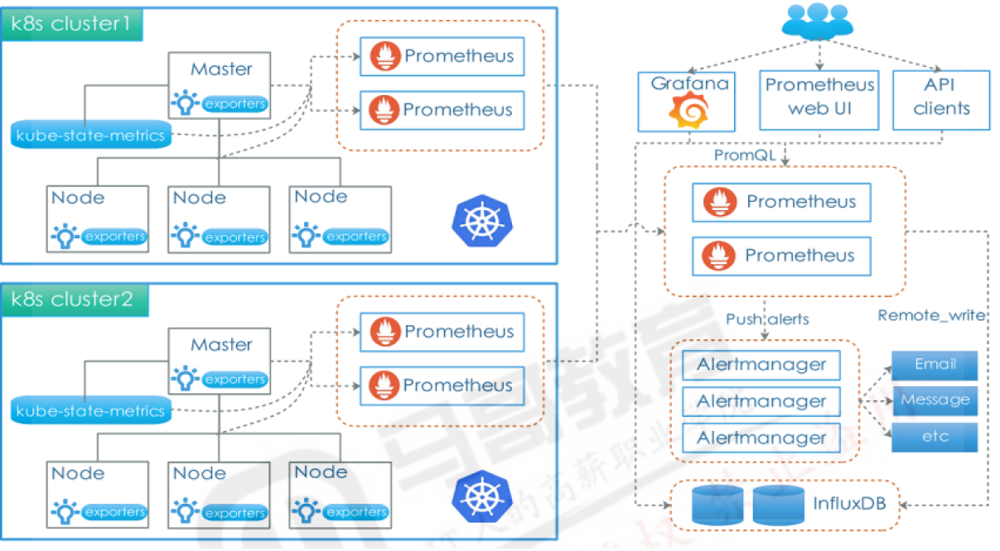
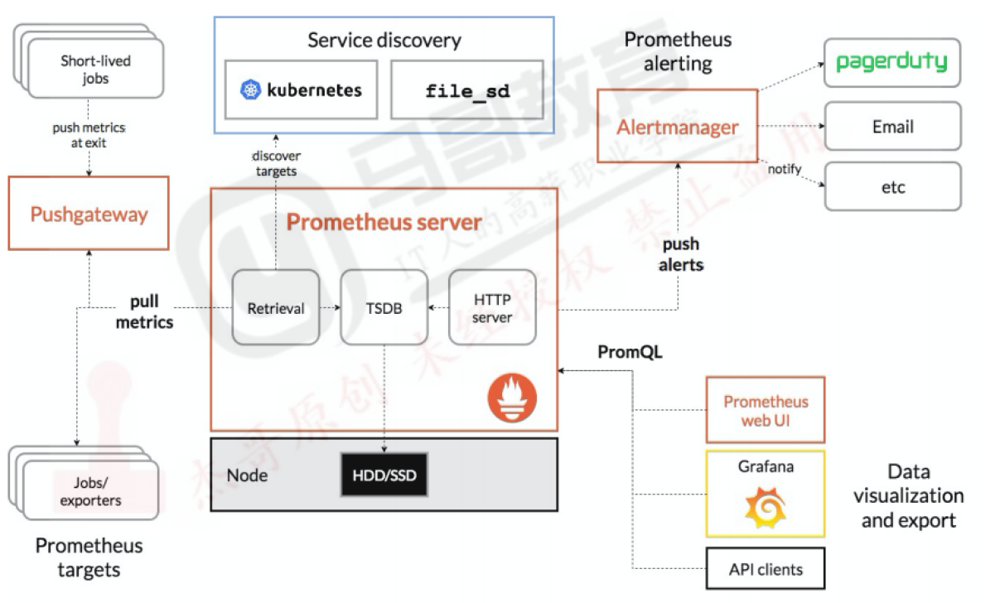
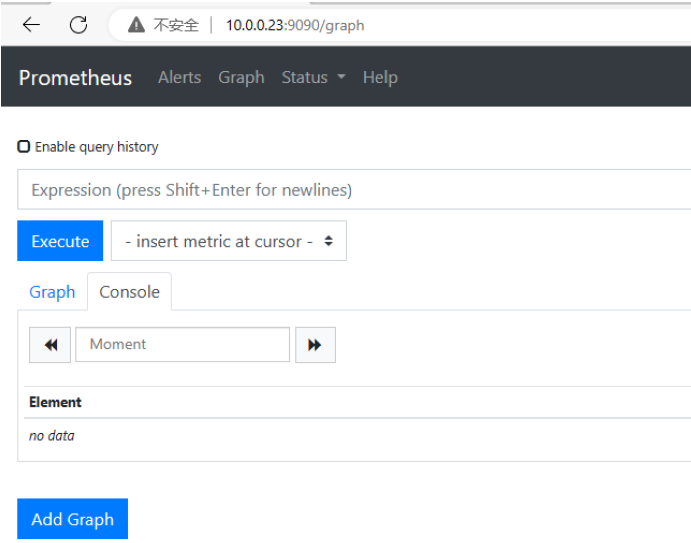
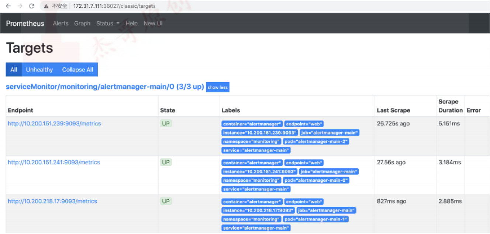
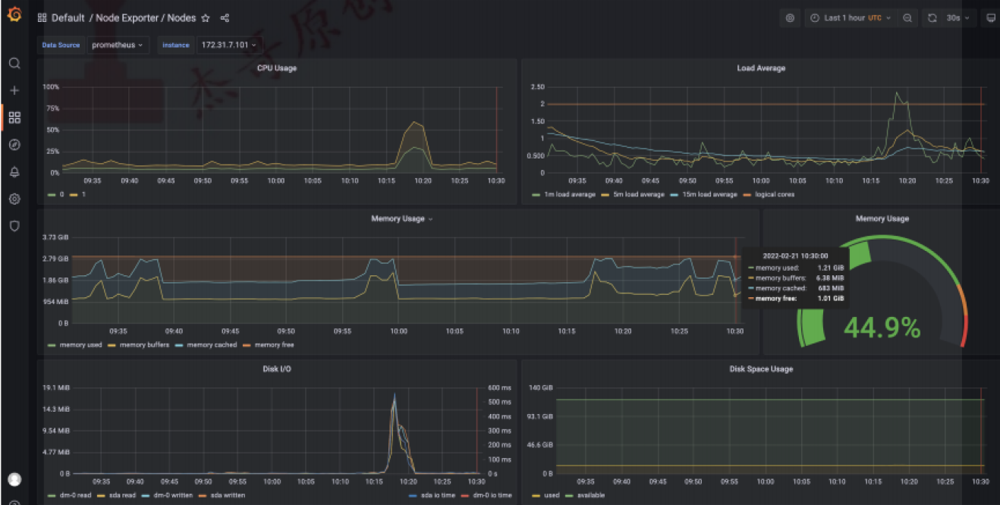
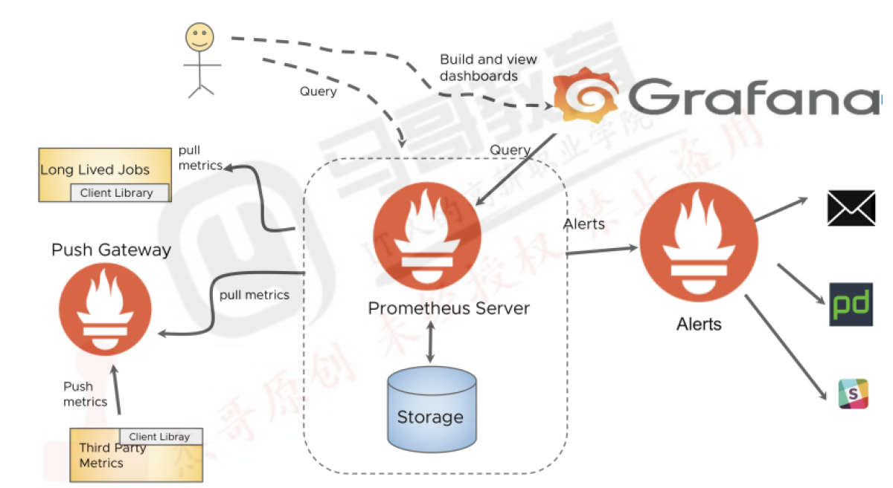
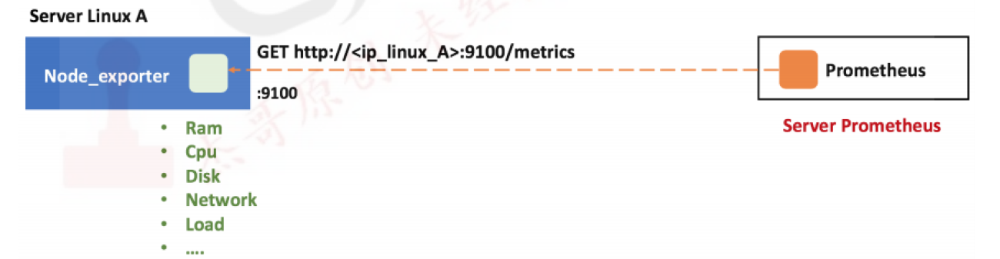
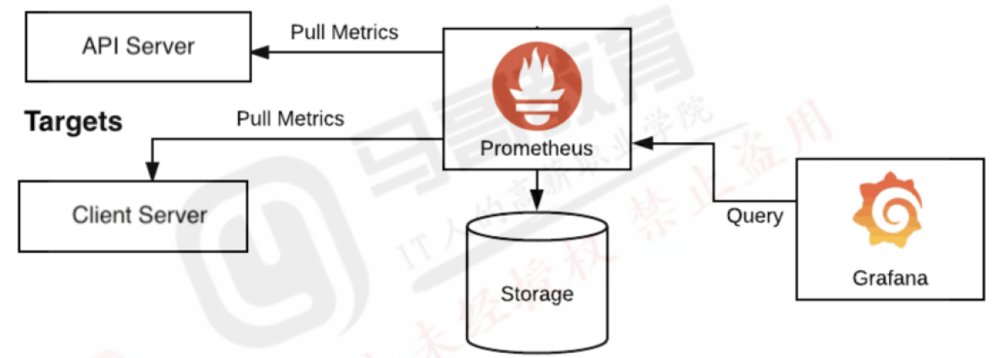

# 一、Prometheus简介
# [Prometheus on k8s 部署与实战操作进阶篇](https://www.toutiao.com/article/7272029390362526208/)  
# [使用 Helm 安装 Prometheus Stack](https://todoit.tech/k8s/prometheus/#%E4%BD%BF%E7%94%A8-helm-%E5%AE%89%E8%A3%85-prometheus-stack)  
# [Operator部署Prometheus](https://www.yuque.com/coolops/kubernetes/wd2vts)  
# [Prometheus全方位监控K8S](https://www.gl.sh.cn/2021/04/26/prometheus_quan_fang_wei_jian_kong_k8s.html)  
## 1.1内容
```
1、监控简介、黑盒监控与白盒监控、常见的监控系统对比
2、prometheus 架构简介及部署方式(apt/yum、docker-compsoe、operator、二进制)
3、基于二进制部署prometheus Server及node-exporter
4、grafana简介、安装grafana、数据源管理及通过模板查看prometheus中的监控数据
5、PromQL语句简介、通过daemonset部署cadvisor及node-exporter
6、kubernetes环境中部署prometheus、服务发现基础及relabel基础
7、kubernetes服务发现配置示例
8、kubernetes部署prometheus以及二进制部署的prometheus实现服务发现
9、prometheus基于consul、file、dns实现服务发现
10、prometheus监控案例-kube-state-metrics和tomcat监控
```

```
1、prometheus监控案例-Tomcat、Redis、Mysql和Haproxy
2、prometheus监控案例-nginx监控、ingress-nginx-controller和blackbox_exporter简介及部署、基于blackbox_exporter实现对URL状态、IP可用性、端口状态、TLS证书的过期时间监控
3、prometheus告警流程简介及结合alertmanager实现邮件告警通知
4、prometheus结合钉钉实现告警通知
5、prometheus结合企业微信实现告警通知、告警模板的使用、告警分类发送及抑制和静默
6、pushgateway简介及实现、prometheus联邦简介
7、prometheus存储简介、prometheus结合victoriametrics实现单机远程存储
8、victoriametrics集群版本实现prometheus及grafana读写分离
```
## 1.2监控系统逻辑布局


# Prometheus架构图

```
prometheus server：主服务，接受外部http请求，收集、存储与查询数据等
prometheus targets: 静态收集的⽬标服务数据
service discovery：动态发现服务
prometheus alerting：报警通知
push gateway：数据收集代理服务器(类似于zabbix proxy)
data visualization and export： 数据可视化与数据导出(访问客户端)
```
**组件介绍**
- Prometheus Server  
   Prometheus的核心组件，负责收集、存储和查询时间序列数据。它通过HTTP协议暴露API接口，可以接收来自各种数据源的指标数据，并将其存储在本地的时间序列数据库中。Prometheus Server内置的Express Browser UI，通过这个UI可以直接通过PromQL实现数据的查询以及可视化。  
- ClientLibrary  
  是一种用于在应用程序中集成Prometheus监控功能的库。它提供了一组API和工具，使应用程序能够方便地生成和暴露指标数据给Prometheus进行收集和存储，通过使用Client Library，应用程序可以方便地将自身的指标数据暴露给Prometheus进行收集和存储，从而实现对应用程序的监控和性能分析  
- Push Gateway  
   Pushgateway是一种特殊的Exporter，用于接收短期任务的指标数据。通常情况下，Prometheus是通过Pull方式来收集指标数据的，即定期从数据源拉取数据。但是对于一些短期任务（如批处理任务、临时任务等），由于其生命周期较短，无法被Prometheus及时拉取到数据。这时可以使用Pushgateway，将任务的指标数据推送到Pushgateway中，然后由Prometheus从Pushgateway中拉取数据  
- Exporters  
    Prometheus通过Exporters来收集各种不同类型的指标数据。Exporters是一种特殊的应用程序，它可以将应用程序或系统的指标数据暴露为Prometheus可识别的格式。Prometheus提供了一些常用的Exporters，如Node Exporter（用于收集主机指标）、Blackbox Exporter（用于收集网络指标）等，同时也支持用户自定义的Exporters  
- Alertmanager  
   Alertmanager是Prometheus的告警管理组件，负责接收、处理和发送告警通知。Prometheus可以通过配置规则来定义告警条件，当条件满足时，Prometheus会生成告警，并将其发送给Alertmanager。Alertmanager可以对告警进行去重、分组和静默等操作，并将告警通知发送给指定的接收者，如邮件、Slack等  
- Grafana  
   Grafana是一个开源的数据可视化和监控平台，可以与Prometheus集成，用于展示和分析Prometheus收集到的指标数据。Grafana提供了丰富的图表和面板，可以根据用户的需求自定义展示方式，并支持多种数据源的查询和展示  

# 二、部署Prometheus监控系统
```
可以通过不同的⽅式安装部署prometheus监控环境，虽然以下的多种安装⽅式演示了不同的部署⽅式，
但是实际⽣产环境只需要根据实际需求选择其中⼀种⽅式部署即可，不过⽆论是使⽤哪⼀种⽅式安装部署的prometheusserver，
以后的使⽤都是⼀样的，后续的课程⼤部分以⼆进制安装环境为例，其它会做简单的对应介绍。
```

```
apt install prometheus #使⽤apt或者yum安装
https://prometheus.io/download/ #官⽅⼆进制下载及安装，prometheus server的监听端⼝为9090
https://prometheus.io/docs/prometheus/latest/installation/ #docker镜像直接启动
https://github.com/coreos/kube-prometheus #operator部署
```
## 2.1 docker-compose部署Prometheus Server、nodeexporter与grafana
```
部署环境：172.31.7.201 #如果之前已经通过其它⽅式部署了prometheus server，需要先停⽌再部署，避免端⼝冲突
```
## 2.1.1:先安装docker、docker-compose
```
#1、使用脚本方式安装docker、docker-compose

tar xf docker-20.10.17-binary-install.tar.gz
bash docker-install.sh
docker info

#2、使用docker-compose.yaml文件方式执行部署
#https://github.com/mohamadhoseinmoradi/Docker-Compose-Prometheus-and-Grafana.git
git clone https://github.com/Einsteinish/Docker-Compose-Prometheus-and-Grafana.git
cd Docker-Compose-Prometheus-and-Grafana/
#修改docker-compose.yml文件
version: '2.1'

networks:
  monitor-net:
    driver: bridge

volumes:
    prometheus_data: {}
    grafana_data: {}

services:

  prometheus:
    image: prom/prometheus:v2.17.1
    container_name: prometheus
    volumes:
      - ./prometheus:/etc/prometheus
      - prometheus_data:/prometheus
    command:
      - '--config.file=/etc/prometheus/prometheus.yml'
      - '--storage.tsdb.path=/prometheus'
      - '--web.console.libraries=/etc/prometheus/console_libraries'
      - '--web.console.templates=/etc/prometheus/consoles'
      - '--storage.tsdb.retention.time=200h'
      - '--web.enable-lifecycle'
    restart: unless-stopped
    expose:
      - 9090
    networks:
      - monitor-net
    labels:
      org.label-schema.group: "monitoring"

  alertmanager:
    image: prom/alertmanager:v0.20.0
    container_name: alertmanager
    volumes:
      - ./alertmanager:/etc/alertmanager
    command:
      - '--config.file=/etc/alertmanager/config.yml'
      - '--storage.path=/alertmanager'
    restart: unless-stopped
    expose:
      - 9093
    networks:
      - monitor-net
    labels:
      org.label-schema.group: "monitoring"

  nodeexporter:
    image: prom/node-exporter:v0.18.1
    container_name: nodeexporter
    volumes:
      - /proc:/host/proc:ro
      - /sys:/host/sys:ro
      - /:/rootfs:ro
    command:
      - '--path.procfs=/host/proc'
      - '--path.rootfs=/rootfs'
      - '--path.sysfs=/host/sys'
      - '--collector.filesystem.ignored-mount-points=^/(sys|proc|dev|host|etc)($$|/)'
    restart: unless-stopped
    expose:
      - 9100
    networks:
      - monitor-net
    labels:
      org.label-schema.group: "monitoring"

  cadvisor:
    #image: gcr.io/google-containers/cadvisor:v0.34.0
    image: google/cadvisor:v0.33.0 #修改为docker hub上的地址，google地址无法拉取镜像
    container_name: cadvisor
    volumes:
      - /:/rootfs:ro
      - /var/run:/var/run:rw
      - /sys:/sys:ro
      - /var/lib/docker:/var/lib/docker:ro
      #- /cgroup:/cgroup:ro #doesn't work on MacOS only for Linux'
    restart: unless-stopped
    expose:
      - 8080
    networks:
      - monitor-net
    labels:
      org.label-schema.group: "monitoring"

  grafana:
    image: grafana/grafana:6.7.2
    container_name: grafana
    volumes:
      - grafana_data:/var/lib/grafana
      - ./grafana/provisioning:/etc/grafana/provisioning
  environment:
    - GF_SECURITY_ADMIN_USER=${ADMIN_USER}
    - GF_SECURITY_ADMIN_PASSWORD=${ADMIN_PASSWORD}
    - GF_USERS_ALLOW_SIGN_UP=false
  restart: unless-stopped
  expose:
    - 3000
  networks:
    - monitor-net
  labels:
    org.label-schema.group: "monitoring"

  pushgateway:
    image: prom/pushgateway:v1.2.0
    container_name: pushgateway
    restart: unless-stopped
    expose:
      - 9091
    networks:
      - monitor-net
    labels:
      org.label-schema.group: "monitoring"

  caddy:
    image: stefanprodan/caddy
    container_name: caddy
    ports:
      - "3000:3000"
      - "9090:9090"
      - "9093:9093"
      - "9091:9091"
    volumes:
      - ./caddy:/etc/caddy
    environment:
      - ADMIN_USER=${ADMIN_USER}
      - ADMIN_PASSWORD=${ADMIN_PASSWORD}
    restart: unless-stopped
    networks:
      - monitor-net
    labels:
      org.label-schema.group: "monitoring"

#3、运行docker-compose
dockercompose up -d -v

```
## 2.1.2 验证web登录页面


## 2.2 Operator部署prometheus监控系统
## 2.2.1 clone项⽬并部署
git clone -b release-0.11 https://github.com/prometheus-operator/kube-prometheus.git  
cd kube-prometheus  
kubectl apply --server-side -f manifests/setup  
#grep image: manifests/ -R | grep "k8s.gcr.io" #有部分镜像⽆法下载
```
准备kube-state-metrics镜像：
nerdctl pull bitnami/kube-statemetrics:2.5.0
nerdctl tag bitnami/kube-state-metrics:2.5.0 registry.cnhangzhou.aliyuncs.com/zhangshijie/kube-state-metrics:2.5.0
nerdctl push registry.cn-hangzhou.aliyuncs.com/zhangshijie/kube-statemetrics:2.5.0
# vim manifests/kubeStateMetrics-deployment.yaml
准备prometheus-adapter镜像：
manifests/prometheusAdapter-deployment.yaml: image:
k8s.gcr.io/prometheusadapter/prometheus-adapter:v0.9.1
nerdctl pull willdockerhub/prometheusadapter:v0.9.1
nerdctl tag willdockerhub/prometheus-adapter:v0.9.1 registry.cnhangzhou.aliyuncs.com/zhangshijie/prometheus-adapter:v0.9.1
nerdctl push registry.cn-hangzhou.aliyuncs.com/zhangshijie/prometheusadapter:v0.9.1
vim manifests/prometheusAdapter-deployment.yaml
# kubectl apply -f manifests/ #有些镜像⽆法下载需要⾃⾏解决
```
## 2.2.2 验证Pod状态
```
kubectl get pod -n monitoring
```
## 2.2.3 通过NodePort访问PrometheusServer
```
cat manifests/prometheus-service.yaml
apiVersion: v1
kind: Service
metadata:
  labels:
  app.kubernetes.io/component: prometheus
  app.kubernetes.io/instance: k8s
  app.kubernetes.io/name: prometheus
  app.kubernetes.io/part-of: kube-prometheus
  app.kubernetes.io/version: 2.33.3
  name: prometheus-k8s
  namespace: monitoring
spec:
  type: NodePort
  ports:
  - name: web
  port: 9090
  targetPort: web
  - name: reloader-web
  port: 8080
  targetPort: reloader-web
  selector:
  app.kubernetes.io/component: prometheus
  app.kubernetes.io/instance: k8s
  app.kubernetes.io/name: prometheus
  app.kubernetes.io/part-of: kube-prometheus
  sessionAffinity: ClientIP
kubectl apply -f manifests/prometheus-service.yaml
```
## 2.2.4 验证prometheusweb界⾯


# 2.2.5 通过NodePort访问Grafana
```
cat manifests/grafana-service.yaml
apiVersion: v1
kind: Service
metadata:
  labels:
  app.kubernetes.io/component: grafana
  app.kubernetes.io/name: grafana
  app.kubernetes.io/part-of: kube-prometheus
  app.kubernetes.io/version: 8.4.1
  name: grafana
  namespace: monitoring
spec:
  type: NodePort
  ports:
  - name: http
  port: 3000
  targetPort: http
  nodePort: 33000
  selector:
  app.kubernetes.io/component: grafana
  app.kubernetes.io/name: grafana
  app.kubernetes.io/part-of: kube-prometheus
kubectl apply -f manifests/grafana-service.yaml
```
## 2.2.6 验证grafanaweb界⾯


## 2.3 ⼆进制部署PrometheusServer

## 2.3.1 解压⼆进制程序
```
官网下载二进制文件
https://prometheus.io/download/
https://github.com/prometheus/prometheus

tar xf prometheus-2.38.0.linuxamd64.tar.gz
ln -sfv /usr/local/src/prometheus/prometheus-2.38.0.linux-amd64  /usr/local/src/prometheus/prometheus
cd prometheus
prometheus* #prometheus服务可执行程序
prometheus.yml #prometheus配置文件
promtool* #测试⼯具，⽤于检测配置prometheus配置⽂件、检测metrics数据等

./promtool check config prometheus.yml

```

## 2.3.2  创建prometheus service启动服务文件
```
vim  /etc/systemd/system/prometheus.service
[Unit]
Description=Prometheus Server
Documentation=https://prometheus.io/docs/introduction/overview/
After=network.target
[Service]
#Type=simple
#User=xx
#https://developer.aliyun.com/ask/361675 

WorkingDirectory=/usr/local/src/prometheus/prometheus
ExecStart=/usr/local/src/prometheus/prometheus/prometheus --
config.file=/usr/local/src/prometheus/prometheus/prometheus.yml
ExecReload=/bin/kill -HUP $MAINPID
KillMode=process
Restart=on-failure
#--storage.tsdb.path.path
#https://blog.csdn.net/weixin_47274578/article/details/127055825
[Install]
WantedBy=multi-user.target
```
## 2.3.3 启动prometheus服务
```
systemctl daemon-reload && systemctl restart prometheus && systemctl enable prometheus 

systemctl daemon-reload && systemctl enable --now prometheus.service

systemctl status prometheus.service
```

## 2.3.4 验证prometheus web界⾯
http://x.x.x.x:9090/   

## 2.3.5 动态(热)加载配置
```
#vim /etc/systemd/system/prometheus.service
--web.enable-lifecycle

[Unit]
Description=Prometheus Server
Documentation=https://prometheus.io/docs/introduction/overview/
After=network.target
[Service]
Restart=on-failure
WorkingDirectory=/usr/local/src/prometheus/prometheus
ExecStart=/usr/local/src/prometheus/prometheus/prometheus --
config.file=/usr/local/src/prometheus/prometheus/prometheus.yml --web.enablelifecycle
[Install]
WantedBy=multi-user.target

# systemctl daemon-reload
# systemctl restart prometheus.service
# curl -X POST http://10.0.0.23:9090/-/reload #重新加载配置文件
```

## 2.4 ⼆进制安装node-exporter
k8s各node节点使⽤⼆进制或者daemonset⽅式安装node_exporter，⽤于收集各k8snode节点宿主机的监控指标数据，默认监听端⼝为9100。
>> 部署环境：kubernetes的node节点，如果之前已经通过其它⽅式部署了prometheus node-exporter，需要先停⽌再部，避免端⼝冲突  



## 2.4.1 解压⼆进制程序
```
tar xf node_exporter-1.3.1.linuxamd64.tar.gz
ln -sfv /usr/local/src/nodeexport/node_exporter-1.3.1.linux-amd64 /usr/local/src/node-export/node-export
```
## 2.4.2 创建node-exporter service启动⽂件
```
#vim /etc/systemd/system/nodeexport.service
[Unit]
Description=Prometheus Node Exporter
After=network.target
[Service]
ExecStart=/usr/local/src/node-export/node-export/node_exporter
[Install]
WantedBy=multi-user.target
```
## 2.4.3 启动node exporter服务
```
systemctl daemon-reload && systemctl enable --now node-export.service
systemctl status nodeexport.service
``` 
## 2.4.4 验证node exporter web界⾯
http://x.x.x.x:9100/metrics

## 2.4.5 node-exporter指标数据
[文档说明](https://knowledge.zhaoweiguo.com/build/html/cloudnative/prometheus/metrics/kubernetes-cadvisor.html)
```
curl 10.0.0.23:9100/metrics

#node-export默认的监听端⼝为9100，可以使⽤浏览器或curl访问数据：
# HELP node_cpu_guest_seconds_total Seconds the CPUs spent in guests (VMs) for each mode.
# TYPE node_cpu_guest_seconds_total counter
node_cpu_guest_seconds_total{cpu="0",mode="nice"} 0
node_cpu_guest_seconds_total{cpu="0",mode="user"} 0
# HELP node_cpu_seconds_total Seconds the CPUs spent in each mode.
# TYPE node_cpu_seconds_total counter
node_cpu_seconds_total{cpu="0",mode="idle"} 4168.02
node_cpu_seconds_total{cpu="0",mode="iowait"} 0.84
node_cpu_seconds_total{cpu="0",mode="irq"} 0
node_cpu_seconds_total{cpu="0",mode="nice"} 1.96
node_cpu_seconds_total{cpu="0",mode="softirq"} 9.33
node_cpu_seconds_total{cpu="0",mode="steal"} 0
node_cpu_seconds_total{cpu="0",mode="system"} 167.92
node_cpu_seconds_total{cpu="0",mode="user"} 290.23
常⻅的指标：
node_boot_time：系统⾃启动以后的总结时间
node_cpu：系统CPU使⽤量
node_disk*：磁盘IO
node_filesystem*：系统⽂件系统⽤量
node_load1：系统CPU负载
node_memeory*：内存使⽤量
node_network*：⽹络带宽指标
node_time：当前系统时间
go_*：node exporter中go相关指标
process_*：node exporter⾃身进程相关运⾏指标
```
## 2.4.6 使用脚本方式安装prometheus和node-exporter
```
tar xf node-exporter-1.3.1-onekey-install.tar.gz
cat node-exporter-1.3.1-onekeyinstall.sh
#!/bin/bash
PKG="node_exporter-1.3.1.linux-amd64.tar.gz"
S_DIR="node_exporter-1.3.1.linux-amd64"
mkdir -p /apps
tar xvf ${PKG} -C /apps/
ln -sfv /apps/${S_DIR} /apps/node_exporter
\cp ./node-exporter.service /etc/systemd/system/node-exporter.service
systemctl daemon-reload && systemctl restart node-exporter && systemctl enable node-exporter
echo "node-exporter install successful"
```

## 2.5 配置prometheus server收集node-exporter指标数据
## 2.5.1：prometheus默认配置⽂件
```
cat /apps/prometheus/prometheus.yml
# my global config
global:
  scrape_interval: 15s # Set the scrape interval to every 15 seconds. Default isevery 1 minute. #数据收集间隔时间，如果不配置默认为⼀分钟
  evaluation_interval: 15s # Evaluate rules every 15 seconds. The default is every 1 minute. #规则扫描间隔时间，如果不配置默认为⼀分钟
  # scrape_timeout is set to the global default (10s).
# Alertmanager configuration
alerting: #报警通知配置
  alertmanagers:
    - static_configs:
        - targets:
          # - alertmanager:9093
# Load rules once and periodically evaluate them according to the global
'evaluation_interval'.
rule_files: #规则配置
# - "first_rules.yml"
# - "second_rules.yml"

# A scrape configuration containing exactly one endpoint to scrape:
# Here it's Prometheus itself.'
scrape_configs: #数据采集⽬标配置
# The job name is added as a label `job=<job_name>` to any timeseries scraped from this config.
- job_name: "prometheus"

  # metrics_path defaults to '/metrics'
  # scheme defaults to 'http'.

  static_configs:
    - targets: ["localhost:9090"]
```
## 2.5.2 添加node节点数据收集
```
- job_name: "prometheus-node"
    static_configs:
       - targets: ["10.0.0.23:9100","10.0.0.24:9100"]
```
## 2.5.3 重启并验证prometheus server状态
systemctl restart prometheus.service  
## 2.5.4 验证prometheus server数据采集状态
http://x.x.x.x:9090/
## 2.5.5 验证node数据
http://x.x.x.x:9100/metrics

## 2.6 grafana
```
grafana是⼀个可视化组件，⽤于接收客户端浏览器的请求并连接到prometheus查询数据，最后经过渲染并在浏览器进⾏体系化显示，需要注意的是，
grafana查询数据类似于zabbix⼀样需要⾃定义模板，模板可以⼿动制作也可以导⼊已有模板。
``` 
[官网](https://grafana.com/)  
[模板下载](https://grafana.com/grafana/dashboards/)   
  

## 2.6.1 安装Grafana Server
```
https://grafana.com/grafana/download #下载地址
https://grafana.com/docs/grafana/latest/installation/requirements/ #安装⽂档

部署要求: 可以和prometheus server分离部署，只要⽹络通信正常即可
部署环境: 172.31.7.202. #grafana server
apt-get install -y adduser libfontconfig1
dpkg -i grafana-enterprise_8.4.1_amd64.deb

yum/rpm
```
## 2.6.2 grafana server配置⽂件
```
# vim /etc/grafana/grafana.ini
[server]
# Protocol (http, https, socket)
protocol = http
# The ip address to bind to, empty will bind to all interfaces
http_addr = 0.0.0.0
# The http port to use
http_port = 3000
```
## 2.6.3 启动grafana
systemctl restart grafana-server
systemctl status grafana-server
## 2.6.4 验证grafana web界⾯
http://x.x.x.x:3000
## 2.6.5添加prometheus数据源
...
## 2.7 grafana导⼊模板
https://grafana.com/grafana/dashboards/11074
...

## 2.7.1 插件管理
```
饼图插件未安装，需要提前安装
https://grafana.com/grafana/plugins/grafana-piechart-panel

在线安装：
# grafana-cli plugins install grafana-piechart-panel
离线安装：
# pwd
/var/lib/grafana/plugins
# unzip grafana-piechart-panel-v1.3.8-0-g4f34110.zip
# mv grafana-piechart-panel-4f34110 grafana-piechart-panel
# systemctl restart grafana-server

```

# 三、 PromQL语句简介
```
https://prometheus.io/docs/prometheus/latest/querying/basics/
Prometheus提供⼀个函数式的表达式语⾔PromQL (Prometheus Query Language)，可以使⽤户实时地查找和聚合时间序列数据，表达式计算结果可以在图表中展示，
也可以在Prometheus浏览器中以表格形式展示，或者作为数据源, 以HTTP API的⽅式提供给外部系统使⽤。
```
## 3.1 PromQL数据基础
## 3.1.1：PromQL查询数据类型
```
https://prometheus.io/docs/prometheus/latest/querying/basics/

瞬时向量、瞬时数据(instant vector):是对⽬标实例查询到的同⼀个时间戳的⼀组时间序列数据(按照时间的推移对数据进存储和展示)，每个时间序列包含单个数据样本，
⽐如node_memory_MemFree_bytes查询的是当前剩余内存(可⽤内存)就是⼀个瞬时向量，该表达式的返回值中只会包含该时间序列中的最新的⼀个样本值，⽽相应的这样的表达式称之为瞬时向量表达式，

例如：prometheus_http_requests_totalprometheus API查询瞬时数据命令，在没有指定匹配条件的前提下，会返回所有包含此指标数据的实例数据
curl 'http://172.31.2.101:9090/api/v1/query' --data 'query=node_memory_MemFree_bytes' --data time=1662516384
查询指定实例的范围数据：
范围向量、范围数据(range vector):是指在任何⼀个时间范围内，抓取的所有度量指标数据.⽐如最近⼀天的⽹卡流量趋势图，

例如：prometheus_http_requests_total[5m]
curl 'http://172.31.2.101:9090/api/v1/query' --data 'query=node_memory_MemFree_bytes{instance="172.31.2.181:9100"}[1m]' --data time=1662516384
标量、纯量数据(scalar)：是⼀个浮点数类型的数据值，使⽤node_load1获取到时⼀个瞬时向量后，在使⽤prometheus的内置函数scalar()将瞬时向量转换为标量，

例如：scalar(sum(node_load1))
curl 'http://172.31.2.101:9090/api/v1/query' --data 'query=scalar(sum(node_load1{instance="172.31.2.181:9100"}))' --data time=1662516384
字符串(string):简单的字符串类型的数据，⽬前未使⽤，（a simple string value; currentlyunused）
```


