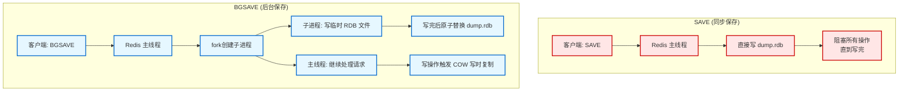
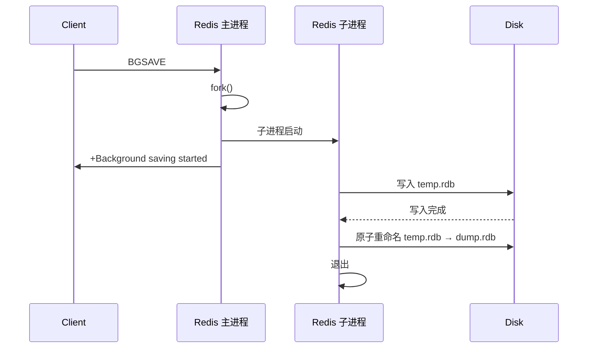

# savebgsave架构图

```mermaid
flowchart TD
    subgraph SAVE_["SAVE (同步保存)"]
        A[客户端: SAVE] --> B[Redis 主线程]
        B --> C[直接写 dump.rdb]
        C --> D[阻塞所有操作<br>直到写完]
    end

    subgraph BGSAVE_["BGSAVE (后台保存)"]
        E[客户端: BGSAVE] --> F[Redis 主线程]
        F --> G[fork创建子进程]
        G --> H[子进程: 写临时 RDB 文件]
        G --> I[主线程: 继续处理请求]
        H --> J[写完后原子替换 dump.rdb]
        I --> K[写操作触发 COW 写时复制]  
    end

    classDef save fill:#ffe6e6,stroke:#c00,stroke-width:2px;
    classDef bgsave fill:#e6f7ff,stroke:#06c,stroke-width:2px;
    
    class A,B,C,D save
    class E,F,G,H,I,J,K bgsave
```

# RDB文件生成流程(BGSAVE)   
 

```mermaid
%%{init: {'securityLevel': 'loose', 'flowchart': {'htmlLabels': true}}}%%
sequenceDiagram
    participant Client
    participant RedisMain as Redis 主进程
    participant RedisChild as Redis 子进程
    participant Disk

    Client->>RedisMain: BGSAVE
    RedisMain->>RedisMain: fork()
    RedisMain->>RedisChild: 子进程启动
    RedisMain->>Client: +Background saving started
    RedisChild->>Disk: 写入 temp.rdb
    Disk-->>RedisChild: 写入完成
    RedisChild->>Disk: 原子重命名 temp.rdb → dump.rdb
    RedisChild->>RedisChild: 退出
```  

