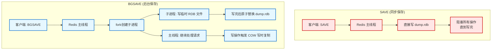
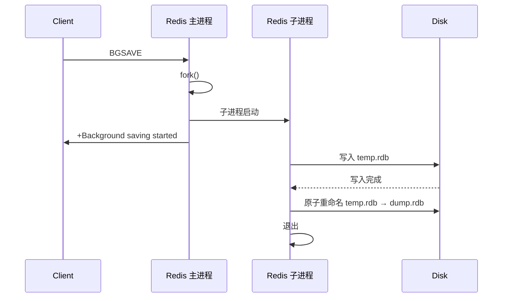

# Redis持久化架构图

```mermaid
flowchart TD
    subgraph SAVE_["SAVE (同步保存)"]
        A[客户端: SAVE] --> B[Redis 主线程]
        B --> C[直接写 dump.rdb]
        C --> D[阻塞所有操作<br>直到写完]
    end

    subgraph BGSAVE_["BGSAVE (后台保存)"]
        E[客户端: BGSAVE] --> F[Redis 主线程]
        F --> G[fork创建子进程]
        G --> H[子进程: 写临时 RDB 文件]
        G --> I[主线程: 继续处理请求]
        H --> J[写完后原子替换 dump.rdb]
        I --> K[写操作触发 COW 写时复制]  
    end

    classDef save fill:#ffe6e6,stroke:#c00,stroke-width:2px;
    classDef bgsave fill:#e6f7ff,stroke:#06c,stroke-width:2px;
    
    class A,B,C,D save
    class E,F,G,H,I,J,K bgsave
```

# RDB文件生成流程(BGSAVE)   
 

```mermaid
%%{init: {'securityLevel': 'loose', 'flowchart': {'htmlLabels': true}}}%%
sequenceDiagram
    participant Client
    participant RedisMain as Redis 主进程
    participant RedisChild as Redis 子进程
    participant Disk

    Client->>RedisMain: BGSAVE
    RedisMain->>RedisMain: fork()
    RedisMain->>RedisChild: 子进程启动
    RedisMain->>Client: +Background saving started
    RedisChild->>Disk: 写入 temp.rdb
    Disk-->>RedisChild: 写入完成
    RedisChild->>Disk: 原子重命名 temp.rdb → dump.rdb
    RedisChild->>RedisChild: 退出
```  

```mermaid
flowchart TD
    %% ========== AOF 写入流程 ==========
    subgraph AOF_Write["AOF 写入流程"]
        A[客户端写命令<br>SET、DEL等] --> B{AOF 是否开启?}
        B -- 否 --> C[仅写内存]
        B -- 是 --> D[追加命令到 aof_buf<br>内存缓冲区]
        D --> E{是否满足<br>fsync策略?}
        E -- always --> F[立即 write + fsync<br>到 appendonly.aof]
        E -- everysec --> G[每秒后台线程<br>write + fsync]
        E -- no --> H[由 OS 决定刷盘时机]
        F --> I[AOF 文件更新]
        G --> I
        H --> I
    end

    %% ========== AOF 重写流程 ==========
    subgraph AOF_Rewrite["AOF 重写 (BGREWRITEAOF)"]
        J[客户端: BGREWRITEAOF<br>或 auto-aof-rewrite] --> K[Redis 主进程fork]
        K --> L[子进程: 生成新 AOF<br>基于当前数据集]
        K --> M[主进程: 继续处理请求<br>并记录新写入到 aof_rewrite_buf]
        L --> N[子进程写入临时文件<br> eg：temp-rewriteaof-bg-12345.aof]
        M --> O[主进程将 aof_rewrite_buf<br>追加到临时文件]
        N --> P[子进程通知主进程<br>重写完成]
        O --> P
        P --> Q[主进程原子替换<br>旧 AOF → 新 AOF]
    end

    %% ========== 数据恢复流程 ==========
    subgraph AOF_Restore["AOF 数据恢复"]
        R[Redis 启动] --> S{存在 AOF 文件?}
        S -- 是 --> T[创建伪客户端]
        T --> U[逐条执行 AOF 中命令]
        U --> V[重建内存数据集]
        S -- 否 --> W[尝试加载 RDB]
    end

    %% 样式定义
    classDef write fill:#f0f9ff,stroke:#1890ff;
    classDef rewrite fill:#fff7e6,stroke:#fa8c16;
    classDef restore fill:#f6ffed,stroke:#52c41a;

    class A,B,C,D,E,F,G,H,I write
    class J,K,L,M,N,O,P,Q rewrite
    class R,S,T,U,V,W restore
```

