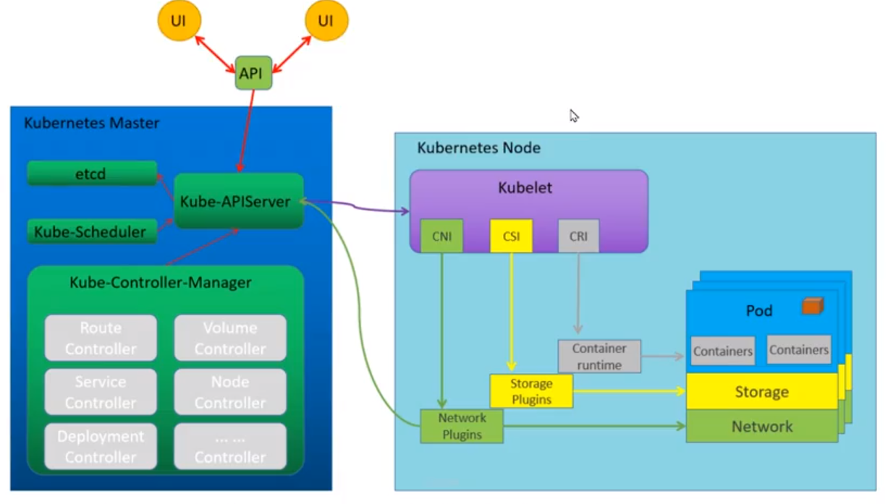

# k8s-架构
 
- 基本工作过程
- 架构：逻辑架构、物理架构

## 基本工作过程
Kubernetes 的核心工作过程  
- 1、资源对象:  #Node、Pod、Service、Deploymnet、label等都可以看作一种资源对象
- 2、操作       #通过使用kubectl工具,执行增删改查
- 3、存储       #对象的目标状态(预设状态)保存在etcd中持久化储存
- 4、自动控制   #跟踪、对比etcd中存储的目标状态与资源的当前状态,对差异资源纠偏,自动控制集群状态  

Kubernetes实际是：高度自动化的资源控制系统,将其管理的一切抽象为资源对象,大到服务器Node节点,小到服务实例Pod  

Kubernetes的资源控制是一种声明+引擎的理念  
- 1、声明：对某种资源,声明他的目标状态 
- 2、自动：Kubernetes自动化资源控制系统,会一直努力将该资源对象维持在目标状态  

## 架构(物理+逻辑)
Kubernetes集群是主从架构  
 

# k8s-master组件

Master主要职责是调度;运行k8s组件有kube-apiserver、kube-scheduler、kube-controller-manager、etcd和Pod网络(flannel、calico)可以同时运行多个Master实现高可用 
 
- **Master管理节点,集群的控制和调度(管理整个Kubernetes集群,接收外部命令,维护集群状态)** 
  * **kube-apiserver(Kubernetes API Server)**   
    API Server(kube-apiserver)提供HTTP/HTTPS RESTful API,实现认证、授权、访问控制、API注册和发现等功能,各种客户端工具(CLI 或 UI)以及k8s其他组件可以通过它管理Cluster资源  
    - 集群控制的入口
    - 资源的增删改查,持久化存储到etcd
    - kubectl直接与API Server交互,默认端口6443
  * **kube-controller-manager(所有资源的自动化控制中心)**   
    Controller-Manager(kube-controller-manager)负责管理Cluster各种资源,保证资源处于预期的状态;  
    Controller-Manager由多种controller组成包括replication controller、endpoints controller、namespace controller、serviceaccounts controller等; 
    不同的controller管理不同的资源。例如replication controller管理Deployment、StatefulSet、DaemonSet的生命周期,namespace controller管理Namespace资源  
    - 每个资源,都对应有一个控制器
    - controller-manager管理这些控制器;自动化的循环控制器
    - Kubernetes的核心控制守护进程,默认监听10252端口
    - scheduler和controller-manager都是通过apiserver从etcd中获取各种资源的状态,进行相应的调度和控制操作
  * **kube-scheduler(负责将pod资源调度到合适的node上)**  
    Scheduler(kube-scheduler)负责决定将Pod放在哪个Node上运行;Scheduler在调度时会充分考虑Cluster的拓扑结构、当前各个节点的负载以及应用对高可用、性能、数据亲和性的需求  
    - 调度算法：根据node节点的性能、负载、数据位置等,进行调度
    - 默认监听10251端口
  * **etcd(一个高可用的key-value存储系统)**   
    etcd负责保存Cluster的配置信息和各种资源的状态信息;当数据发生变化时etcd会快速地通知k8s相关组件  
    - 作用：存储资源的状态
    - 支持Restful的API
    - 默认监听2379和2380端口(2379提供服务,2380用于集群节点通信)
  * **pod网络** 
    Pod网络：Pod是k8s的最小工作单元;每个Pod包含一个或多个容器;Pod中的容器会作为一个整体被Master调度到一个Worker上运行;Pod要能够相互通信,Cluster必须部署Pod网络,flannel、calico其中一个可选方案   

# k8s-node组件
Worker是Pod运行的地方;k8s支持Docker、rkt等容器Runtime;Worker上运行的组件有kubelet、kube-proxy和Pod网络;Worker由Master管理,负责监控并向Master汇报容器的状态,并根据Master的要求管理容器的生命周期  

- **Node工作节点(Master将任务调度到Node以docker方式运行;当Node节点宕机时,Master会自动将Node上的任务调度到其他Node上)**   
  * **kubelet(节点Pod的生命周期管理,定期向Master上报本节点及Pod的基本信息)**   
    kubelet是Worker的agent;当Scheduler确定在某个Worker上运行Pod后,会将Pod的具体配置信息(image、volume等)发送给该节点的kubelet,kubelet根据这些信息创建和运行容器,并向Master报告运行状态  
    - Kubelet是在每个Node节点上运行agent
    - 负责维护和管理所有容器：从apiserver接收Pod的创建请求,启动和停止Pod
    - Kubelet不会管理不是由Kubernetes创建的容器
    - 定期向Master上报信息,如操作系统、CPU、内存、pod运行状态等信息
    - 默认监听10250
  * **kube-proxy(集群中Service的通信以及负载均衡)**    
    kube-proxy：service在逻辑上代表了后端的多个Pod;外界通过service访问Pod;service接收到的请求是如何转发到Pod的呢？这就是kube-proxy要完成的工作  
    每个Worker都会运行kube-proxy服务,负责将访问service的TCP/UPD数据流转发到后端的容器;如果有多个副本kube-proxy会实现负载均衡  
    - 功能：服务发现、反向代理
    - 反向代理：支持TCP和UDP连接转发,默认基于Round Robin算法将客户端流量转发到与service对应的一组后端pod
    - 服务发现：使用etcd的watch机制,监控集群中service和endpoint对象数据的动态变化,并且维护一个service到endpoint的映射关系(本质是路由关系)
    - 默认监听10256
    - 实现方式：userspace、iptables、ipvs
      * userspace：在用户空间,通过kuber-proxy实现负载均衡的代理服务,是最初的实现方案,较稳定、效率不高
      * iptables：在内核空间,是纯采用iptables来实现LB,是Kubernetes目前默认的方式
      * ipvs  
  * **runtime(CRI)：一般使用docker容器、rkt、containerd等其他的容器**  
  * **pod网络(CNI)**   

 # k8s组件端口监控
```
ss -tlnup|grep -E "102|etcd"
tcp    LISTEN     0      128    127.0.0.1:10248                 *:*                   users:(("kubelet",pid=29840,fd=21))
tcp    LISTEN     0      128    127.0.0.1:10249                 *:*                   users:(("kube-proxy",pid=30962,fd=10))
tcp    LISTEN     0      128    192.168.19.227:2379                  *:*                   users:(("etcd",pid=30377,fd=6))
tcp    LISTEN     0      128    127.0.0.1:2379                  *:*                   users:(("etcd",pid=30377,fd=5))
tcp    LISTEN     0      128    192.168.19.227:2380                  *:*                   users:(("etcd",pid=30377,fd=3))
tcp    LISTEN     0      128    127.0.0.1:10257                 *:*                   users:(("kube-controller",pid=30387,fd=5))
tcp    LISTEN     0      128    127.0.0.1:10259                 *:*                   users:(("kube-scheduler",pid=30397,fd=5))
tcp    LISTEN     0      128      :::10250                :::*                   users:(("kubelet",pid=29840,fd=30))
tcp    LISTEN     0      128      :::10251                :::*                   users:(("kube-scheduler",pid=30397,fd=3))
tcp    LISTEN     0      128      :::10252                :::*                   users:(("kube-controller",pid=30387,fd=3))
tcp    LISTEN     0      128      :::10256                :::*                   users:(("kube-proxy",pid=30962,fd=9))
```


http://ningg.top/kubernetes-series-03-architecture/
