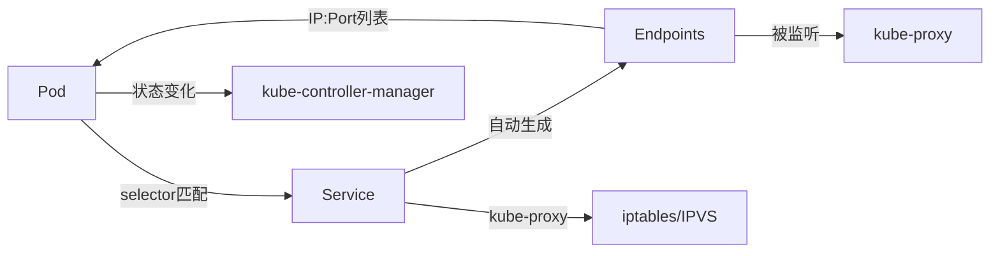
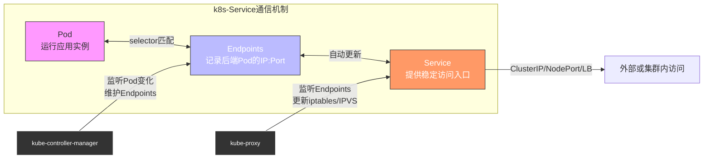

# k8s-Endpoints

## Endpoints是什么
Endpoints是k8s资源对象,是实现服务发现和服务通信;它连接了Service和Pod;SVC能够动态感知后端Pod的变化(如扩缩容、故障重启),实现无缝的服务访问    
Endpoints(端点)通常是一组Pod的IP地址和端口,用于实现Service到Pod的网络流量转发   
Endpoints保存了某个Service所对应的所有后端Pod的IP和端口信息;换句话说(它记录了"这个服务实际可以访问到哪些Pod")  
  - 每个Service都会自动(或手动)关联一个同名的Endpoints对象  
  - Endpoints的作用是：将Service的抽象逻辑访问地址(ClusterIP)映射到具体的Pod网络地址(IP:Port)  

```yaml
kubectl get po,svc,endpoints
```

## k8s-Endpoints的作用
- 1、服务发现：
    - Endpoints使得Service能够找到后端的Pod,即使这些Pod是动态变化的。当Pod被创建或删除时,Endpoints会自动更新,以确保Service总是指向正确的Pod。
- 2、负载均衡：
    - Endpoint配合Service使用,可以实现负载均衡。当外部请求到达Service时,Service会根据Endpoint提供的Pod列表进行负载均衡,将流量分发到不同的Pod上。
- 3、网络抽象：
    - Endpoints提供了网络抽象,使得客户端不需要知道后端Pod的具体信息,只需通过Service来访问。

## k8s-Endpoint的工作原理(工作流程)
- 1、当你创建一个带有selector的Service时,k8s会自动创建一个与之关联的Endpoint对象  
- 2、Endpoint控制器(EndpointsController)监听Pod的变化;通过Service的选择器(selector)找到所有匹配的Pod;获取Pod的IP和容器端口   
- 3、Endpoint控制器会将这些Pod的IP地址和端口信息存储在Endpoints对象中  
- 4、kube-proxy根据Endpoints更新节点上的iptables或IPVS规则,实现流量转发(当Service接收到流量时,它会将流量转发到Endpoint中的一个Pod)  
>Endpoints与kube-proxy的关系 
>>kube-proxy运行在每个节点上,负责实现Service的网络代理  
>>它监听Endpoints的变化,并根据Endpoints更新本地的iptables或IPVS规则  
>>当请求访问Service的ClusterIP时,kube-proxy根据Endpoints中的Pod列表进行负载均衡(如轮询)  

## k8s-Endpoint的类型
- 1、ClusterIP 
  - 默认的Endpoint类型,它在集群内部提供一个虚拟IP地址,用于服务发现和负载均衡  
- 2、NodePort
  - 在集群的所有节点上打开一个端口,将外部流量转发到Service的ClusterIP 
- 3、LoadBalancer：
  - 为Service分配一个外部负载均衡器,自动配置云提供商的负载均衡服务  
- 4、ExternalName：
  - 允许将Service定义为对外部服务的引用,例如,将Service指向一个外部数据库的DNS名称。
  
## [Endpoints、Service、Pod的关系](https://github.com/gitseen/gitOps/blob/main/k8s/k8s-label.md#k8s-labelscontrolsvcendpoints%E5%85%B3%E7%B3%BB)
1. Service(svc服务)
   - Service是一个抽象,定义了一个逻辑集合(如"前端服务")和访问该集合的策略(如ClusterIP、NodePort、LoadBalancer)
   - Service通过标签选择器(selector)来匹配一组Pod  
2. Pod
   - Pod是实际运行应用的最小单位;每个Pod有唯一的IP地址(由CNI网络插件分配)。
3. Endpoints(端点)  
   - Endpoints是Service和Pod之间的**桥梁**  
   - 当Service的selector匹配到Pod时,kube-controller-manager中的EndpointsController会自动创建或更新同名的Endpoints对象,将这些Pod的IP:Port填入其中  

**简洁版流程图**  


**关系流程图**

>Pod：实际运行容器的单元,有独立IP  
Service：抽象的服务入口(如ClusterIP),通过selector匹配Pod  
Endpoints：由控制器自动创建,保存被Service选中的Pod的真实网络地址(IP + Port)  
kube-controller-manager：内部的EndpointsController负责监听Pod和Service,更新Endpoints  
kube-proxy：在每个节点运行,监听Endpoints变化,更新本地网络规则(iptables或IPVS),实现流量转发  

