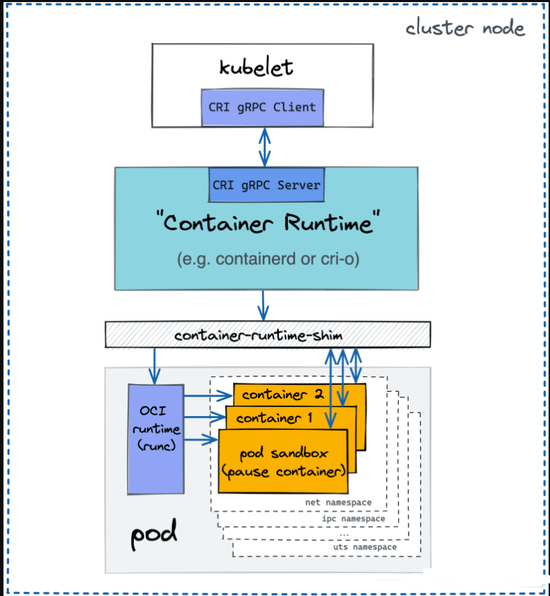
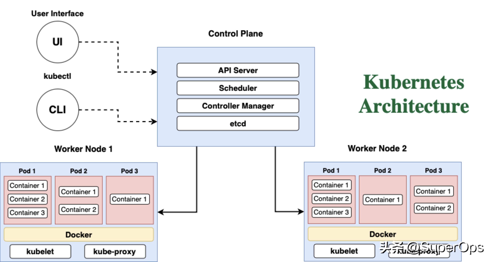
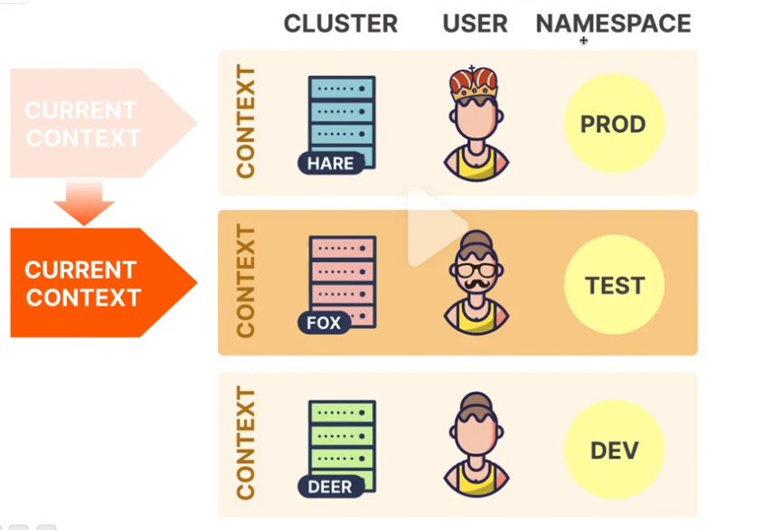

# k8s-commands CLI
 
 
# k8s-commands
  
K8S所有的命令行操作本质是对资源的CRUD有一个对应关系,用YAML描述资源的关系,用cli对资源进行各种操作,因为K8S命令实在太多,很多各种各样的操作参数非常难以记忆   

# kubectl格式化选项
  - -l "labelname=labelvalue"
       ```
       这个参数允许我们使用一个或多个匹配的标签来过滤资源。
       例如,要通过myapp=nginx标签过滤pod,你可以运行
       kubectl get pods -l app=nginx
       ```
  - --sort-by
       ```
       这个参数允许我们根据我们指定的资源属性来对输出进行排序
       例如,要按名称排序,你可以运行
       kubectl get pods --sort-by=.metadata.name
       ```
  - -f,--field-selector="attributename=attributevalue"
       ```
       这个参数允许我们使用一些资源属性来过滤输出
       例如,要通过status.phase=Running过滤pod,你可以运行
       kubectl get pods --field-selector=status.phase=Running
       ```
  - -o wide
       ```
       这个参数允许我们显示额外的信息,如pod的IP地址,pod被安排到哪个节点
       例如,要显示每个pod的IP地址,你可以运行
       kubectl get pods -o wide
       ```
  - -output "-output=format" 
       ```
       这个参数给了我们一个指定所需输出格式的方法,比如JSON、YAML、wide、name、JSONPath或GO模板
       例如,要以JSON格式显示每个pod的名称和命名空间,你可以运行
       kubectl get pods -o json
       ```
  - 使用shell工具,如awk、grep或sed来进一步清理输出
  - 使用第三方工具,如jq来过滤输出,只提取你需要的信息
       ```
       例如,要提取每个pod的名称和IP地址,你可以运行
       kubectl get pods -o json | jq '.items[] | {name: .metadata.name, ip: .status.podIP}' 
       ```

# 基础操作
<details>
  <summary>base-eg</summary>
  <pre><code>
alias k=kubectl echo ‘alias k=kubectl’ >>~/.bashrc
kubectl get pods -o=json
kubectl get pods -o=yaml
kubectl get pods -o=wide
kubectl get pods -n=<namespace_name>
kubectl create -f ./
kubectl logs -l name=
  </code></pre>
</details>

# 资源相关
<details>
  <summary>resources</summary>
  <pre><code>
kubectl create -f  a.yaml     #Create objects.
kubectl create -f  ./*        #Create objects in all manifest files in a directory.
kubectl create -f [url]       #Create objects from a URL.
kubectl delete -f  ...        #Delete an object.
  </code></pre>
</details>

# 集群相关
<details>
  <summary>k8s-cluster</summary>
  <pre><code>
kubectl cluster-info #Display endpoint information about the master and services in the cluster.
kubectl version      #Display the Kubernetes version running on the client and server.
kubectl config view  #Get the configuration of the cluster.
kubectl config view -o jsonpath='{.users[*].name}' #Get a list of users.
kubectl config current-context #Display the current context.
kubectl config get-contexts    #Display a list of contexts.
kubectl config use-context    #Set the default context.
kubectl api-resources         #List the API resources that are available.
kubectl api-versions          #List the API versions that are available. kubectl get all --all-namespaces
  </code></pre>
</details>

# DaemonSets相关
<details>
  <summary>DaemonSets</summary>
  <pre><code>
kubectl get daemonset                     #List one or more daemonsets.
kubectl edit daemonset <daemonset_name>   #Edit and update the definition of one or more daemonset.
kubectl delete daemonset <daemonset_name> #Delete a daemonset.
kubectl create daemonset <daemonset_name> #Create a new daemonset.
kubectl rollout daemonset                 #Manage the rollout of a daemonset.
kubectl describe ds <daemonset_name> -n <namespace_name> #Display the detailed state of daemonsets within a namespace.
  </code></pre>
</details>

# Deployments相关
<details>
  <summary>Deployments</summary>
  <pre><code>
kubectl get deployment                              #List one or more deployments.
kubectl describe deployment <deployment_name>       #Display the detailed state of one or more deployments.
kubectl edit deployment <deployment_name>           #Edit and update the definition of one or more deployments on the server.
kubectl create deployment <deployment_name>         #Create a new deployment.
kubectl delete deployment <deployment_name>         #Delete deployments.
kubectl rollout status deployment <deployment_name> #See the rollout status of a deployment.
kubectl set image deployment/ =image:               #Perform a rolling update (K8S default), set the image of the container to a new version for a particular deployment.
kubectl rollout undo deployment/                    #Rollback a previous deployment.
kubectl replace --force -f                          #Perform a replace deployment — Force replace, delete and then re-create the resource.
  </code></pre>
</details>

# StatefulSet相关
<details>
  <summary>StatefulSet</summary>
  <pre><code>
kubectl get statefulset   #List StatefulSet
kubectl delete statefulset/[stateful_set_name] --cascade=false #Delete StatefulSet only (not pods).
  </code></pre>
</details>

# 事件相关
<details>
  <summary>k8s-event</summary>
  <pre><code>
kubectl get events                               #List recent events for all resources in the system.
kubectl get events --field-selector type=Warning #List Warnings only.
kubectl get events --sort-by=.metadata.creationTimestamp      #List events sorted by timestamp.
kubectl get events --field-selector involvedObject.kind!=Pod  #List events but exclude Pod events.
kubectl get events --field-selector type!=Normal              #Filter out normal events from a list of events.
kubectl get events --field-selector involvedObject.kind=Node, involvedObject.name=<node_name>  #Pull events for a single node with a specific name.
  </code></pre>
</details>

# 日志相关
<details>
  <summary>k8s-logs</summary>
  <pre><code>
kubectl logs <pod_name>              #Print the logs for a pod.
kubectl logs --since=6h <pod_name>   #Print the logs for the last 6 hours for a pod.
kubectl logs --tail=50 <pod_name>    #Get the most recent 50 lines of logs.
kubectl logs -f <pod_name>           #Print the logs for a pod and follow new logs.
kubectl logs -f <service_name> [-c <$container>]  #Get logs from a service and optionally select which container.
kubectl logs -c <container_name> <pod_name>       #Print the logs for a container in a pod.
kubectl logs <pod_name> pod.log                   #Output the logs for a pod into a file named ‘pod.log’.
kubectl logs --previous <pod_name>                #View the logs for a previously failed pod.
kubectl logs --tail=2000 -f <pod_name>  #时时监控
  </code></pre>
</details>

# Namespace相关
<details>
  <summary>k8s-namespace</summary>
  <pre><code>
kubectl create namespace <namespace_name>    #Create a namespace.
kubectl get namespace <namespace_name>       #List one or more namespaces.
kubectl describe namespace <namespace_name>  #Display the detailed state of one or more namespaces.
kubectl delete namespace <namespace_name>    #Delete a namespace.
kubectl edit namespace <namespace_name>      #Edit and update the definition of a namespace.
kubectl top namespace <namespace_name>       #Display Resource (CPU/Memory/Storage) usage for a namespace.
  </code></pre>
</details>

# Nodes相关 
<details>
  <summary>k8s-nodes</summary>
  <pre><code>
kubectl taint node <node_name>  #Update the taints on one or more nodes.
kubectl get node                #List one or more nodes.
kubectl delete node <node_name> #Delete a node or multiple nodes.
kubectl top node <node_name>    #Display Resource usage (CPU/Memory/Storage) for nodes.
kubectl get pods -o wide | grep <node_name>  #Pods running on a node.
kubectl annotate node <node_name>  #Annotate a node.
kubectl cordon node <node_name>    #Mark a node as unschedulable.
kubectl uncordon node <node_name>  #Mark node as schedulable.
kubectl drain node <node_name>     #Drain a node in preparation for maintenance.
kubectl label node                 #Add or update the labels of one or more nodes.
去污点
kubectl describe node alone | grep Taint
kubectl describe node  | grep -i taint
Taints:             node-role.kubernetes.io/master:NoSchedule
kubectl taint nodes alone node-role.kubernetes.io/master:NoSchedule-
                          node-role.kubernetes.io/master:NoSchedule-
  </code></pre>
</details>

# Pods操作相关
<details>
  <summary>k8s-pod</summary>
  <pre><code>
kubectl get pod                                                         #List one or more pods.
kubectl get pods --sort-by='.status.containerStatuses[0].restartCount'  # List pods Sorted by Restart Count.
kubectl get pods --field-selector=status.phase=Running    #Get all running pods in the namespace.
kubectl delete pod <pod_name>                             #Delete a pod.
kubectl describe pod <pod_name>                           #Display the detailed state of a pods.
kubectl create pod <pod_name>                             #Create a pod.
kubectl exec <pod_name> -c <container_name>  #Execute a command against a container in a pod. Read more: Using Kubectl Exec: Connect to Your Kubernetes Containers
kubectl exec -it <pod_name> /bin/sh   #Get an interactive shell on a single-container pod.
kubectl top pod                       #Display Resource usage (CPU/Memory/Storage) for pods.
kubectl annotate pod <pod_name>       #Add or update the annotations of a pod.
kubectl label pods <pod_name> new-label=   #Add or update the label of a pod.
kubectl get pods --show-labels  #Get pods and show labels.
kubectl port-forward :          #Listen on a port on the local machine and forward to a port on a specified pod.
  </code></pre>
</details>

# Replicate-Controller相关
<details>
  <summary>k8s-rc</summary>
  cpre><code>
kubectl get rc          #List the replication controllers.
kubectl get rc --namespace='<namespace_name>'  #List the replication controllers by namespace
  </code></pre>
</details>

# ReplicaSets相关
<details>
  <summary>k8s-rs</summary>
  <pre><code>
kubectl get replicasets                         #List ReplicaSets.
kubectl describe replicasets <replicaset_name>  #Display the detailed state of one or more ReplicaSets.
kubectl scale --replicas=[x]                    #Scale a ReplicaSet.
  </code></pre>
</details>

# Secrets相关
<details>
  <summary>k8s-secrets</summary>
  <pre><code>
kubectl create secret                #Create a secret.
kubectl get secrets                  #List secrets.
kubectl describe secrets             #List details about secrets.
kubectl delete secret <secret_name>  #Delete a secret.
  </code></pre>
</details>

# Services相关
<details>
  <summary>k8s-services</summary>
  <pre><code>
kubectl get services             #List one or more services.
kubectl describe services        #Display the detailed state of a service.
kubectl edit services            #Edit and update the definition of one or more services.
kubectl expose deployment [deployment_name]  #Expose a replication controller, service, deployment, or pod as a new Kubernetes service.
  </code></pre>
</details>

# Service-Accounts相关
<details>
  <summary>k8s-serveraccount</summary>
  <pre><code>
kubectl get serviceaccounts      #List service accounts.
kubectl describe serviceaccounts #Display the detailed state of one or more service accounts.
kubectl replace serviceaccount   #Replace a service account.
kubectl delete serviceaccount <service_account_name>  #Delete a service account.
  </code></pre>
</details>

[k8s-CLI](https://www.toutiao.com/article/7169043088801792512/)  


# kubectl config管理多k8s集群
```
kubectl config -h
current-context  显示 current_context
delete-cluster   删除 kubeconfig 文件中指定的集群
delete-context   删除 kubeconfig 文件中指定的 context
get-clusters     显示 kubeconfig 文件中定义的集群
get-contexts     描述一个或多个 contexts
rename-context Renames a context from the kubeconfig file
set             设置kubeconfig 文件中的一个单个值
set-cluster     设置 kubeconfig 文件中的一个集群条目
set-context     设置 kubeconfig 文件中的一个 context 条目
set-credentials 设置 kubeconfig 文件中的一个用户条目
unset           取消设置 kubeconfig 文件中的一个单个值
use-context     设置 kubeconfig 文件中的当前上下文
view            显示合并的 kubeconfig 配置或一个指定的 kubeconfig 文件

kubectl config get-clusters      #k8s集群名字
kubectl config get-contexts      #k8s集群上下文
kubectl config use-context xxx   #设为当前上下文
```
  
**使用第三方插件更方法** 
- kubectx
- kubens
- kubie  
[多K8s集群-K8s技术圈](https://www.toutiao.com/video/7202514417886757410/)  
**config-example**
```
kubectl config get-clusters
NAME
zzjz-test-k8s
kubectl config get-contexts 
CURRENT   NAME                             CLUSTER         AUTHINFO              NAMESPACE
*         zzjz-test-k8s-admin@kubernetes   zzjz-test-k8s   zzjz-test-k8s-admin   
cat config|grep "zzjz-test"
  name: zzjz-test-k8s
    cluster: zzjz-test-k8s
    user: zzjz-test-k8s-admin
  name: zzjz-test-k8s-admin@kubernetes
current-context: zzjz-test-k8s-admin@kubernetes
- name: zzjz-test-k8s-admin

#设置默认namespace为xx而不是default
kubectl config set-context $(kubectl config current-context) --namespace=mynamespace  

#创建namepace
apiVersion: v1 
kind: Namespace 
metadata: 
  name: mynamespace

kubectl create -f my-namespace.yaml  == kubectl create namespace my-namespace
namespace/my-namespace created 
```

**如何为Kubectl配置对多个群集的访问**  

默认情况下kubectl将使用.kube文件夹中的配置
```
apiVersion: v1
clusters:
- cluster:
    certificate-authority: fake-ca-file
    server: https://1.2.3.4
  name: development
  contexts:
- context:
    cluster: development
        namespace: frontend
            user: developer
              name: dev-frontend
current-context: ""
kind: Config
preferences: {}
users:
- name: developer
  user:
    client-certificate: fake-cert-file
    client-key: fake-key-seefile
kubectl config --kubeconfig=config set-cluster development --server=https://1.2.3.4 --certificate-authority=fake-ca-file
kubectl config --kubeconfig=config set-context dev-frontend --cluster=development --namespace=frontend --user=developer
kubectl config --kubeconfig=config set-credentials developer --client-certificate=fake-cert-file --client-key=fake-key-seefile
KUBECONFIG=~/.kube/cluster-a/config:.kube/cluster-b/config:.kube/cluster-c/config kubectl config view --merge --flatten > ~/.kube/config
kubectl config get-contexts

kubectl config view --template='{{ range .contexts }}{{ if eq .name "'$(kubectl config current-context)'" }}Current user: {{ printf "%s\n" .context.user }}{{ end }}{{ end }}'
```
 
---

# Kubernetes日常运维工作中常用的命令
```
#获取前一个容器的日志
kubectl -n my-namespace logs  xx OR kubectl logs xx -n my-namespace

#获取每个节点的Pod数量 
kubectl get po -o json --all-namespaces | jq '.items | group_by(.spec.nodeName) | map({"nodeName": .[0].spec.nodeName, "count": length}) | sort_by(.count)'

#根据pods的重启次数进行排序
kubectl get pods -A --sort-by='.status.containerStatuses[0].restartCount'

#根据启动时间降序（descending order）
kubectl get pods --sort-by=.metadata.creationTimestamp

#根据启动时间升序（ascending order）
kubectl get pods --sort-by=.metadata.creationTimestamp | awk 'NR == 1; NR > 1 {print $0 | "tac"}'
kubectl get pods --sort-by=.metadata.creationTimestamp | tail -n +2 | tac
kubectl get pods --sort-by={metadata.creationTimestamp} --no-headers | tac
kubectl get pods --sort-by=.metadata.creationTimestamp | tail -n +2 | tail -r

#查看集群內Pod的服务质量等级（QoS）
kubectl get pods --all-namespaces -o custom-columns=NAME:.metadata.name,NAMESPACE:.metadata.namespace,QOS-CLASS:.status.qosClass

#无缝重启deploy,daemonset,statfulset(zero downtime)
kubectl -n <namespace> rollout restart deployment <deployment-name>

#把Secret复制到其他namespace
kubectl get secrets -o json --namespace namespace-old | jq '.items[].metadata.namespace = "namespace-new"' |   kubectl create -f  -
kubectl get secret <SECRET-NAME> -n <SOURCE-NAMESPACE> -o yaml | sed "/namespace:/d" | kubectl apply --namespace=<TARGET-NAMESPACE> -f - #比如使用证书镜像凭证等

#获取K8s的token
kubectl -n kube-system describe $(kubectl -n kube-system get secret -n kube-system -o name | grep namespace) | grep token

#查找非running状态的Pod
kubectl get pods -A --field-selector=status.phase!=Running | grep -v Complete

#清理K8s异常pod
kubectl get pods --all-namespaces -o wide | grep Evicted   | awk '{print $1,$2}' | xargs -L1 kubectl delete pod -n  #clean Evicted
kubectl get pods --all-namespaces -o wide | grep Error     | awk '{print $1,$2}' | xargs -L1 kubectl delete pod -n  #clean error 
kubectl get pods --all-namespaces -o wide | grep Completed | awk '{print $1,$2}' | xargs -L1 kubectl delete pod -n  #clean compete
kubectl get pods --all-namespaces -o wide | grep -E "Evicted|Error|Completed" | awk '{print $1,$2}' | xargs -L1 kubectl delete pod -n

#k8s-Evicted-脚本
#!/bin/bash
## 获取当前状态为Evicted的pod;并输出到一个临时文件内
#kubectl get pods --all-namespaces | awk '/Evicted/ {print $1 "\t" $2}'  > evicted_pods.txt
#kubectl get pods --all-namespaces | awk '/Evicted/ {print $1 " " $2}'  > evicted_pods.txt
## 这是按空格示例，截取文本解析成字段:命名空间和pod名
while IFS=' ' read -r namespace pod_name; do
## 这是按制表符tab键示例，截取文本解析成字段
#while IFS=$'\t' read -r namespace pod_name; do
  ## 验证命名空间和 Pod 名称是否存在
  if [[ ! -z "$namespace" && ! -z "$pod_name" ]]; then
    echo "kubectl delete pod $pod_name -n $namespace:"
    kubectl delete pod "$pod_name" -n "$namespace"
  fi
done < evicted_pods.txt
## 可选是否清理临时文件rm -f evicted_pods.txt
from: https://www.toutiao.com/article/7353117756822405651

#使用简单脚本
for ns in $(kubectl get ns |awk 'NR>1{print $1}')
do 
  kubectl get pod -n ${ns} |grep "Evicted"|awk '{print $1}' | xargs kubectl delete pod -n ${ns}
done


#强制删除指定namespace下Terminating状态的pod
kubectl get pod -n $namespace |grep Terminating|awk '{print $1}'|xargs kubectl delete pod --grace-period=0 --force

#批量强制删除集群内Terminating状态的pod
for ns in $(kubectl get ns --no-headers | cut -d ' ' -f1); do \
  for po in $(kubectl -n $ns get po --no-headers --ignore-not-found | grep Terminating | cut -d ' ' -f1); do \
    kubectl -n $ns delete po $po --force --grace-period 0; \
  done; \
done;

#导出干净的YAML(需要插件kubectl-neat支持https://github.com/itaysk/kubectl-neat)
kubectl get cm nginx-config -o yaml | kubectl neat -o yaml

#clean unused pv
kubectl describe -A pvc | grep -E "^Name:.*$|^Namespace:.*$|^Used By:.*$" | grep -B 2 "<none>" | grep -E "^Name:.*$|^Namespace:.*$" | cut -f2 -d: | paste -d " " - - | xargs -n2 bash -c 'kubectl -n ${1} delete pvc ${0}'

#清理没有被绑定的PVC
kubectl get pvc --all-namespaces | tail -n +2 | grep -v Bound | awk '{print $1,$2}' | xargs -L1 kubectl delete pvc -n

#清理没有被绑定的PV
kubectl get pv | tail -n +2 | grep -v Bound | awk '{print $1}' | xargs -L1 kubectl delete pv

#临时释放的指定namespace下的pod
方法一：通过patch模式      kubectl get deploy -o name -n <NAMESPACE>|xargs -I{} kubectl patch {} -p '{"spec":{"replicas":0}}'
方法二：通过资源伸缩副本数 kubectl get deploy -o name |xargs -I{} kubectl scale --replicas=0 {}

#临时关闭Daemonsets(如果需要临时将Daemonsets关闭,只需要将其调度到一个不存在的node上即可,调整下nodeSelector)
kubectl patch daemonsets nginx-ingress-controller -p '{"spec":{"template":{"spec":{"nodeSelector":{"project/xdp":"none"}}}}}'

#根据overlay2目录名找容器
docker ps -q | xargs docker inspect --format '{{.Name}}, {{.State.Pid}}, {{.Id}}, {{.GraphDriver.Data.WorkDir}}'

#通过变量组合展示容器绑定端口列表
docker inspect --format '{{/*通过变量组合展示容器绑定端口列表*/}}已绑定端口列表：{{println}}{{range $p,$conf := .NetworkSettings.Ports}}{{$p}} -> {{(index $conf 0).HostPort}}{{println}}{{end}}' Web_web_1

#查询指定网络下的容器名称,如果存在输出容器名称,如果没有,输出With No Containers
docker inspect --format '{{range .Containers}}{{.Name}}{{println}}{{else}}With No Containers{{end}}' bridge

#通过索引序号读取默认网关
docker inspect bridge --format '{{/*查看网络的默认网关*/}}{{(index .IPAM.Config 0).Gateway}}'

#查看容器是否配置了容器策略
docker ps -q | xargs docker inspect --format '{{if not .State.Restarting}}{{.Name}}容器没有配置重启策略{{end}}'

#查看容器当前的运行状态
docker inspect --format '{{or .State.Status .State.Restarting}}' configuration-center

#显示所有容器的IP
docker inspect --format='{{range .NetworkSettings.Networks}}{{.IPAddress}}{{end}}' $(docker ps -q)

#显示所有容器的mac地址
docker inspect --format='{{range .NetworkSettings.Networks}}{{.MacAddress}}{{end}}' $(docker ps -a -q)

#显示所有容器的名称,并分离出反斜杠
docker inspect --format='{{.Name}}' $(docker ps -aq)|cut -d"/" -f2

#创建临时可调式POD
kubectl run ephemeral-busybox \
  --rm \
  --stdin \
  --tty \
  --restart=Never \
  --image=lqshow/busybox-curl:1.28 \
  -- sh
 
#获取容器的日志路径
docker inspect --format='{{.LogPath}}' docker-test1

#调试coredns
kubectl run -it --rm --restart=Never --image=infoblox/dnstools:latest dnstools

#查看资源使用情况
kubectl get nodes --no-headers | awk '{print $1}' | xargs -I {} sh -c "echo {} ; kubectl describe node {} | grep Allocated -A 5 | grep -ve Event -ve Allocated -ve percent -ve --;"

#查看资源总情况
kubectl get no -o=custom-columns="NODE:.metadata.name,ALLOCATABLE CPU:.status.allocatable.cpu,ALLOCATABLE MEMORY:.status.allocatable.memory"

#查看CPU分配情况
kubectl get nodes --no-headers | awk '{print $1}' | xargs -I {} sh -c 'echo -n "{}\t"|tr "\n" " " ; kubectl describe node {} | grep Allocated -A 5 | grep -ve Event -ve Allocated -ve percent -ve -- | grep cpu | awk '\''{print $2$3}'\'';'

#查看内存分配
kubectl get nodes --no-headers | awk '{print $1}' | xargs -I {} sh -c 'echo "{}\t"|tr "\n" " " ; kubectl describe node {} | grep Allocated -A 5 | grep -ve Event -ve Allocated -ve percent -ve -- | grep memory | awk '\''{print $2$3}'\'';'

#获取节点列表及其内存容量
kubectl get no -o json | jq -r '.items | sort_by(.status.capacity.memory)[]|[.metadata.name,.status.capacity.memory]| @tsv'


#查看所有镜像
kubectl get pods -o custom-columns='NAME:metadata.name,IMAGES:spec.containers[*].image'

#线程数统计
printf "    ThreadNUM  PID\t\tCOMMAND\n" && ps -eLf | awk '{$1=null;$3=null;$4=null;$5=null;$6=null;$7=null;$8=null;$9=null;print}' | sort |uniq -c |sort -rn | head -10

#设置环境变量
kubectl set env deploy <DEPLOYMENT_NAME> OC_XXX_HOST=bbb

#端口映射pod(将localhost:3000的请求转发到nginx-pod Pod的80端口)
kubectl port-forward nginx-po 3000:80
#端口映射svc将localhost:3201的请求转发到nginx-web service的3201端口
kubectl port-forward svc/nginx-web 3201

#配置默认storageclass
kubectl patch storageclass <your-class-name> -p '{"metadata": {"annotations":{"storageclass.kubernetes.io/is-default-class":"true"}}}'

#在多个pod中运行命令
kubectl get pods -o name | xargs -I{} kubectl exec {} -- <command goes here>

#查看容器名
kubectl get po calibre-web-76b9bf4d8b-2kc5j -o json | jq -j ".spec.containers[].name"

#进入容器namespace
docker ps | grep APP_NAME
docker inspect CONTAINER_ID | grep Pid
nsenter -t PID -n

#使用交互shell访问匹配到标签的Pod
  案例1 kubectl exec -i -t $(kubectl get pod -l <KEY>=<VALUE> -o name |sed 's/pods\///') -- bash
  案例2 kubectl exec -i -t $(kubectl get pod -l <KEY>=<VALUE> -o jsonpath='{.items[0].metadata.name}') -- bash

#重置集群节点
kubectl describe node k8s-master |grep Taints  #Taints: node-role.kubernetes.io/master:NoSchedule   #k8s集群master的hostname
kubectl taint nodes k8s-master node-role.kubernetes.io/master-                                      #修改参数可以参与pod调度
kubectl taint nodes k8s-master node-role.kubernetes.io/master=:NoSchedule                           #让master不参与pod调度
1、将节点标记为不可调度,确保新的容器不会调度到该节点
kubectl cordon <NODE-NAME>
2、Master节点上将需要重置的节点驱逐, 除了deamonset
kubectl drain <NODE-NAME> --delete-local-data --force --ignore-daemonsets
3、删除节点
kubectl delete node <NODE-NAME>
4、在需要重置节点上执⾏重置脚本,注意,如果在Master主节点执⾏kubeadm reset,则需要重新初始化集群
kubeadm reset

```
[from](https://mp.weixin.qq.com/s/rXSoUwcyVRIDtvYf_69jyA) 
