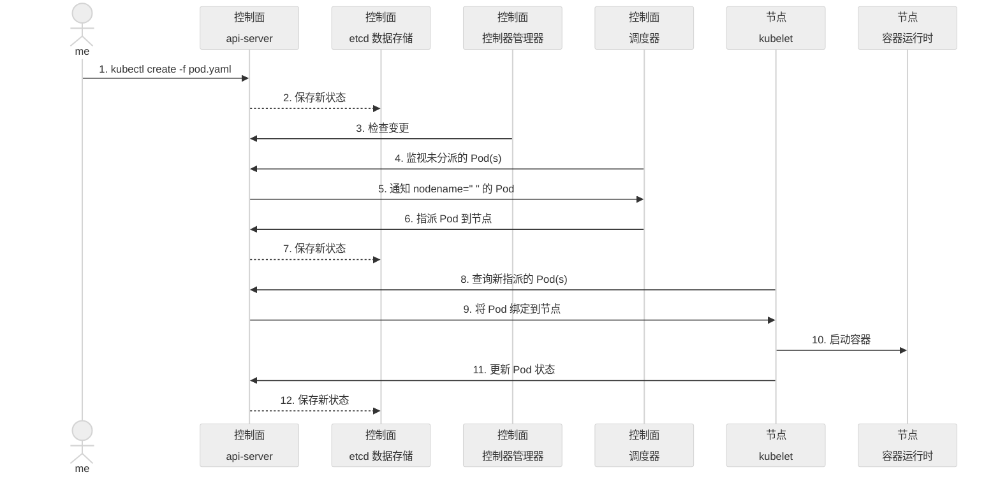

# K8S-Pod知识点
  - [k8s-1Pod概念](https://github.com/gitseen/gitOps/blob/main/k8s/k8s-pod.md#1Pod概念)
  - [k8s-2pod资源yaml清单](https://github.com/gitseen/gitOps/blob/main/k8s/k8s-pod.md#2pod资源yaml清单)
  - [k8s-3pod类型](https://github.com/gitseen/gitOps/blob/main/k8s/k8s-pod.md#3pod类型)
  - [k8s-4POD内容器间资源共享实现机制](https://github.com/gitseen/gitOps/blob/main/k8s/k8s-pod.md#4POD内容器间资源共享实现机制)
  - [k8s-5Pod常用管理命令](https://github.com/gitseen/gitOps/blob/main/k8s/k8s-pod.md#5Pod常用管理命令)
  - [k8s-6pod环境变量](https://github.com/gitseen/gitOps/blob/main/k8s/k8s-pod.md#6pod环境变量)
  - [k8s-7pod生命周期](https://github.com/gitseen/gitOps/blob/main/k8s/k8s-pod.md#7pod生命周期)
    * [pod生命周期-pod基础容器Pause](https://github.com/gitseen/gitOps/blob/main/k8s/k8s-pod.md#基础容器Pause)
    * [pod生命周期-pod阶段](https://github.com/gitseen/gitOps/blob/main/k8s/k8s-pod.md#pod阶段)
    * [pod生命周期-pod创建过程](https://github.com/gitseen/gitOps/blob/main/k8s/k8s-pod.md#创建过程)
    * [pod生命周期-Init-container](https://github.com/gitseen/gitOps/blob/main/k8s/k8s-pod.md#)
    * [pod生命周期-Main-container](https://github.com/gitseen/gitOps/blob/main/k8s/k8s-pod.md#)  
      - [postStart](https://github.com/gitseen/gitOps/blob/main/k8s/k8s-pod.md#postStart)  
      - [preStop](https://github.com/gitseen/gitOps/blob/main/k8s/k8s-pod.md#postStop)  
      - [startupProbe启动探针](https://github.com/gitseen/gitOps/blob/main/k8s/k8s-pod.md#startupProbe)
      - [livenessProbe存活探针](https://github.com/gitseen/gitOps/blob/main/k8s/k8s-pod.md#livenessProbe)
      - [readinessProbe就绪探针](https://github.com/gitseen/gitOps/blob/main/k8s/k8s-pod.md#readinessProbe)
    * [pod生命周期-pod终止过程](https://github.com/gitseen/gitOps/blob/main/k8s/k8s-pod.md#)
    ~~* [pod生命周期-pod状态](https://github.com/gitseen/gitOps/blob/main/k8s/k8s-pod.md#)~~  

---

## 1Pod概念
Pod是k8s的最小单位,里面包含一组容器,其中一个为Pause容器,也称为"根容器"  
Pod是一个逻辑抽象概念,K8s创建和管理的最小单元,一个Pod由一个容器或多个容器组成    
Pod里面的多个业务容器共享Pause容器的网络和Volume卷  
Pod是短暂的,每个Pod都有一个唯一的IP地址,称之为PodIP,k8s管理的是Pod而不是直接管理容器  

**特点**  
+ 一个Pod可以理解为是一个应用实例
+ Pod中容器始终部署在一个Node上
+ Pod中容器共享网络、存储资源  
  
**Pod主要用法**  
* 运行单个容器：最常见的用法,在这种情况下,可以将Pod看作是单个容器的抽象封装
* 运行多个容器：边车模式(Sidecar)在Pod中定义专门容器,来执行主业务容器需要的辅助工作,将辅助功能同业务容器解耦,实现独立发布和能力重用  

**Pod信息状态**  
```bash
tantianran@test-b-k8s-master:~$ kubectl get pods -n test-a
NAME                         READY   STATUS    RESTARTS        AGE
goweb-demo-b98869456-25sj9   1/1     Running   1 (3m49s ago)   5d10h
在READY字段中,1/1的意义为在这个pod里,已准备的容器/一共有多少个容器
STATUS字段指pod当前运行状态,RESTARTS指pod是重启次数,AGE表pod运行时长
```  
---

## 2pod资源yaml清单
<details>
  <summary>k8s-pod-yaml</summary>
  <pre><code>
apiVersion: v1 #指定api版本,此值必须在kubectl apiversion中
kind: Pod #指定创建资源的角色/类型
metadata: #资源的元数据/属性
  name: web04-pod #资源的名字,在同一个namespace中必须唯一
  labels: #设定资源的标签,详情请见http://blog.csdn.net/liyingke112/article/details/77482384
    k8s-app: apache
    version: v1
    kubernetes.io/cluster-service: "true"
  annotations:            #自定义注解列表
    - name: String        #自定义注解名字
spec: #specification of the resource content 指定该资源的内容
  restartPolicy: Always #表明该容器一直运行,默认k8s的策略,在此容器退出后,会立即创建一个相同的容器
  nodeSelector:     #节点选择,先给主机打标签kubectl label nodes kube-node1 zone=node1
    zone: node1
  containers:
  - name: web04-pod #容器的名字
    image: web:apache #容器使用的镜像地址
    imagePullPolicy: Never #三个选择Always、Never、IfNotPresent,每次启动时检查和更新（从registery）images的策略,
                           # Always,每次都检查
                           # Never,每次都不检查（不管本地是否有）
                           # IfNotPresent,如果本地有就不检查,如果没有就拉取
    command: ['sh'] #启动容器的运行命令,将覆盖容器中的Entrypoint,对应Dockefile中的ENTRYPOINT
    args: ["$(str)"] #启动容器的命令参数,对应Dockerfile中CMD参数
    env: #指定容器中的环境变量
    - name: str #变量的名字
      value: "/etc/run.sh" #变量的值
    resources: #资源管理,请求请见http://blog.csdn.net/liyingke112/article/details/77452630
      requests: #容器运行时,最低资源需求,也就是说最少需要多少资源容器才能正常运行
        cpu: 0.1 #CPU资源（核数）,两种方式,浮点数或者是整数+m,0.1=100m,最少值为0.001核（1m）
        memory: 32Mi #内存使用量
      limits: #资源限制
        cpu: 0.5
        memory: 32Mi
    ports:
    - containerPort: 80 #容器开发对外的端口
      name: httpd  #名称
      protocol: TCP
    livenessProbe: #pod内容器健康检查的设置,详情请见http://blog.csdn.net/liyingke112/article/details/77531584
      httpGet: #通过httpget检查健康,返回200-399之间,则认为容器正常
        path: / #URI地址
        port: 80
        #host: 127.0.0.1 #主机地址
        scheme: HTTP
      initialDelaySeconds: 180 #表明第一次检测在容器启动后多长时间后开始
      timeoutSeconds: 5 #检测的超时时间
      periodSeconds: 15  #检查间隔时间
      #也可以用这种方法
      #exec: 执行命令的方法进行监测,如果其退出码不为0,则认为容器正常
      #  command:
      #    - cat
      #    - /tmp/health
      #也可以用这种方法
      #tcpSocket: //通过tcpSocket检查健康
      #  port: number
    lifecycle: #生命周期管理
      postStart: #容器运行之前运行的任务
        exec:
          command:
            - 'sh'
            - 'yum upgrade -y'
          #command: ["/bin/sh", "-c", "yum upgrade -y"]
      preStop:#容器关闭之前运行的任务
        exec:
          command: ['service httpd stop']
    volumeMounts:  #详情请见http://blog.csdn.net/liyingke112/article/details/76577520
    - name: volume #挂载设备的名字,与volumes[*].name 需要对应
      mountPath: /data #挂载到容器的某个路径下
      readOnly: True
  volumes: #定义一组挂载设备
  - name: volume #定义一个挂载设备的名字
    #meptyDir: {}
    hostPath:
      path: /opt #挂载设备类型为hostPath,路径为宿主机下的/opt,这里设备类型支持很多种
#https://www.jianshu.com/p/32042a744d1c
  </code></pre>
</details>

---

## 3pod类型
在K8S中,Pod可以根据其创建和管理的方式分为三类：静态Pod、自主式Pod和动态Pod  
- 静态Pod
- 自主式Pod
- 动态Pod  

### 3.1静态Pod(Static Pods)
**定义**   
静态Pod在指定的节点上由kubelet守护进程直接管理,不需要通过k8sAPI服务创建,而是直接在Node节点上创建并通过kubelet进行管理  
kubelet监视每个静态Pod(在它失败之后重新启动)静态Pod始终都会绑定到特定节点的Kubelet上  
静态Pod的配置文件通常放置在/etc/kubernetes/manifests目录中(或通过 --manifest-dir 参数指定的其他目录)  

**特点**  
不受高可用性HA保护：如果节点宕机,静态Pod将不可用,直到节点恢复  
不支持滚动更新或回滚  
不受k8sAPI服务的管理,因此不支持高级功能,如自动伸缩、健康检查等  
主要用于运行需要在所有节点上运行的服务,如集群监控代理等    

<details>
  <summary>静态pod示例</summary>
  <pre><code> 
随便登录到某台node节点,然后创建/etc/kubernetes/manifests/static_pod.yaml
apiVersion: v1
kind: Pod
metadata:
  name: test-static-pod
spec:
  containers:
  - name: test-container
    image: 192.168.11.247/web-demo/goweb-demo:20221229v3
    command: ["/bin/bash", "-c", "while true; do echo 'Hello, world!'; sleep 10; done"]

创建后,回到master节点上查看pod
kubectl get pod
NAME                                READY   STATUS    RESTARTS   AGE
test-static-pod-test-b-k8s-node01   1/1     Running   0          11s
通过上面的输出结果可以看到,该静态pod已经在节点test-b-k8s-node01上面正常运行了
说明kubelet守护进程已经自动发现并创建了它。你可能会问,它不是不需要API服务器监管吗？为啥在master节点能看到它？
因为kubelet会尝试通过Kubernetes API服务器为每个静态Pod自动创建一个镜像Pod这意味着节点上运行的静态Pod对API服务来说是可见的,但是不能通过API服务器来控制
且Pod名称将把以连字符开头的节点主机名作为后缀。
  </code></pre>
</details>

### 3.2自主式Pod(Standalone Pods)
**定义**   
自主式Pod是指通过Kubernetes API服务直接创建的Pod,而不是通过任何控制器(如Deployment、sts、ds、Job等)创建  
这些Pod通常作为一次性任务或测试目的使用  

**特点**  
可以通过kubectl run 或 kubectl create 命令创建   
不受任何控制器的管理,所以如果 Pod 因故障而被删除,它不会被自动重建   
通常不建议在生产环境中使用自主式 Pod,因为它们缺乏高可用性和可扩展性的保障   

**示例**  
```bash
使用kubectl run创建自主式Pod：
kubectl run my-standalone-pod --image=192.168.11.247/web-demo/goweb-demo:20221229v3 
```

### 3.3动态Pod(Dynamic Pods)
**定义**  
动态Pod是通过控制器(Deployment、StatefulSet、ds、Job、CronJob等）创建和管理的Pod  
这些Pod由控制器自动管理,包括创建、更新和删除  

**特点**  
受到高可用性保护：如果 Pod 因故障而被删除,控制器会自动重建Pod  
支持滚动更新、回滚和其他高级功能  
适用于大多数生产环境中的工作负载  

**[声明式pod示例参考](https://github.com/gitseen/gitOps/blob/main/k8s/yaml.md)**   

**Pod类型总结**  
- 静态Pod用于运行需要在所有节点上运行的服务,不受k8sAPI服务管理  
- 自主式Pod通常用于一次性任务或测试目的,直接通过k8sAPI服务创建  
- 动态Pod通过控制器创建和管理,适用于大多数生产环境中的工作负载 

**[容器类型](https://mp.weixin.qq.com/s/-TXbvQiR-tpB0RgQ5d-QDw)**  
- 基础容器(pausecontainer)  
- 初始化容器(initcontainer)  
- [SidecarContainer: 边车容器](https://kubernetes.io/zh-cn/docs/concepts/workloads/pods/sidecar-containers/#sidecar-example)  
- EphemeralContainer: 临时容器  
- MultiContainer: 多容器  
- 普通容器(业务容器/应用容器)  

**创建pod的容器分类**  
* 1、基础容器: pause
* 2、initContainer(初始化状态):init c 1和2过程中,pod的状态init 1/3
* 3、manContainer业务容器

每个Pod都有一个特殊的被称为"根容器"的Pause容器  
Pause容器对应的镜像属于k8s平台的一部分,除了Pause容器，每个Pod还包含一个或者多个紧密相关的用户业务容器和init初始化容器  


 
## 4POD内容器间资源共享实现机制
### 4.1Pod共享数据的机制
+ emptyDir  
  会在Pod被删除的同时也会被删除,当Pod分派到某个节点上时,emptyDir卷会被创建,并且在Pod在该节点上运行期间,卷一直存在。 就像其名称表示的那样,卷最初是空的。 尽管Pod中的容器挂载emptyDir卷的路径可能相同也可能不同,这些容器都可以读写emptyDir卷中相同的文件。 当Pod因为某些原因被从节点上删除时emptyDir卷中的数据也会被永久删除  
```
apiVersion: v1
kind: Pod
metadata:
name: test-pod1
spec:
containers:
- image: nginx
    name: nginx1
    volumeMounts:
    - mountPath: /cache
    name: cache-volume
- image: busybox
    name: bs1
    command: ["/bin/sh", "-c", "sleep 12h"]
    volumeMounts:
    - mountPath: /cache
    name: cache-volume
volumes:
- name: cache-volume
    emptyDir:
    sizeLimit: 500Mi
```
+ cephfs  
  cephfs 卷允许你将现存的CephFS卷挂载到Pod中,cephfs卷的内容在Pod被删除时会被保留,只是卷被卸载了。 这意味着cephfs卷可以被预先填充数据,且这些数据可以在Pod之间共享。同一cephfs卷可同时被多个写者挂载   

### 4.2Pod共享网络的机制
共享网络的机制是由Pause容器实现,下面慢慢分析一下,啥是pause,了解一下它的作用等等。  
1、先准备一个yaml文件（pod1.yaml ）,创建一个pod,pod里包含两个容器,一个是名为nginx1的容器,还有一个是名为bs1的容器  
```bash
apiVersion: v1
kind: Pod
metadata:
  name: test-pod1
spec:
  containers:
  - image: nginx
    name: nginx1
    volumeMounts:
    - mountPath: /cache
      name: cache-volume
  - image: busybox
    name: bs1
    command: ["/bin/sh", "-c", "sleep 12h"]
    volumeMounts:
    - mountPath: /cache
      name: cache-volume
  volumes:
  - name: cache-volume
    emptyDir:
      sizeLimit: 500Mi
```
2、开始创建  
```bash
kubectl create -f pod1.yaml
```
3、创建完后看看在哪个节点  
```bash
kubectl get pod -o wide
```
4、去到对应的节点查看容器  
```bash
docker ps | grep test-pod1
0db01653bdac   busybox                                                "/bin/sh -c 'sleep 1…"   9 minutes ago    Up 9 minutes              k8s_bs1_test-pod1_default_c3a15f70-3ae2-4a73-8a84-d630c047d827_0
296972c29efe   nginx                                                  "/docker-entrypoint.…"   9 minutes ago    Up 9 minutes              k8s_nginx1_test-pod1_default_c3a15f70-3ae2-4a73-8a84-d630c047d827_0
a5331fba7f11   registry.aliyuncs.com/google_containers/pause:latest   "/pause"                 10 minutes ago   Up 10 minutes             k8s_POD_test-pod1_default_c3a15f70-3ae2-4a73-8a84-d630c047d827_0
```

通过查看容器,名为test-pod1的pod里除了两个业务容器外(k8s_bs1_test-pod1、nginx1_test-pod1)还有一个pause容器,这个到底是什么?  

**对pause容器的理解**  
- pause容器又叫Infra container,就是基础设施容器的意思,Infra container只是pause容器的一个叫法而已
- 上面看到paus容器,是从registry.aliyuncs.com/google_containers/pause:latest这个镜像拉起的
- 在其中一台node节点上查看docker镜像,可看到该镜像的大小是240KB
```bash
  registry.aliyuncs.com/google_containers/pause        latest       350b164e7ae1   8 years ago     240kB
```
---

## 5Pod常用管理命令
**pod重启策略**  
+ Always：当容器终止退出,总是重启容器,默认策略
+ OnFailure：当容器异常退出（退出状态码非0）时,才重启容器
+ Never：当容器终止退出,从不重启容器

```bash
#查看pod的重启策略
kubectl get pods test-pod1 -o yaml #找到restartPolicy字段,就是重启策略restartPolicy: Always

#查看pod里所有容器的名称
kubectl get pods test-pod1 -o jsonpath={.spec.containers[*].name}

#进入pod里的指定容器的终端,如下进入pod为test-pod1里的容器nginx1和bs1
kubectl exec -it test-pod1 -c nginx1 -- bash
kubectl exec -it test-pod1 -c bs1 -- sh

#查看pod里指定容器的log
kubectl logs test-pod1 -c nginx1 
```

---

## 6pod环境变量
创建Pod时,可以为其下的容器设置环境变量。通过配置文件的env或者envFrom字段来设置环境变量  
**应用场景**  
+ 容器内应用程序获取pod信息
+ 容器内应用程序通过用户定义的变量改变默认行为
+ 变量值定义的方式  

**自定义变量值**  
- 变量值从Pod属性获取
- 变量值从Secret、ConfigMap获取  
<details>
  <summary>POD-ENV示例</summary>
  <pre><code> 
设置自定义变量,使用env给pod里的容器设置环境变量,本例子中,设置了环境变量有SAVE_TIME、MAX_CONN、DNS_ADDR  
apiVersion: v1
kind: Pod
metadata:
  name: test-env-demo
spec:
  containers:
  - name: test-env-demo-container
    image: 192.168.11.247/web-demo/goweb-demo:20221229v3
    env:
    - name: SAVE_TIME
      value: "60"
    - name: MAX_CONN
      value: "1024"
    - name: DNS_ADDR
      value: "8.8.8.8"

#开始创建POD kubectl create -f test-env.yaml
#创建后,验证环境变量是否能获取到(使用printenv打印环境变量) kubectl exec test-env-demo -- printenv
PATH=/go/bin:/usr/local/go/bin:/usr/local/sbin:/usr/local/bin:/usr/sbin:/usr/bin:/sbin:/bin
HOSTNAME=test-env-demo
SAVE_TIME=60 # 这个是
MAX_CONN=1024 # 这个是
DNS_ADDR=8.8.8.8 # 这个是
KUBERNETES_SERVICE_HOST=10.96.0.1
KUBERNETES_SERVICE_PORT=443
KUBERNETES_SERVICE_PORT_HTTPS=443
KUBERNETES_PORT=tcp://10.96.0.1:443
KUBERNETES_PORT_443_TCP=tcp://10.96.0.1:443
KUBERNETES_PORT_443_TCP_PROTO=tcp
KUBERNETES_PORT_443_TCP_PORT=443
KUBERNETES_PORT_443_TCP_ADDR=10.96.0.1
GOLANG_VERSION=1.19.4
GOPATH=/go
HOME=/root

#进入容器打印环境变量 kubectl exec -it test-env-demo -c test-env-demo-container -- bash
echo $SAVE_TIME # 单独打印一个
60
env  执行env命令查看
KUBERNETES_SERVICE_PORT_HTTPS=443
KUBERNETES_SERVICE_PORT=443
HOSTNAME=test-env-demo
PWD=/opt/goweb-demo
DNS_ADDR=8.8.8.8
HOME=/root
KUBERNETES_PORT_443_TCP=tcp://10.96.0.1:443
MAX_CONN=1024
GOLANG_VERSION=1.19.4
TERM=xterm
SHLVL=1
KUBERNETES_PORT_443_TCP_PROTO=tcp
KUBERNETES_PORT_443_TCP_ADDR=10.96.0.1
SAVE_TIME=60
KUBERNETES_SERVICE_HOST=10.96.0.1
KUBERNETES_PORT=tcp://10.96.0.1:443
KUBERNETES_PORT_443_TCP_PORT=443
PATH=/go/bin:/usr/local/go/bin:/usr/local/sbin:/usr/local/bin:/usr/sbin:/usr/bin:/sbin:/bin
GOPATH=/go
_=/usr/bin/env

  </code></pre>
</details>


<details>
  <summary>POD_ENV(使用容器字段作为环境变量的值)</summary>
  <pre><code> 
例子设置了资源限制的字段requests和limits,在设置环境变量中,使用资源限制的值作为了变量的值
apiVersion: v1
kind: Pod
metadata:
  name: test-env-demo
spec:
  containers:
  - name: test-env-demo-container
    image: 192.168.11.247/web-demo/goweb-demo:20221229v3
    resources:
      requests:
        memory: "32Mi"
        cpu: "125m"
      limits:
        memory: "64Mi"
        cpu: "250m"
    env:
      - name: CPU_REQUEST
        valueFrom:
          resourceFieldRef:
            containerName: test-env-demo-container
            resource: requests.cpu
      - name: CPU_LIMIT
        valueFrom:
          resourceFieldRef:
            containerName: test-env-demo-container
            resource: limits.cpu
      - name: MEM_REQUEST
        valueFrom:
          resourceFieldRef:
            containerName: test-env-demo-container
            resource: requests.memory
      - name: MEM_LIMIT
        valueFrom:
          resourceFieldRef:
            containerName: test-env-demo-container
            resource: limits.memory
#打印变量 kubectl exec test-env-demo -- printenv
PATH=/go/bin:/usr/local/go/bin:/usr/local/sbin:/usr/local/bin:/usr/sbin:/usr/bin:/sbin:/bin
HOSTNAME=test-env-demo
MEM_REQUEST=33554432
MEM_LIMIT=67108864
CPU_REQUEST=1
CPU_LIMIT=1
KUBERNETES_SERVICE_PORT_HTTPS=443
KUBERNETES_PORT=tcp://10.96.0.1:443
KUBERNETES_PORT_443_TCP=tcp://10.96.0.1:443
KUBERNETES_PORT_443_TCP_PROTO=tcp
KUBERNETES_PORT_443_TCP_PORT=443
KUBERNETES_PORT_443_TCP_ADDR=10.96.0.1
KUBERNETES_SERVICE_HOST=10.96.0.1
KUBERNETES_SERVICE_PORT=443
GOLANG_VERSION=1.19.4
GOPATH=/go
HOME=/root
  </code></pre>
</details>

---

## 7pod生命周期
**Pod的生命周期是指从Pod被创建开始直到它被删除或终止的时间范围称为其生命周期**   
 
在这段时间中,Pod会处于多种不同的状态,并执行一系统操作,操作如下： 
 
**创建pause容器 → 创建 → 调度 → 初始化init容器启动→ 主容器启动mainContainer → 主容器postStart启动后钩子 → 主容器preStop终止前钩子 → 主容器探针检测 → 主容器运行Running → 终止Termination → 清理**   

***pod生命周期架构图***    
  
  
  
  
  
  

pod对象从创建至终的这段时间范围称为pod的生命周期,它主要包含下面的过程：  
- [pod生命周期-pod基础容器Pause](https://github.com/gitseen/gitOps/blob/main/k8s/k8s-pod.md#71-pause容器)
- [pod生命周期-pod阶段](https://github.com/gitseen/gitOps/blob/main/k8s/k8s-pod.md#72-pod阶段)
- [pod生命周期-pod创建](https://github.com/gitseen/gitOps/blob/main/k8s/k8s-pod.md#73-pod创建)
- [pod生命周期-initContainer初始化容器运行](https://github.com/gitseen/gitOps/blob/main/k8s/k8s-pod.md#74-initcontainer初始化容器运行)
- [pod生命周期-mainContainer主容器运行](https://github.com/gitseen/gitOps/blob/main/k8s/k8s-pod.md#75-mainContainer主容器运行)
- [pod生命周期-主容器钩子函数](https://github.com/gitseen/gitOps/blob/main/k8s/k8s-pod.md#)
  * postStart启动后钩子
  * preStop终止前钩子
- [pod生命周期-主容器健康检查(三种探针)](https://github.com/gitseen/gitOps/blob/main/k8s/k8s-pod.md#)
  * startupProbe启动探针
  * livenessProbe存活性探测
  * readinessProbe就绪性探测
- [pod生命周期-pod终止](https://github.com/gitseen/gitOps/blob/main/k8s/k8s-pod.md#)  
- ~~[pod生命周期-pod状态](https://github.com/gitseen/gitOps/blob/main/k8s/k8s-pod.md#)~~  

## 7、1 pause容器
pause是一个"暂停"的容器, 它的作用是: 解决pod的网络和存储的问题   
pause容器称为InfraContainer,其他的容器称为业务容器(mianContainer)  
Infracontainer是一个非常小的镜像,大概700KB 左右,是一个C语言写的、永远处于"暂停"状态的容器  
Pod里运行着一个特殊的被称之为Pause的容器,其他容器则为业务容器,这些业务容器共享Pause容器的网络栈和Volume挂载卷,因此他们之间通信和数据交换更为高效  

pause共享两种资源(存储、网络)  
- 网络     
        每个pod都会被分配一个集群内部的唯一ip地址,pod内的容器共享网络,pod在集群内部的ip地址和端口;  
        pod内部的容器可以使用localhost互相通信,pod中的容器与外部通信时,从共享的资源当中进行分配,宿主机的端口映射    
- 存储  
        pod可以指定共享的volume,pod内的容器共享这些volume,volume可以实现持久化。防止pod重新构建之后文件消失  

Pause容器也称为"Infra容器"或"Sandbox容器"是Pod生命周期中一个非常关键的底层组件  
Pause它虽然看似"透明"但对Pod的稳定性和功能实现起着核心作用,以下是Pod生命周期与Pause容器的关系  

### 7.1.1、Pause容器的核心作用
kubernetes中的pause容器主要为每个业务容器提供以下功能
- PID命名空间： Pod中的不同应用程序可以看到其他应用程序的进程ID,pid命名空间开启init进程;所有容器共享同一个进程树(通过kubectl exec看进程)
- 网络命名空间：Pod中的多个容器能够共享同一个IP和端口范围;所有Pod内容器共享同一个IP和端口空间  
- IPC命名空间： Pod中的多个容器能够使用SystemV IPC或POSIX消息队列进行通信;允许容器间通过进程间通信(如共享内存)  
- UTS命名空间： Pod中的多个容器共享一个主机名;Volumes(共享存储卷)  
  

### 7.1.2、Pause容器与Pod生命周期的关系
- Pod启动阶段  
  * 初始化Pause容器：当Pod被调度到节点后,kubelet首先启动Pause容器。它的唯一任务是挂起自身(执行pause命令),占用极少的资源  
  * 创建共享命名空间：Pause容器为Pod建立网络、IPC等命名空间,后续所有用户容器(如业务容器)会加入这些命名空间  
  * Pod网络配置：CNI插件(如Calico、Flannel)会基于Pause容器的网络命名空间配置Pod的IP、路由规则等
  
- Pod运行阶段  
  * 维持命名空间稳定性：Pause容器在整个Pod生命周期中持续运行,确保即使业务容器崩溃重启,Pod的网络命名空间(如IP地址)也不会改变  
  * 处理PID1进程：在Linux中,PID1进程负责孤儿进程回收。Pause容器作为PID1进程,确保业务容器的孤儿进程能被正确回收,避免僵尸进程  
  
- Pod终止阶段  
  * 优雅终止：当Pod被删除时,kubelet首先向Pause容器发送SIGTERM信号,触发Pod内所有容器的终止流程  
  * 清理资源：Pause容器退出后,其占用的网络命名空间等资源会被释放,确保Pod彻底终止  

### 7.1.3、Pause容器常见问题
- 为什么需要Pause容器?  
  * 稳定性：避免因业务容器重启导致Pod网络配置丢失  
  * 资源隔离：将Pod级别的资源(如IP)与容器解耦,实现多容器共享;共享(存储、网络)资源  
  * 标准化：统一Pod的初始化流程,简化CNI插件的实现  

- Pause容器崩溃会怎样?  
  * 如果Pause容器崩溃,整个Pod会被kubelet标记为失败,并触发重建。因为Pause容器是Pod的基础设施,它的崩溃意味着Pod的共享命名空间已不可用。

- 如何查看Pause容器?
  * docker ps |grep pause 或crictl ps  

***pause总结***
- Pause容器是Pod的"基础设施":它不运行业务代码,但为Pod提供共享的命名空间和稳定的运行环境  
- 生命周期绑定：Pause容器的启动、运行和终止与Pod的生命周期完全同步  
- 设计意义：通过解耦Pod基础设施与业务容器,k8s实现了更灵活的容器编排能力  
- 理解Pause容器的作用,有助于深入掌握k8s的网络模型、资源隔离机制以及多容器协作原理  

## 7.2 pod阶段
Pod阶段phase是Pod在其生命周期中的简单宏观概述,该阶段并不是对容器或Pod的综合汇总,也不是为了做为综合状态机   
Pod的"status"字段是一个PodStatus对象,其中包含"phase"字段 (Pod.status.phase)  
```bash
kubectl get pod podName -o yaml | grep phase

kubectl get pod podName -o jsonpath="{.status.phase}"
```
| Pod的阶段  | 描述 |     
| --------- | :-------: | 
| Pending | k8s已经开始创建Pod但由于Pod中的容器还未创建成功,所以Pod还处于挂起的状态。这时Pod可能在等待被调度,或者在等待下载镜像  |
| Runging | Pod已经被调度到某个节点上了,Pod中的所有容器都已被成功创建,并且至少有一个容器正处于启动、重启、运行这3个状态中的1个  |
| Success | Pod中的所有容器都已成功执行完成,并且不会再重启  |
| Failed  | Pod所有容器都已经停止运行,并且至少有一个容器是因为失败而退出(即容器以非0状态退出或者被系统强制终止)  |
| Unknown | 因为某些原因导致无法取得Pod的状态。这种情况通常是由于网络的造成,例如Pod所在主机通信失败等  |

## 7.2.1 pod生命周期的几个阶段
- 1.创建阶段在创建新Pod时  
k8s首先会检查使用的容器镜像是否存在,并检查Pod配置是否正确。如果一切正常,k8s将创建一个名为"Pending"的初始状态  

- 2.运行阶段一旦Pod处于Pending状态  
k8s将开始为它分配资源并启动容器。当所有容器都成功启动后,Pod将进入"Running"状态  

- 3.容器故障恢复阶段在运行期间  
如果某个容器意外终止,则k8s将自动重启该容器。如果该容器无法自动重启,则Pod将进入"Failed"状态  

- 4.更新阶段在进行更新操作时  
k8s首先会通过创建一个新的Pod来实现更新。然后k8s将停止旧Pod中的容器,并将它们迁移到新Pod中。一旦所有容器都成功迁移,旧Pod将被删除,"Rolling Update"完成   

- 5.删除阶段当Pod不再需要时  
可以通过删除Pod对象来释放资源。k8s将删除所有关联的容器,并从集群中删除该Pod对象  
  

## 7.2.2 pod生命周期的常见状态
***pod生命周期的几个状态phase值*** 
- Pending挂起：apiServer创建了Pod资源对象并已经存入了etcd中,但是它并未被调度完成,或者仍然处于从仓库下载镜像的过程中  
- Running运行中：pod已被调度到某节点上,且容器都已经被kubelet创建完成。至少有一个容器正处于启动、重启、运行这3个状态中的1个  
- Succeeded成功：Pod中的所有容器都被成功终止,并且不会再重启  
- Failed失败：pod中的所有容器都已终止了,但至少有一个容器是因为失败终止,即容器返回了非0值的退出状态
- Unknown未知：apiServer无法获取得pod对象的状态信息,通常是因为与Pod所在主机网络通信失败  
  

***Pod的生命周期示意图,从图中可以看到Pod状态的变化***  


## 7.3 pod创建
  

***Pod是k8s的基础单元,pod创建过程***  
```bash
①用户通过kubectl或其他API客户端提交Pod.Spec给APIServer。
②APIServer尝试将Pod对象的相关信息存储到etcd中,等待写入操作完成,APIServer返回确认信息到客户端。
③APIServer开始反映etcd中的状态变化。
④所有的k8s组件通过"watch"机制跟踪检查APIServer上的相关信息变动。
⑤kube-scheduler调度器通过其"watcher"检测到APIServer创建了新的Pod对象但是没有绑定到任何工作节点。
⑥kube-scheduler为Pod对象挑选一个工作节点并将结果信息更新到APIServer。
⑦调度结果新消息由APIServer更新到etcd,并且APIServer也开始反馈该Pod对象的调度结果。
⑧Pod被调度到目标工作节点上的kubelet尝试在当前节点上调用docker-engine进行启动容器,并将容器的状态结果返回到APIServer。
⑨APIServer将Pod信息存储到etcd系统中。
⑩在etcd确认写入操作完成,APIServer将确认信息发送到相关的kubelet。
```


## 7.4 initContainer初始化容器运行
每个Pod中可以包含多个容器, 应用运行在这些容器里面,同时Pod也可以有一个或多个先于应用容器启动的Init容器。    
初始化容器是在pod的主容器启动之前要运行的容器,主要是做一些主容器的前置工作;init容器不是必须的,取决于需求。  

<details>
  <summary>initContainers构建manContainers的前置工作</summary>
  <pre><code>
--- 
apiVersion: v1
kind: Pod
metadata:
  name: my-pod
spec:
  initContainers:
  - name: init-container-1
    image: busybox
    command: ["sh", "-c", "echo Initializing...; sleep 5"]
  - name: init-container-2
    image: alpine
    command: ["sh", "-c", "echo Performing setup...; sleep 10"]
  containers:
  - name: main-container
    image: my-app-image
    # 主应用容器的配置
    # ...
    # ...
  </code></pre>
</details>

### 7.4.1 initContainer的特点
**initContainer它具有两大特征** 
- initContainer初始化容器必须运行完成直至结束,若某初始化容器运行失败,那么k8s需要重启它直到成功完成  
- initContainer初始化容器必须按照定义的顺序执行,当且仅当前一个成功之后,后面的一个才能运行  

**initContainer初始化容器有很多的应用场景**  
- 提供主容器镜像中不具备的工具程序或自定义代码  
- 初始化容器要先于应用容器串行启动并运行完成,因此可用于延后应用容器的启动直至其依赖的条件得到满足  
总的来说,如果有的程序不方便放在主容器,或者需要严格指定先后启动顺序的程序可以放在初始化容器中。  
                         
**initContainer容器的重启策略** 
- 如果Init容器执行失败,Pod设置的restartPolicy为Never,则pod将处于fail状态。否则Pod将一直重新执行每一个Init容器直到所有的Init容器都成功。
- 如果Pod异常退出,重新拉取Pod后,Init容器也会被重新执行。所以在init容器中执行的任务,需要保证是幂等的。

### 7.4.2 initContainer的容器作用
**initContainer容器与主容器为分离的单独镜像,其启动相关代码具有如下优势**   
- Init容器可以包含一些安装过程中应用容器中不存在的实用工具或个性化代码。    
  例如,没有必要仅为了在安装过程中使用类似sed、awk、 python、dig这样的工具而去FROM。一个镜像来生成一个新的镜像。    
- Init容器可以安全地运行这些工具,避免这些工具导致应用镜像的安全性降低。  
- 应用镜像的创建者和部署者可以各自独立工作,而没有必要联合构建–个单独的应用镜像。  
- 它们使用LinuxNamespace,所以对应用容器具有不同的文件系统视图。因此Init容器可具有访问Secrets的权限,而应用容器不能够访问。  
- 由于Init容器必须在应用容器启动之前运行完成,因此Init容器提供了一种机制来阻塞或延迟应用容器的启动,直到满足了一组先决条件;一旦前置条件满足,Pod内的所有的应用容器会并行启动。

### 7.4.3 initContainer示例
<details>
  <summary>initContainers-域名解析示例</summary>
  <pre><code>
---
apiVersion: v1
kind: Service
metadata:
  name: my-service-1
spec:
  ports:
   - protocol: TCP
     port: 80
     targetPort: 8080
---
apiVersion: v1
kind: Service
metadata:
  name: my-service-2
spec:
  ports:
   - protocol: TCP
     port: 80
     targetPort: 8080
---
apiVersion: v1
kind: Pod
metadata:
  name: init-demo
  labels:
    app: init-app
spec:
  containers:
  - name: my-init-demo
    image: fangjiaxiaobai/my-app:v1
    command: ["sh", "-c", "echo the app is running! && sleep 3600"]
  initContainers:
  - name: init-myservice-1
    image: busybox
    command: ['sh', '-c', "until nslookup my-service-1; do echo 'waiting for my-service-1'; sleep 2; done;"]
    #command: ['/bin/sh', '-c', 'until ping 192.168.23.188 -c 1; do echo waiting for mysql; sleep 3; done;']
  - name: init-myservice-2
    image: busybox
    command: ['sh', '-c', "until nslookup my-service-2; do echo 'waiting for my-service-2'; sleep 2; done;"]
    #command: ['/bin/sh', '-c', 'until ping 192.168.23.189 -c 1; do echo waiting for redis; sleep 3; done;']
#验证
kubectl create -f init-demo.yaml
kubectl get pods -w -o wide
kubectl logs -f init-demo -c init-myservice-1
kubectl logs -f init-demo -c init-myservice-2
kubectl logs -f init-demo
Defaulted container "my-init-demo" out of: my-init-demo, init-myservice-1 (init), init-myservice-2 (init)
the app is running!
  </code></pre>
</details>

<details>
  <summary>initContainers-busybox</summary>
  <pre><code>
---
apiVersion: v1
kind: Service
metadata:
  name: myservice
spec:
  selector:
    app: myservice
  ports:
    - port: 80
      targetPort: 9376
      protocol: TCP
---
apiVersion: v1
kind: Service
metadata:
  name: mydb
spec:
  selector:
    app: mydb
  ports:
    - port: 80
      targetPort: 9377
      protocol: TCP
---
apiVersion: v1
kind: Pod
metadata:
  name: initcpod-test
  labels:
    app: initcpod-test
spec:
  containers:
    - name: initcpod-test
      image: busybox:1.32.0
      imagePullPolicy: IfNotPresent
      command: ['sh','-c','echo The app is running! && sleep 3600']
  initContainers:
    - name: init-myservice
      image: busybox:1.32.0
      imagePullPolicy: IfNotPresent
      command: ['sh','-c','until nslookup myservice; do echo waitting for myservice; sleep 2;done;']
    - name: init-mydb
      image: busybox:1.32.0
      imagePullPolicy: IfNotPresent
      command: ['sh','-c','until nslookup mydb; do echo waitting for mydb; sleep 2;done;']
  restartPolicy: Always
#先查看pod启动情况kubectl get pods
#详细查看pod启动情况kubectl describe pod initcpod-test
#查看initcpod-test中的第一个initContainer日志kubectl logs initcpod-test -c init-myservice
#运行init服务kubectl apply -f init.yml
#查看init服务运行情况kubectl get svc
#查看initcpod-test运行情况,需要耐心等一会,会发现pod的第一个init已经就绪kubectl get pods
#查看init-myservice服务运行情况kubectl get svc
#查看initcpod-test运行情况,需要耐心等一会,会发现pod的两个init已经就绪,pod状态为ready
kubectl get pod -w
  </code></pre>
</details>

<details>
  <summary>initContainers-test</summary>
  <pre><code>
#第一个等待myservice启动, 第二个等待mydb启动。 一旦这两个Init容器都启动完成,Pod将启动spec节中的应用容器。
---
apiVersion: v1
kind: Service
metadata:
  name: myservice
spec:
  ports:
  - protocol: TCP
    port: 80
    targetPort: 9376
---
apiVersion: v1
kind: Service
metadata:
  name: mydb
spec:
  ports:
  - protocol: TCP
    port: 80
    targetPort: 9377
---
apiVersion: v1
kind: Pod
metadata:
  name: myapp-pod
  labels:
    app.kubernetes.io/name: MyApp
spec:
  containers:
  - name: myapp-container
    image: busybox:1.28
    command: ['sh', '-c', 'echo The app is running! && sleep 3600']
  initContainers:
  - name: init-myservice
    image: busybox:1.28
    command: ['sh', '-c', "until nslookup myservice.$(cat /var/run/secrets/kubernetes.io/serviceaccount/namespace).svc.cluster.local; do echo waiting for myservice; sleep 2; done"]
  - name: init-mydb
    image: busybox:1.28
    command: ['sh', '-c', "until nslookup mydb.$(cat /var/run/secrets/kubernetes.io/serviceaccount/namespace).svc.cluster.local; do echo waiting for mydb; sleep 2; done"]
#操作过程
kubectl apply -f myapp.yaml
kubectl logs myapp-pod -c init-myservice # 查看第一个Init容器
kubectl logs myapp-pod -c init-mydb      # 查看第二个Init容器
  </code></pre>
</details>


