# K8S-Pod知识点
  - [k8s-1Pod概念](https://github.com/gitseen/gitOps/blob/main/k8s/k8s-pod.md#1Pod概念)  
  - [k8s-2pod资源yaml清单](https://github.com/gitseen/gitOps/blob/main/k8s/k8s-pod.md#2pod资源yaml清单)  
  - [k8s-3pod类型](https://github.com/gitseen/gitOps/blob/main/k8s/k8s-pod.md#3pod类型)  
  - [k8s-4POD内容器间资源共享实现机制](https://github.com/gitseen/gitOps/blob/main/k8s/k8s-pod.md#4POD内容器间资源共享实现机制)  
  - [k8s-5Pod常用管理命令](https://github.com/gitseen/gitOps/blob/main/k8s/k8s-pod.md#5Pod常用管理命令)  
  - [k8s-6pod环境变量](https://github.com/gitseen/gitOps/blob/main/k8s/k8s-pod.md#6pod环境变量)  
  - [k8s-7pod生命周期](https://github.com/gitseen/gitOps/blob/main/k8s/k8s-pod.md#7pod生命周期)  
    * [pod生命周期-pod基础容器Pause](https://github.com/gitseen/gitOps/blob/main/k8s/k8s-pod.md#71-pause容器) 
    * [pod生命周期-pod阶段](https://github.com/gitseen/gitOps/blob/main/k8s/k8s-pod.md#72-pod阶段)
    * [pod生命周期-pod创建过程](https://github.com/gitseen/gitOps/blob/main/k8s/k8s-pod.md#73-pod创建)   
    * [pod生命周期-initContainer初始化容器运行](https://github.com/gitseen/gitOps/blob/main/k8s/k8s-pod.md#74-initcontainer初始化容器运行)  
    * [pod生命周期-mainContainer主容器运行](https://github.com/gitseen/gitOps/blob/main/k8s/k8s-pod.md#75-mainContainer主容器运行)  
    * [pod生命周期-主容器钩子函数](https://github.com/gitseen/gitOps/blob/main/k8s/k8s-pod.md#76-主容器钩子函数)  
      - [postStart启动后钩子](https://github.com/gitseen/gitOps/blob/main/k8s/k8s-pod.md#761-postStart启动后钩子)  
      - [preStop终止前钩子](https://github.com/gitseen/gitOps/blob/main/k8s/k8s-pod.md#762-preStop终止前钩子)   
    * [pod生命周期-主容器健康检查(三种探针)](https://github.com/gitseen/gitOps/blob/main/k8s/k8s-pod.md#77-主容器健康检查(三种探针))  
      - [主容器健康检测作用](https://github.com/gitseen/gitOps/blob/main/k8s/k8s-pod.md#771--主容器健康检测作用)  
      - [主容器探针配置参数](https://github.com/gitseen/gitOps/blob/main/k8s/k8s-pod.md#772--探针配置参数)  
      - [主容器探针检测方式与检测结果](https://github.com/gitseen/gitOps/blob/main/k8s/k8s-pod.md#773--探针检测方式与检测结果)  
      - [主容器健康检测示例](https://github.com/gitseen/gitOps/blob/main/k8s/k8s-pod.md#774--主容器健康检测示例)  
  - [pod生命周期-pod终止过程](https://github.com/gitseen/gitOps/blob/main/k8s/k8s-pod.md#78-pod终止过程)  
  - ~~[pod生命周期-pod状态](https://github.com/gitseen/gitOps/blob/main/k8s/k8s-pod.md#)~~  

---

## 1Pod概念
Pod是k8s的最小单位,里面包含一组容器,其中一个为Pause容器,也称为"根容器"  
Pod是一个逻辑抽象概念,K8s创建和管理的最小单元,一个Pod由一个容器或多个容器组成    
Pod里面的多个业务容器共享Pause容器的网络和Volume卷  
Pod是短暂的,每个Pod都有一个唯一的IP地址,称之为PodIP,k8s管理的是Pod而不是直接管理容器  

**特点**  
+ 一个Pod可以理解为是一个应用实例
+ Pod中容器始终部署在一个Node上
+ Pod中容器共享网络、存储资源  
  
**Pod主要用法**  
* 运行单个容器：最常见的用法,在这种情况下,可以将Pod看作是单个容器的抽象封装
* 运行多个容器：边车模式(Sidecar)在Pod中定义专门容器,来执行主业务容器需要的辅助工作,将辅助功能同业务容器解耦,实现独立发布和能力重用  

**Pod信息状态**  
```bash
tantianran@test-b-k8s-master:~$ kubectl get pods -n test-a
NAME                         READY   STATUS    RESTARTS        AGE
goweb-demo-b98869456-25sj9   1/1     Running   1 (3m49s ago)   5d10h
在READY字段中,1/1的意义为在这个pod里,已准备的容器/一共有多少个容器
STATUS字段指pod当前运行状态,RESTARTS指pod是重启次数,AGE表pod运行时长
```  
---

## 2pod资源yaml清单
<details>
  <summary>k8s-pod-yaml</summary>
  <pre><code>
apiVersion: v1 #指定api版本,此值必须在kubectl apiversion中
kind: Pod #指定创建资源的角色/类型
metadata: #资源的元数据/属性
  name: web04-pod #资源的名字,在同一个namespace中必须唯一
  labels: #设定资源的标签,详情请见http://blog.csdn.net/liyingke112/article/details/77482384
    k8s-app: apache
    version: v1
    kubernetes.io/cluster-service: "true"
  annotations:            #自定义注解列表
    - name: String        #自定义注解名字
spec: #specification of the resource content 指定该资源的内容
  restartPolicy: Always #表明该容器一直运行,默认k8s的策略,在此容器退出后,会立即创建一个相同的容器
  nodeSelector:     #节点选择,先给主机打标签kubectl label nodes kube-node1 zone=node1
    zone: node1
  containers:
  - name: web04-pod #容器的名字
    image: web:apache #容器使用的镜像地址
    imagePullPolicy: Never #三个选择Always、Never、IfNotPresent,每次启动时检查和更新（从registery）images的策略,
                           # Always,每次都检查
                           # Never,每次都不检查（不管本地是否有）
                           # IfNotPresent,如果本地有就不检查,如果没有就拉取
    command: ['sh'] #启动容器的运行命令,将覆盖容器中的Entrypoint,对应Dockefile中的ENTRYPOINT
    args: ["$(str)"] #启动容器的命令参数,对应Dockerfile中CMD参数
    env: #指定容器中的环境变量
    - name: str #变量的名字
      value: "/etc/run.sh" #变量的值
    resources: #资源管理,请求请见http://blog.csdn.net/liyingke112/article/details/77452630
      requests: #容器运行时,最低资源需求,也就是说最少需要多少资源容器才能正常运行
        cpu: 0.1 #CPU资源（核数）,两种方式,浮点数或者是整数+m,0.1=100m,最少值为0.001核（1m）
        memory: 32Mi #内存使用量
      limits: #资源限制
        cpu: 0.5
        memory: 32Mi
    ports:
    - containerPort: 80 #容器开发对外的端口
      name: httpd  #名称
      protocol: TCP
    livenessProbe: #pod内容器健康检查的设置,详情请见http://blog.csdn.net/liyingke112/article/details/77531584
      httpGet: #通过httpget检查健康,返回200-399之间,则认为容器正常
        path: / #URI地址
        port: 80
        #host: 127.0.0.1 #主机地址
        scheme: HTTP
      initialDelaySeconds: 180 #表明第一次检测在容器启动后多长时间后开始
      timeoutSeconds: 5 #检测的超时时间
      periodSeconds: 15  #检查间隔时间
      #也可以用这种方法
      #exec: 执行命令的方法进行监测,如果其退出码不为0,则认为容器正常
      #  command:
      #    - cat
      #    - /tmp/health
      #也可以用这种方法
      #tcpSocket: //通过tcpSocket检查健康
      #  port: number
    lifecycle: #生命周期管理
      postStart: #容器运行之前运行的任务
        exec:
          command:
            - 'sh'
            - 'yum upgrade -y'
          #command: ["/bin/sh", "-c", "yum upgrade -y"]
      preStop:#容器关闭之前运行的任务
        exec:
          command: ['service httpd stop']
    volumeMounts:  #详情请见http://blog.csdn.net/liyingke112/article/details/76577520
    - name: volume #挂载设备的名字,与volumes[*].name 需要对应
      mountPath: /data #挂载到容器的某个路径下
      readOnly: True
  volumes: #定义一组挂载设备
  - name: volume #定义一个挂载设备的名字
    #meptyDir: {}
    hostPath:
      path: /opt #挂载设备类型为hostPath,路径为宿主机下的/opt,这里设备类型支持很多种
#https://www.jianshu.com/p/32042a744d1c
  </code></pre>
</details>

---

## 3pod类型
在K8S中,Pod可以根据其创建和管理的方式分为三类：静态Pod、自主式Pod和动态Pod  
- 静态Pod
- 自主式Pod
- 动态Pod  

### 3.1静态Pod(Static Pods)
**定义**   
静态Pod在指定的节点上由kubelet守护进程直接管理,不需要通过k8sAPI服务创建,而是直接在Node节点上创建并通过kubelet进行管理  
kubelet监视每个静态Pod(在它失败之后重新启动)静态Pod始终都会绑定到特定节点的Kubelet上  
静态Pod的配置文件通常放置在/etc/kubernetes/manifests目录中(或通过 --manifest-dir 参数指定的其他目录)  

**特点**  
不受高可用性HA保护：如果节点宕机,静态Pod将不可用,直到节点恢复  
不支持滚动更新或回滚  
不受k8sAPI服务的管理,因此不支持高级功能,如自动伸缩、健康检查等  
主要用于运行需要在所有节点上运行的服务,如集群监控代理等    

<details>
  <summary>静态pod示例</summary>
  <pre><code> 
随便登录到某台node节点,然后创建/etc/kubernetes/manifests/static_pod.yaml
apiVersion: v1
kind: Pod
metadata:
  name: test-static-pod
spec:
  containers:
  - name: test-container
    image: 192.168.11.247/web-demo/goweb-demo:20221229v3
    command: ["/bin/bash", "-c", "while true; do echo 'Hello, world!'; sleep 10; done"]

创建后,回到master节点上查看pod
kubectl get pod
NAME                                READY   STATUS    RESTARTS   AGE
test-static-pod-test-b-k8s-node01   1/1     Running   0          11s
通过上面的输出结果可以看到,该静态pod已经在节点test-b-k8s-node01上面正常运行了
说明kubelet守护进程已经自动发现并创建了它。你可能会问,它不是不需要API服务器监管吗？为啥在master节点能看到它？
因为kubelet会尝试通过Kubernetes API服务器为每个静态Pod自动创建一个镜像Pod这意味着节点上运行的静态Pod对API服务来说是可见的,但是不能通过API服务器来控制
且Pod名称将把以连字符开头的节点主机名作为后缀。
  </code></pre>
</details>

### 3.2自主式Pod(Standalone Pods)
**定义**   
自主式Pod是指通过Kubernetes API服务直接创建的Pod,而不是通过任何控制器(如Deployment、sts、ds、Job等)创建  
这些Pod通常作为一次性任务或测试目的使用  

**特点**  
可以通过kubectl run 或 kubectl create 命令创建   
不受任何控制器的管理,所以如果 Pod 因故障而被删除,它不会被自动重建   
通常不建议在生产环境中使用自主式 Pod,因为它们缺乏高可用性和可扩展性的保障   

**示例**  
```bash
使用kubectl run创建自主式Pod：
kubectl run my-standalone-pod --image=192.168.11.247/web-demo/goweb-demo:20221229v3 
```

### 3.3动态Pod(Dynamic Pods)
**定义**  
动态Pod是通过控制器(Deployment、StatefulSet、ds、Job、CronJob等）创建和管理的Pod  
这些Pod由控制器自动管理,包括创建、更新和删除  

**特点**  
受到高可用性保护：如果 Pod 因故障而被删除,控制器会自动重建Pod  
支持滚动更新、回滚和其他高级功能  
适用于大多数生产环境中的工作负载  

**[声明式pod示例参考](https://github.com/gitseen/gitOps/blob/main/k8s/yaml.md)**   

**Pod类型总结**  
- 静态Pod用于运行需要在所有节点上运行的服务,不受k8sAPI服务管理  
- 自主式Pod通常用于一次性任务或测试目的,直接通过k8sAPI服务创建  
- 动态Pod通过控制器创建和管理,适用于大多数生产环境中的工作负载 

**[容器类型](https://mp.weixin.qq.com/s/-TXbvQiR-tpB0RgQ5d-QDw)**  
- 基础容器(pausecontainer)  
- 初始化容器(initcontainer)  
- [SidecarContainer: 边车容器](https://kubernetes.io/zh-cn/docs/concepts/workloads/pods/sidecar-containers/#sidecar-example)  
- EphemeralContainer: 临时容器  
- MultiContainer: 多容器  
- 普通容器(业务容器/应用容器)  

**创建pod的容器分类**  
* 1、基础容器: pause
* 2、initContainer(初始化状态):init c 1和2过程中,pod的状态init 1/3
* 3、manContainer业务容器

每个Pod都有一个特殊的被称为"根容器"的Pause容器  
Pause容器对应的镜像属于k8s平台的一部分,除了Pause容器，每个Pod还包含一个或者多个紧密相关的用户业务容器和init初始化容器  
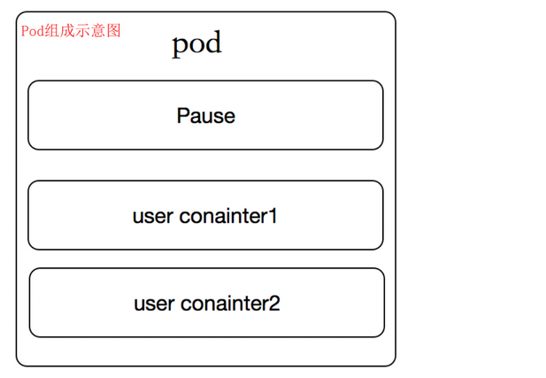

 
## 4POD内容器间资源共享实现机制
### 4.1Pod共享数据的机制
+ emptyDir  
  会在Pod被删除的同时也会被删除,当Pod分派到某个节点上时,emptyDir卷会被创建,并且在Pod在该节点上运行期间,卷一直存在。 就像其名称表示的那样,卷最初是空的。 尽管Pod中的容器挂载emptyDir卷的路径可能相同也可能不同,这些容器都可以读写emptyDir卷中相同的文件。 当Pod因为某些原因被从节点上删除时emptyDir卷中的数据也会被永久删除  
```
apiVersion: v1
kind: Pod
metadata:
name: test-pod1
spec:
containers:
- image: nginx
    name: nginx1
    volumeMounts:
    - mountPath: /cache
    name: cache-volume
- image: busybox
    name: bs1
    command: ["/bin/sh", "-c", "sleep 12h"]
    volumeMounts:
    - mountPath: /cache
    name: cache-volume
volumes:
- name: cache-volume
    emptyDir:
    sizeLimit: 500Mi
```
+ cephfs  
  cephfs 卷允许你将现存的CephFS卷挂载到Pod中,cephfs卷的内容在Pod被删除时会被保留,只是卷被卸载了。 这意味着cephfs卷可以被预先填充数据,且这些数据可以在Pod之间共享。同一cephfs卷可同时被多个写者挂载   

### 4.2Pod共享网络的机制
共享网络的机制是由Pause容器实现,下面慢慢分析一下,啥是pause,了解一下它的作用等等。  
1、先准备一个yaml文件（pod1.yaml ）,创建一个pod,pod里包含两个容器,一个是名为nginx1的容器,还有一个是名为bs1的容器  
```bash
apiVersion: v1
kind: Pod
metadata:
  name: test-pod1
spec:
  containers:
  - image: nginx
    name: nginx1
    volumeMounts:
    - mountPath: /cache
      name: cache-volume
  - image: busybox
    name: bs1
    command: ["/bin/sh", "-c", "sleep 12h"]
    volumeMounts:
    - mountPath: /cache
      name: cache-volume
  volumes:
  - name: cache-volume
    emptyDir:
      sizeLimit: 500Mi
```
2、开始创建  
```bash
kubectl create -f pod1.yaml
```
3、创建完后看看在哪个节点  
```bash
kubectl get pod -o wide
```
4、去到对应的节点查看容器  
```bash
docker ps | grep test-pod1
0db01653bdac   busybox                                                "/bin/sh -c 'sleep 1…"   9 minutes ago    Up 9 minutes              k8s_bs1_test-pod1_default_c3a15f70-3ae2-4a73-8a84-d630c047d827_0
296972c29efe   nginx                                                  "/docker-entrypoint.…"   9 minutes ago    Up 9 minutes              k8s_nginx1_test-pod1_default_c3a15f70-3ae2-4a73-8a84-d630c047d827_0
a5331fba7f11   registry.aliyuncs.com/google_containers/pause:latest   "/pause"                 10 minutes ago   Up 10 minutes             k8s_POD_test-pod1_default_c3a15f70-3ae2-4a73-8a84-d630c047d827_0
```

通过查看容器,名为test-pod1的pod里除了两个业务容器外(k8s_bs1_test-pod1、nginx1_test-pod1)还有一个pause容器,这个到底是什么?  

**对pause容器的理解**  
- pause容器又叫Infra container,就是基础设施容器的意思,Infra container只是pause容器的一个叫法而已
- 上面看到paus容器,是从registry.aliyuncs.com/google_containers/pause:latest这个镜像拉起的
- 在其中一台node节点上查看docker镜像,可看到该镜像的大小是240KB
```bash
  registry.aliyuncs.com/google_containers/pause        latest       350b164e7ae1   8 years ago     240kB
```
---

## 5Pod常用管理命令
**pod重启策略**  
+ Always：当容器终止退出,总是重启容器,默认策略
+ OnFailure：当容器异常退出（退出状态码非0）时,才重启容器
+ Never：当容器终止退出,从不重启容器

```bash
#查看pod的重启策略
kubectl get pods test-pod1 -o yaml #找到restartPolicy字段,就是重启策略restartPolicy: Always

#查看pod里所有容器的名称
kubectl get pods test-pod1 -o jsonpath={.spec.containers[*].name}

#进入pod里的指定容器的终端,如下进入pod为test-pod1里的容器nginx1和bs1
kubectl exec -it test-pod1 -c nginx1 -- bash
kubectl exec -it test-pod1 -c bs1 -- sh

#查看pod里指定容器的log
kubectl logs test-pod1 -c nginx1 
```

---

## 6pod环境变量
创建Pod时,可以为其下的容器设置环境变量。通过配置文件的env或者envFrom字段来设置环境变量  
**应用场景**  
+ 容器内应用程序获取pod信息
+ 容器内应用程序通过用户定义的变量改变默认行为
+ 变量值定义的方式  

**自定义变量值**  
- 变量值从Pod属性获取
- 变量值从Secret、ConfigMap获取  
<details>
  <summary>POD-ENV示例</summary>
  <pre><code> 
设置自定义变量,使用env给pod里的容器设置环境变量,本例子中,设置了环境变量有SAVE_TIME、MAX_CONN、DNS_ADDR  
apiVersion: v1
kind: Pod
metadata:
  name: test-env-demo
spec:
  containers:
  - name: test-env-demo-container
    image: 192.168.11.247/web-demo/goweb-demo:20221229v3
    env:
    - name: SAVE_TIME
      value: "60"
    - name: MAX_CONN
      value: "1024"
    - name: DNS_ADDR
      value: "8.8.8.8"

#开始创建POD kubectl create -f test-env.yaml
#创建后,验证环境变量是否能获取到(使用printenv打印环境变量) kubectl exec test-env-demo -- printenv
PATH=/go/bin:/usr/local/go/bin:/usr/local/sbin:/usr/local/bin:/usr/sbin:/usr/bin:/sbin:/bin
HOSTNAME=test-env-demo
SAVE_TIME=60 # 这个是
MAX_CONN=1024 # 这个是
DNS_ADDR=8.8.8.8 # 这个是
KUBERNETES_SERVICE_HOST=10.96.0.1
KUBERNETES_SERVICE_PORT=443
KUBERNETES_SERVICE_PORT_HTTPS=443
KUBERNETES_PORT=tcp://10.96.0.1:443
KUBERNETES_PORT_443_TCP=tcp://10.96.0.1:443
KUBERNETES_PORT_443_TCP_PROTO=tcp
KUBERNETES_PORT_443_TCP_PORT=443
KUBERNETES_PORT_443_TCP_ADDR=10.96.0.1
GOLANG_VERSION=1.19.4
GOPATH=/go
HOME=/root

#进入容器打印环境变量 kubectl exec -it test-env-demo -c test-env-demo-container -- bash
echo $SAVE_TIME # 单独打印一个
60
env  执行env命令查看
KUBERNETES_SERVICE_PORT_HTTPS=443
KUBERNETES_SERVICE_PORT=443
HOSTNAME=test-env-demo
PWD=/opt/goweb-demo
DNS_ADDR=8.8.8.8
HOME=/root
KUBERNETES_PORT_443_TCP=tcp://10.96.0.1:443
MAX_CONN=1024
GOLANG_VERSION=1.19.4
TERM=xterm
SHLVL=1
KUBERNETES_PORT_443_TCP_PROTO=tcp
KUBERNETES_PORT_443_TCP_ADDR=10.96.0.1
SAVE_TIME=60
KUBERNETES_SERVICE_HOST=10.96.0.1
KUBERNETES_PORT=tcp://10.96.0.1:443
KUBERNETES_PORT_443_TCP_PORT=443
PATH=/go/bin:/usr/local/go/bin:/usr/local/sbin:/usr/local/bin:/usr/sbin:/usr/bin:/sbin:/bin
GOPATH=/go
_=/usr/bin/env

  </code></pre>
</details>


<details>
  <summary>POD_ENV(使用容器字段作为环境变量的值)</summary>
  <pre><code> 
例子设置了资源限制的字段requests和limits,在设置环境变量中,使用资源限制的值作为了变量的值
apiVersion: v1
kind: Pod
metadata:
  name: test-env-demo
spec:
  containers:
  - name: test-env-demo-container
    image: 192.168.11.247/web-demo/goweb-demo:20221229v3
    resources:
      requests:
        memory: "32Mi"
        cpu: "125m"
      limits:
        memory: "64Mi"
        cpu: "250m"
    env:
      - name: CPU_REQUEST
        valueFrom:
          resourceFieldRef:
            containerName: test-env-demo-container
            resource: requests.cpu
      - name: CPU_LIMIT
        valueFrom:
          resourceFieldRef:
            containerName: test-env-demo-container
            resource: limits.cpu
      - name: MEM_REQUEST
        valueFrom:
          resourceFieldRef:
            containerName: test-env-demo-container
            resource: requests.memory
      - name: MEM_LIMIT
        valueFrom:
          resourceFieldRef:
            containerName: test-env-demo-container
            resource: limits.memory
#打印变量 kubectl exec test-env-demo -- printenv
PATH=/go/bin:/usr/local/go/bin:/usr/local/sbin:/usr/local/bin:/usr/sbin:/usr/bin:/sbin:/bin
HOSTNAME=test-env-demo
MEM_REQUEST=33554432
MEM_LIMIT=67108864
CPU_REQUEST=1
CPU_LIMIT=1
KUBERNETES_SERVICE_PORT_HTTPS=443
KUBERNETES_PORT=tcp://10.96.0.1:443
KUBERNETES_PORT_443_TCP=tcp://10.96.0.1:443
KUBERNETES_PORT_443_TCP_PROTO=tcp
KUBERNETES_PORT_443_TCP_PORT=443
KUBERNETES_PORT_443_TCP_ADDR=10.96.0.1
KUBERNETES_SERVICE_HOST=10.96.0.1
KUBERNETES_SERVICE_PORT=443
GOLANG_VERSION=1.19.4
GOPATH=/go
HOME=/root
  </code></pre>
</details>

---

## 7pod生命周期
**Pod的生命周期是指从Pod被创建开始直到它被删除或终止的时间范围称为其生命周期**   
 
在这段时间中,Pod会处于多种不同的状态,并执行一系统操作,操作如下： 
 
**创建pause容器 → 创建 → 调度 → 初始化init容器启动→ 主容器启动mainContainer → 主容器postStart启动后钩子 → 主容器preStop终止前钩子 → 主容器探针检测 → 主容器运行Running → 终止Termination → 清理**   

***pod生命周期架构图***    
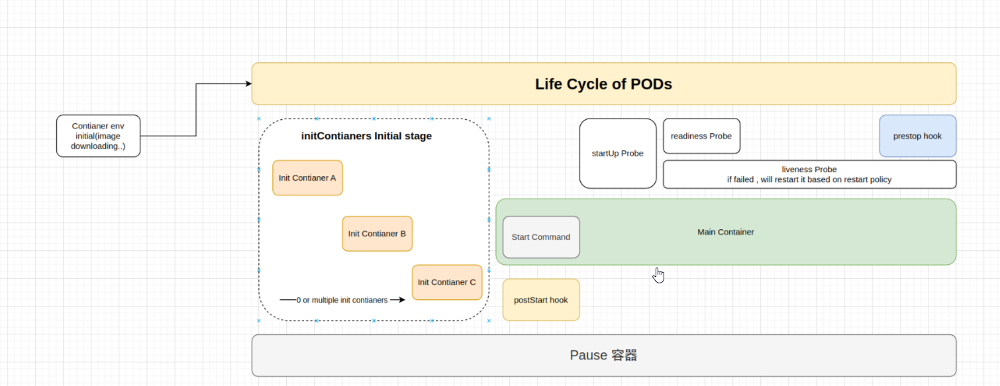  
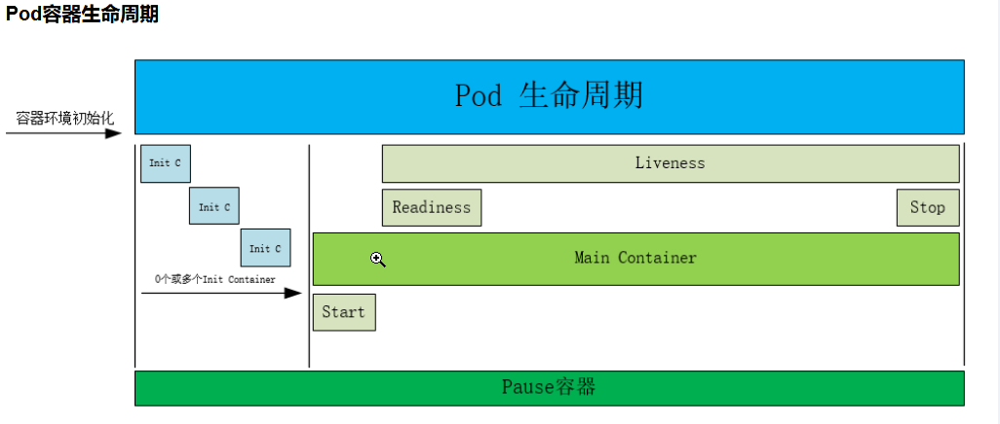  
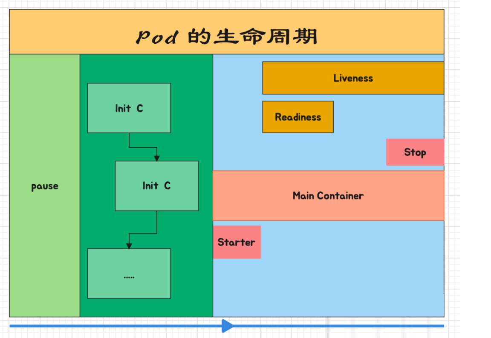  
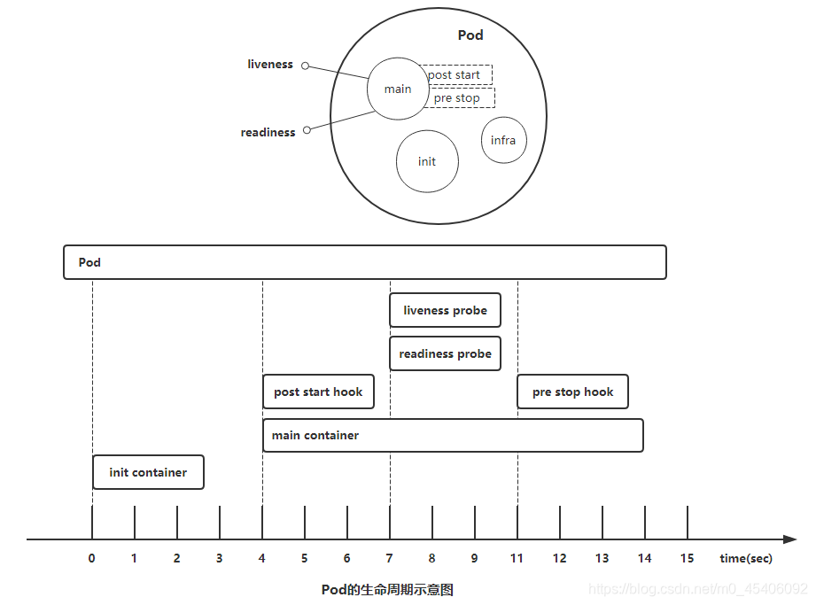  
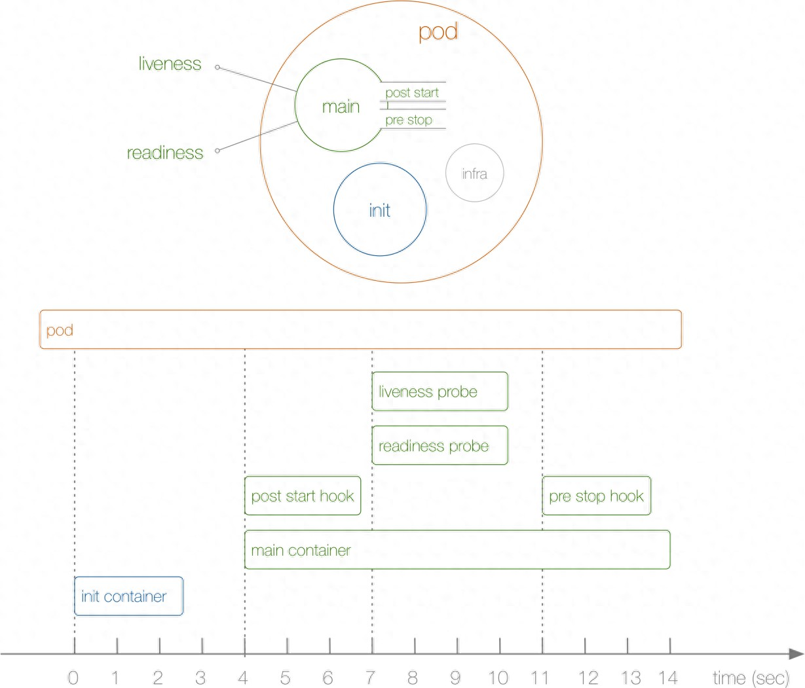  
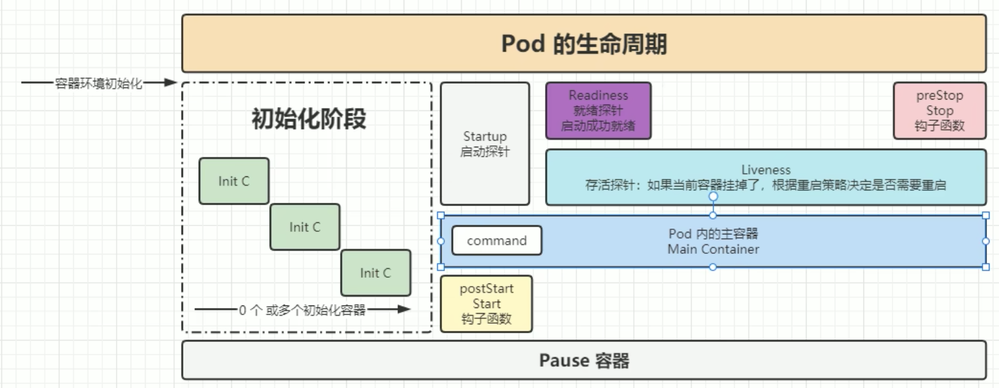  

pod对象从创建至终的这段时间范围称为pod的生命周期,它主要包含下面的过程：  
- [pod生命周期-pod基础容器Pause](https://github.com/gitseen/gitOps/blob/main/k8s/k8s-pod.md#71-pause容器)
- [pod生命周期-pod阶段](https://github.com/gitseen/gitOps/blob/main/k8s/k8s-pod.md#72-pod阶段)
- [pod生命周期-pod创建](https://github.com/gitseen/gitOps/blob/main/k8s/k8s-pod.md#73-pod创建)
- [pod生命周期-initContainer初始化容器运行](https://github.com/gitseen/gitOps/blob/main/k8s/k8s-pod.md#74-initcontainer初始化容器运行)
- [pod生命周期-mainContainer主容器运行](https://github.com/gitseen/gitOps/blob/main/k8s/k8s-pod.md#75-mainContainer主容器运行)
- [pod生命周期-主容器钩子函数](https://github.com/gitseen/gitOps/blob/main/k8s/k8s-pod.md#76-主容器钩子函数)
  * [postStart启动后钩子](https://github.com/gitseen/gitOps/blob/main/k8s/k8s-pod.md#761-postStart启动后钩子)   
  * [preStop终止前钩子](https://github.com/gitseen/gitOps/blob/main/k8s/k8s-pod.md#762-preStop终止前钩子)    
- [pod生命周期-主容器健康检查(三种探针)](https://github.com/gitseen/gitOps/blob/main/k8s/k8s-pod.md#77-主容器健康检查(三种探针))
  * [主容器健康检测作用](https://github.com/gitseen/gitOps/blob/main/k8s/k8s-pod.md#771--主容器健康检测作用)  
  * [主容器探针配置参数](https://github.com/gitseen/gitOps/blob/main/k8s/k8s-pod.md#772--探针配置参数)  
  * [主容器探针检测方式与检测结果](https://github.com/gitseen/gitOps/blob/main/k8s/k8s-pod.md#773--探针检测方式与检测结果)  
  * [主容器健康检测示例](https://github.com/gitseen/gitOps/blob/main/k8s/k8s-pod.md#774--主容器健康检测示例)  
- [pod生命周期-pod终止](https://github.com/gitseen/gitOps/blob/main/k8s/k8s-pod.md#78-pod终止过程)   

- ~~[pod生命周期-pod状态](https://github.com/gitseen/gitOps/blob/main/k8s/k8s-pod.md#)~~  

## 7、1 pause容器
pause是一个"暂停"的容器, 它的作用是: 解决pod的网络和存储的问题   
pause容器称为InfraContainer,其他的容器称为业务容器(mianContainer)  
Infracontainer是一个非常小的镜像,是一个C语言写的、永远处于"暂停"状态的容器  
Pod里运行着一个特殊的被称之为Pause的容器,其他容器则为业务容器,这些业务容器共享Pause容器的网络栈和Volume挂载卷,因此他们之间通信和数据交换更为高效  

pause共享两种资源(存储、网络)  
- 网络     
        每个pod都会被分配一个集群内部的唯一ip地址,pod内的容器共享网络,pod在集群内部的ip地址和端口;  
        pod内部的容器可以使用localhost互相通信,pod中的容器与外部通信时,从共享的资源当中进行分配,宿主机的端口映射    
- 存储  
        pod可以指定共享的volume,pod内的容器共享这些volume,volume可以实现持久化。防止pod重新构建之后文件消失  

Pause容器也称为"Infra容器"或"Sandbox容器"是Pod生命周期中一个非常关键的底层组件  
Pause它虽然看似"透明"但对Pod的稳定性和功能实现起着核心作用,以下是Pod生命周期与Pause容器的关系  

### 7.1.1、Pause容器的核心作用
kubernetes中的pause容器主要为每个业务容器提供以下功能
- PID命名空间： Pod中的不同应用程序可以看到其他应用程序的进程ID,pid命名空间开启init进程;所有容器共享同一个进程树(通过kubectl exec看进程)
- 网络命名空间：Pod中的多个容器能够共享同一个IP和端口范围;所有Pod内容器共享同一个IP和端口空间  
- IPC命名空间： Pod中的多个容器能够使用SystemV IPC或POSIX消息队列进行通信;允许容器间通过进程间通信(如共享内存)  
- UTS命名空间： Pod中的多个容器共享一个主机名;Volumes(共享存储卷)  
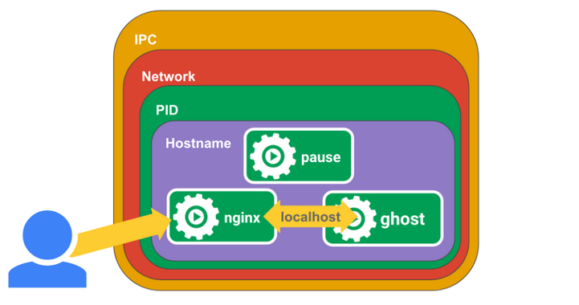  

### 7.1.2、Pause容器与Pod生命周期的关系
- Pod启动阶段  
  * 初始化Pause容器：当Pod被调度到节点后,kubelet首先启动Pause容器。它的唯一任务是挂起自身(执行pause命令),占用极少的资源  
  * 创建共享命名空间：Pause容器为Pod建立网络、IPC等命名空间,后续所有用户容器(如业务容器)会加入这些命名空间  
  * Pod网络配置：CNI插件(如Calico、Flannel)会基于Pause容器的网络命名空间配置Pod的IP、路由规则等
  
- Pod运行阶段  
  * 维持命名空间稳定性：Pause容器在整个Pod生命周期中持续运行,确保即使业务容器崩溃重启,Pod的网络命名空间(如IP地址)也不会改变  
  * 处理PID1进程：在Linux中,PID1进程负责孤儿进程回收。Pause容器作为PID1进程,确保业务容器的孤儿进程能被正确回收,避免僵尸进程  
  
- Pod终止阶段  
  * 优雅终止：当Pod被删除时,kubelet首先向Pause容器发送SIGTERM信号,触发Pod内所有容器的终止流程  
  * 清理资源：Pause容器退出后,其占用的网络命名空间等资源会被释放,确保Pod彻底终止  

### 7.1.3、Pause容器常见问题
- 为什么需要Pause容器?  
  * 稳定性：避免因业务容器重启导致Pod网络配置丢失  
  * 资源隔离：将Pod级别的资源(如IP)与容器解耦,实现多容器共享;共享(存储、网络)资源  
  * 标准化：统一Pod的初始化流程,简化CNI插件的实现  

- Pause容器崩溃会怎样?  
  * 如果Pause容器崩溃,整个Pod会被kubelet标记为失败,并触发重建。因为Pause容器是Pod的基础设施,它的崩溃意味着Pod的共享命名空间已不可用。

- 如何查看Pause容器?
  * docker ps |grep pause 或crictl ps  

***pause总结***
- Pause容器是Pod的"基础设施":它不运行业务代码,但为Pod提供共享的命名空间和稳定的运行环境  
- 生命周期绑定：Pause容器的启动、运行和终止与Pod的生命周期完全同步  
- 设计意义：通过解耦Pod基础设施与业务容器,k8s实现了更灵活的容器编排能力  
- 理解Pause容器的作用,有助于深入掌握k8s的网络模型、资源隔离机制以及多容器协作原理  

## 7.2 pod阶段
Pod阶段phase是Pod在其生命周期中的简单宏观概述,该阶段并不是对容器或Pod的综合汇总,也不是为了做为综合状态机   
Pod的"status"字段是一个PodStatus对象,其中包含"phase"字段 (Pod.status.phase)  
```bash
kubectl get pod podName -o yaml | grep phase

kubectl get pod podName -o jsonpath="{.status.phase}"
```
| Pod的阶段  | 描述 |     
| --------- | ------- | 
| Pending | k8s已经开始创建Pod但由于Pod中的容器还未创建成功,所以Pod还处于挂起的状态。这时Pod可能在等待被调度,或者在等待下载镜像  |
| Runging | Pod已经被调度到某个节点上了,Pod中的所有容器都已被成功创建,并且至少有一个容器正处于启动、重启、运行这3个状态中的1个  |
| Success | Pod中的所有容器都已成功执行完成,并且不会再重启  |
| Failed  | Pod所有容器都已经停止运行,并且至少有一个容器是因为失败而退出(即容器以非0状态退出或者被系统强制终止)  |
| Unknown | 因为某些原因导致无法取得Pod的状态。这种情况通常是由于网络的造成,例如Pod所在主机通信失败等  |

## 7.2.1 pod生命周期的几个阶段
- 1.创建阶段在创建新Pod时  
k8s首先会检查使用的容器镜像是否存在,并检查Pod配置是否正确。如果一切正常,k8s将创建一个名为"Pending"的初始状态  

- 2.运行阶段一旦Pod处于Pending状态  
k8s将开始为它分配资源并启动容器。当所有容器都成功启动后,Pod将进入"Running"状态  

- 3.容器故障恢复阶段在运行期间  
如果某个容器意外终止,则k8s将自动重启该容器。如果该容器无法自动重启,则Pod将进入"Failed"状态  

- 4.更新阶段在进行更新操作时  
k8s首先会通过创建一个新的Pod来实现更新。然后k8s将停止旧Pod中的容器,并将它们迁移到新Pod中。一旦所有容器都成功迁移,旧Pod将被删除,"Rolling Update"完成   

- 5.删除阶段当Pod不再需要时  
可以通过删除Pod对象来释放资源。k8s将删除所有关联的容器,并从集群中删除该Pod对象  
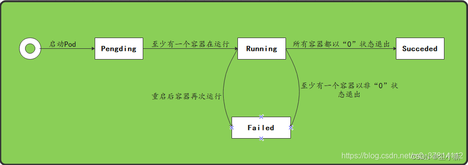  

## 7.2.2 pod生命周期的常见状态
***pod生命周期的几个状态phase值*** 
- Pending挂起：apiServer创建了Pod资源对象并已经存入了etcd中,但是它并未被调度完成,或者仍然处于从仓库下载镜像的过程中  
- Running运行中：pod已被调度到某节点上,且容器都已经被kubelet创建完成。至少有一个容器正处于启动、重启、运行这3个状态中的1个  
- Succeeded成功：Pod中的所有容器都被成功终止,并且不会再重启  
- Failed失败：pod中的所有容器都已终止了,但至少有一个容器是因为失败终止,即容器返回了非0值的退出状态
- Unknown未知：apiServer无法获取得pod对象的状态信息,通常是因为与Pod所在主机网络通信失败  
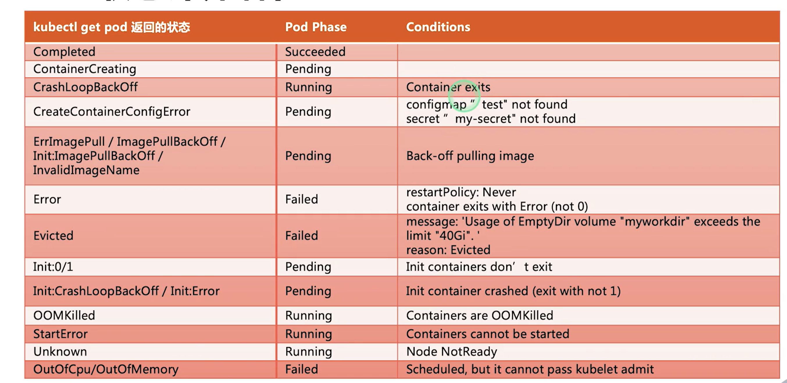  

***Pod的生命周期示意图,从图中可以看到Pod状态的变化***  
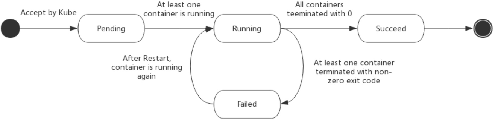
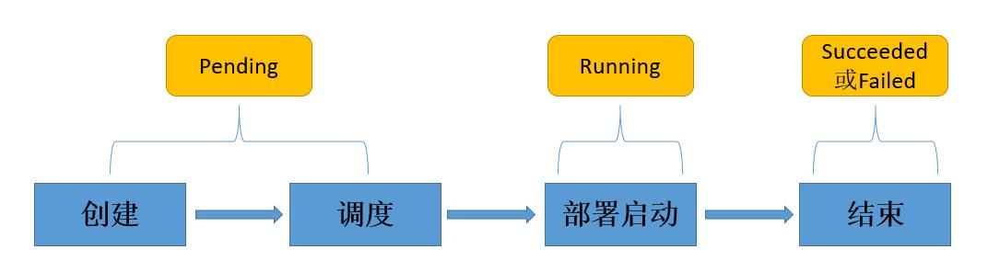

## 7.3 pod创建
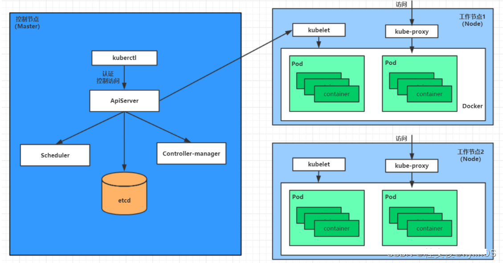  

***Pod是k8s的基础单元,pod创建过程***  
```bash
①用户通过kubectl或其他API客户端提交Pod.Spec给APIServer。
②APIServer尝试将Pod对象的相关信息存储到etcd中,等待写入操作完成,APIServer返回确认信息到客户端。
③APIServer开始反映etcd中的状态变化。
④所有的k8s组件通过"watch"机制跟踪检查APIServer上的相关信息变动。
⑤kube-scheduler调度器通过其"watcher"检测到APIServer创建了新的Pod对象但是没有绑定到任何工作节点。
⑥kube-scheduler为Pod对象挑选一个工作节点并将结果信息更新到APIServer。
⑦调度结果新消息由APIServer更新到etcd,并且APIServer也开始反馈该Pod对象的调度结果。
⑧Pod被调度到目标工作节点上的kubelet尝试在当前节点上调用docker-engine进行启动容器,并将容器的状态结果返回到APIServer。
⑨APIServer将Pod信息存储到etcd系统中。
⑩在etcd确认写入操作完成,APIServer将确认信息发送到相关的kubelet。
```
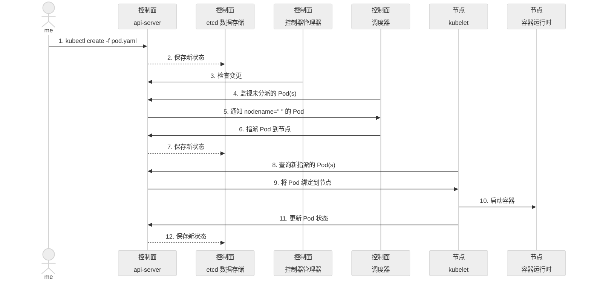

## 7.4 initContainer初始化容器运行
每个Pod中可以包含多个容器, 应用运行在这些容器里面,同时Pod也可以有一个或多个先于应用容器启动的Init容器。    
初始化容器是在pod的主容器启动之前要运行的容器,主要是做一些主容器的前置工作;init容器不是必须的,取决于需求。  

<details>
  <summary>initContainers构建manContainers的前置工作</summary>
  <pre><code>
--- 
apiVersion: v1
kind: Pod
metadata:
  name: my-pod
spec:
  initContainers:
  - name: init-container-1
    image: busybox
    command: ["sh", "-c", "echo Initializing...; sleep 5"]
  - name: init-container-2
    image: alpine
    command: ["sh", "-c", "echo Performing setup...; sleep 10"]
  containers:
  - name: main-container
    image: my-app-image
    # 主应用容器的配置
    # ...
    # ...
  </code></pre>
</details>

## 7.4.1 initContainer的核心特点
* 执行顺序  
  - 一个Pod中可以定义多个initContainers,它们按照顺序执行,前一个成功完成后才会启动下一个  
  - 若某个initContainer失败,k8s会根据restartPolicy决定是否重试(默认不重启)
* initContainer与mainContainer主容器的区别   
  - 目标不同：initContainer负责初始化,主容器运行业务逻辑    
  - 生命周期：initContainer执行完成后立即终止,主容器持续运行  
  - 资源隔离：initContainer可以独立配置资源(CPU/内存)和镜像    
  - initContainer不支持探针startupProbe、livenessProbe、readinessProbe   
* 共享机制    
  - initContainer与mainContainer主容器共享同一Pod的Volume、网络命名空间、但文件系统隔离(除非显式挂载)  

### 7.4.2initContainer初始化容器应用场景
* 依赖服务等待  
  - 供主容器镜像中不具备的工具程序或自定义代码(检查数据库、消息队列等依赖服务是否就绪) 
  - 示例：通过循环调用curl、nc、ping、dig命令等待服务可达
* 配置文件生成  
  - 动态生成主容器所需的配置文件(如从ConfigMap/Secret渲染模板)   
  - 示例：使用envsubst替换环境变量生成应用配置  
* 数据预加载  
  - 从远程存储(如 S3、Git)下载数据到共享Volume    
  - 示例：克隆代码仓库到/app目录供主容器使用  
* 权限初始化  
  - 设置文件系统权限或安全上下文(chmod、chown)  
  - 示例：为共享Volume的目录赋予主容器用户权限   

总的来说,如果有的程序不方便放在主容器,或者需要严格指定先后启动顺序的程序可以放在初始化容器中。

### 7.4.3 initContainer容器执行流程
- 1.Pod 创建  
  * 调度器Scheduler将Pod分配到节点,触发initContainer执行  
- 2.顺序执行  
  * 第一个initContainer启动,完成后退出(状态码需为0)  
  * 后续initContainer依次执行,全部成功后主容器启动  
- 3.失败处理  
  * 若某个InitContainer失败(退出码非0)Pod状态为Init:Error  
  * 根据restartPolicy决定是否重启   
     - Always：自动重启失败的InitContainer(无限重试)  
     - OnFailure：仅当失败时重启(默认策略)  
     - Never：不重启,Pod进入Init:Error状态  
- 4.资源释放  
  * 所有initContainer终止后,其占用的资源(如临时存储)会被释放  
  
### 7.4.4 initContainer的容器作用
**initContainer容器与主容器为分离的单独镜像,其启动相关代码具有如下优势**
- Init容器可以包含一些安装过程中应用容器中不存在的实用工具或个性化代码。
  例如,没有必要仅为了在安装过程中使用类似sed、awk、 python、dig这样的工具而去FROM。一个镜像来生成一个新的镜像。
- Init容器可以安全地运行这些工具,避免这些工具导致应用镜像的安全性降低。
- 应用镜像的创建者和部署者可以各自独立工作,而没有必要联合构建–个单独的应用镜像。
- 它们使用LinuxNamespace,所以对应用容器具有不同的文件系统视图。因此Init容器可具有访问Secrets的权限,而应用容器不能够访问。
- 由于Init容器必须在应用容器启动之前运行完成,因此Init容器提供了一种机制来阻塞或延迟应用容器的启动,直到满足了一组先决条件;一旦前置条件满足,Pod内的所有的应用容器会并行启动。


### 7.4.5 initContainer示例
<details>
  <summary>initContainers-域名解析示例</summary>
  <pre><code>
---
apiVersion: v1
kind: Service
metadata:
  name: my-service-1
spec:
  ports:
   - protocol: TCP
     port: 80
     targetPort: 8080
---
apiVersion: v1
kind: Service
metadata:
  name: my-service-2
spec:
  ports:
   - protocol: TCP
     port: 80
     targetPort: 8080
---
apiVersion: v1
kind: Pod
metadata:
  name: init-demo
  labels:
    app: init-app
spec:
  containers:
  - name: my-init-demo
    image: fangjiaxiaobai/my-app:v1
    command: ["sh", "-c", "echo the app is running! && sleep 3600"]
  initContainers:
  - name: init-myservice-1
    image: busybox
    command: ['sh', '-c', "until nslookup my-service-1; do echo 'waiting for my-service-1'; sleep 2; done;"]
    #command: ['/bin/sh', '-c', 'until ping 192.168.23.188 -c 1; do echo waiting for mysql; sleep 3; done;']
  - name: init-myservice-2
    image: busybox
    command: ['sh', '-c', "until nslookup my-service-2; do echo 'waiting for my-service-2'; sleep 2; done;"]
    #command: ['/bin/sh', '-c', 'until ping 192.168.23.189 -c 1; do echo waiting for redis; sleep 3; done;']
#验证
kubectl create -f init-demo.yaml
kubectl get pods -w -o wide
kubectl logs -f init-demo -c init-myservice-1
kubectl logs -f init-demo -c init-myservice-2
kubectl logs -f init-demo
Defaulted container "my-init-demo" out of: my-init-demo, init-myservice-1 (init), init-myservice-2 (init)
the app is running!
  </code></pre>
</details>

<details>
  <summary>initContainers-busybox</summary>
  <pre><code>
---
apiVersion: v1
kind: Service
metadata:
  name: myservice
spec:
  selector:
    app: myservice
  ports:
    - port: 80
      targetPort: 9376
      protocol: TCP
---
apiVersion: v1
kind: Service
metadata:
  name: mydb
spec:
  selector:
    app: mydb
  ports:
    - port: 80
      targetPort: 9377
      protocol: TCP
---
apiVersion: v1
kind: Pod
metadata:
  name: initcpod-test
  labels:
    app: initcpod-test
spec:
  containers:
    - name: initcpod-test
      image: busybox:1.32.0
      imagePullPolicy: IfNotPresent
      command: ['sh','-c','echo The app is running! && sleep 3600']
  initContainers:
    - name: init-myservice
      image: busybox:1.32.0
      imagePullPolicy: IfNotPresent
      command: ['sh','-c','until nslookup myservice; do echo waitting for myservice; sleep 2;done;']
    - name: init-mydb
      image: busybox:1.32.0
      imagePullPolicy: IfNotPresent
      command: ['sh','-c','until nslookup mydb; do echo waitting for mydb; sleep 2;done;']
  restartPolicy: Always
#先查看pod启动情况kubectl get pods
#详细查看pod启动情况kubectl describe pod initcpod-test
#查看initcpod-test中的第一个initContainer日志kubectl logs initcpod-test -c init-myservice
#运行init服务kubectl apply -f init.yml
#查看init服务运行情况kubectl get svc
#查看initcpod-test运行情况,需要耐心等一会,会发现pod的第一个init已经就绪kubectl get pods
#查看init-myservice服务运行情况kubectl get svc
#查看initcpod-test运行情况,需要耐心等一会,会发现pod的两个init已经就绪,pod状态为ready
kubectl get pod -w
  </code></pre>
</details>

<details>
  <summary>initContainers-test</summary>
  <pre><code>
#第一个等待myservice启动, 第二个等待mydb启动。 一旦这两个Init容器都启动完成,Pod将启动spec节中的应用容器。
---
apiVersion: v1
kind: Service
metadata:
  name: myservice
spec:
  ports:
  - protocol: TCP
    port: 80
    targetPort: 9376
---
apiVersion: v1
kind: Service
metadata:
  name: mydb
spec:
  ports:
  - protocol: TCP
    port: 80
    targetPort: 9377
---
apiVersion: v1
kind: Pod
metadata:
  name: myapp-pod
  labels:
    app.kubernetes.io/name: MyApp
spec:
  containers:
  - name: myapp-container
    image: busybox:1.28
    command: ['sh', '-c', 'echo The app is running! && sleep 3600']
  initContainers:
  - name: init-myservice
    image: busybox:1.28
    command: ['sh', '-c', "until nslookup myservice.$(cat /var/run/secrets/kubernetes.io/serviceaccount/namespace).svc.cluster.local; do echo waiting for myservice; sleep 2; done"]
  - name: init-mydb
    image: busybox:1.28
    command: ['sh', '-c', "until nslookup mydb.$(cat /var/run/secrets/kubernetes.io/serviceaccount/namespace).svc.cluster.local; do echo waiting for mydb; sleep 2; done"]
#操作过程
kubectl apply -f myapp.yaml
kubectl logs myapp-pod -c init-myservice # 查看第一个Init容器
kubectl logs myapp-pod -c init-mydb      # 查看第二个Init容器
  </code></pre>
</details>

<details>
  <summary>initContainers-生成配置文件</summary>
  <pre><code>
---
apiVersion: v1
kind: Pod
metadata:
  name: myapp-pod
spec:
  initContainers:
    - name: init-service-check
      image: busybox:1.28
      command: ['sh', '-c', 'until nslookup mysql-service; do echo "Waiting for MySQL..."; sleep 2; done']
    - name: init-config-download
      image: alpine/curl
      command: ['curl', '-o', '/app/config.yaml', 'https://config-server/config.yaml']
      volumeMounts:
        - name: app-config
          mountPath: /app
  containers:
    - name: main-app
      image: myapp:1.0
      volumeMounts:
        - name: app-config
          mountPath: /etc/app
  volumes:
    - name: app-config
      emptyDir: {}
#init-service-check：等待MySQL服务的DN 解析可用
#init-config-download：从远程服务器下载配置文件到共享Volume app-config 
#主容器 main-app：使用已下载的配置文件启动应用  
  </code></pre>
</details>

***initContainer总结***  
InitContainer是k8s中实现 启动顺序控制 和 初始化依赖管理 的关键机制   
通过将初始化任务与业务逻辑解耦，显著提升了应用的可靠性和可维护性   
合理使用InitContainer可以避免主容器因依赖未就绪而频繁崩溃,是复杂应用部署的必备工具 

## 7.5 mainContainer主容器运行
在k8s中,Pod是最小的调度和部署单元,包含一个或多个共享网络和存储资源的容器(如主容器、Sidecar容器、Init容器)等而主容器mainContainer是Pod中运行核心业务逻辑的容器。  
### 7.5.1 mainContainer主容器核心特性
- 容器共享同一网络命名空间(通过localhost通信)   
- 容器共享同一组存储卷Volumes   
- 生命周期统一管理(调度、启动、终止)   

### 7.5.2 mainContainer主容器的核心作用
主容器是Pod中承担核心业务逻辑的容器
- 运行Web服务器Nginx、Apache 
- 执行微服务如SpringBoot、Node.js应用  
- 处理数据任务如Spark、Flink作业  

| 主容器的关键特性  | 说明 |
| --------- | ------- |
| 启动顺序 | 在Init容器全部成功后启动  |
| 生命周期 | 持续运行,直到任务完成或Pod被删除  |
| 资源隔离 | 可独立配置CPU/内存资源(requests和limits)  |
| 健康检查 | 支持探针startupProbe启动探针、livenessProbe就绪探针、readinessProbe存活探针  |
| 日志与监控 | 日志通过标准输出(stdout/stderr)收集,监控通过暴露的指标端点实现  |

### 7.5.3 mainContainer主容器的生命周期管理
- 1.动流程  
  * Pod调度：由调度器Scheduler分配到合适节点  
  * Init容器执行：Init容器按顺序执行并成功退出  
  * 主容器启动  
    - 拉取镜像(若本地不存在)  
    - 挂载Volume(如ConfigMap、Secret、emptyDir)  
    - 执行启动命令(command、args)  
- 2.运行阶段
  * 健康检查  
    - startupProbe: 检查成功才由存活检查接手,用于保护慢启动容器(检测pod内的容器是否已经启动成功并准备好接收流量)  
    - livenessProbe：检测容器是否存活(失败则重启容器)
    - readinessProbe：检测容器是否就绪(失败则从Service的Endpoints移除）
    
  * 资源管理
    - 根据resources.requests和resources.limits限制CPU/内存使用   
    - [k8s三个服务质量类别](https://github.com/gitseen/gitOps/blob/main/k8s/k8s-resource-Qos.md)    
 
- 3.终止流程  
  * 优雅终止(Graceful Shutdown）  
    - 收到SIGTERM信号,执行预设的清理逻辑(如关闭数据库连接)  
    - 默认等待30秒(可配置terminationGracePeriodSeconds)  
  * 强制终止：超时后发送SIGKILL强制终止容器  
    ```bash
    kubectl delete ns ns_name --force --grace-period=0  
    kubectl delete pod pod_name --force --grace-period=0  
    ```
### 7.5.4 mainContainer主容器的配置示例
<details>
  <summary>mainContainer主容器的配置示例</summary>
  <pre><code>
---
apiVersion: v1
kind: Pod
metadata:
  name: myapp-pod
spec:
  initContainers:          # 初始化容器(可选)
    - name: init-config
      image: busybox
      command: ["sh", "-c", "echo 'Initializing...'"]
  containers:             # 主容器(必选)
    - name: main-app      # 主容器名称
      image: nginx:1.25   # 主容器镜像
      command: ["python"]        #覆盖镜像默认命令  （可选）
      args: ["-m", "http.server", "8000"]  #传递参数（可选）
      ports:
        - containerPort: 80
      lifecycle: # 主容器(postStart、preStop;command优先于>initContainers优先于>postStart执行)
        postStart:
          exec:
            command: ['/bin/sh', '-c', 'echo Hello from podStart handler > /usr/share/message']
        preStop:
          exec:
            command: ['/bin/sh', '-c', 'echo Bye from podStop handler']
      resources:          # 主容器(资源限制)
        requests:
          cpu: "100m"
          memory: "128Mi"
        limits:
          cpu: "200m"
          memory: "256Mi"
      startupProbe:      # 主容器(启动探针)
          httpGet:
            path: /login
            port: 8090
          failureThreshold: 30
          periodSeconds: 10
      livenessProbe:      # 主容器(存活探针)
        httpGet:
          path: /healthz
          port: 8080
        initialDelaySeconds: 10  #容器启动后等待10秒开始探测
        periodSeconds: 5         #每5秒检查一次
      readinessProbe:       # 主容器(就绪探针)
        tcpSocket:
          port: 8080
        initialDelaySeconds: 5
        periodSeconds: 10
      env:                  # 主容器(环境变量传递)
        - name: NODE_NAME
          valueFrom:
            fieldRef:
              fieldPath: spec.nodeName
        - name: POD_IP
          valueFrom:
            fieldRef:
              fieldPath: status.podIP
        - name:  TZ
          value： Asia/Shanghai
        - name: CSE-SERVERURL
          value: https://www.g.cn
      volumeMounts:          # 主容器(存储挂载)
        - name: main-app-data
          mountPath: /data
      volumeMounts:
        - name: shared-data
          mountPath: /sidecar-data 
    volumes: #   定义一组挂载设备(宿主机或ConfigMap、Secret、emptyDir)
      - name: volume #定义一个挂载设备的名字
        #meptyDir: {}       
        hostPath:
          path: /opt #挂载设备类型为hostPath,路径为宿主机下的/opt,这里设备类型支持很多种
#主容器频繁重启问题
kubectl get events --field-selector involvedObject.name=<pod-name>
    </code></pre>
</details>

***mainContainer主容器运行总结***  
pod是容器编排的核心单元,主容器是其运行业务逻辑的核心组件。  
主容器与Init容器、Sidecar容器协作,通过共享网络和存储实现高效通信。  
合理配置资源、健康检查和生命周期管理,是保障应用稳定性的关键。

## 7.6 主容器钩子函数
在k8s中Pod的主容器支持生命周期钩子函数(Lifecycle Hooks)用于在容器启动和终止的关键节点触发自定义操作  

k8s支持钩子函数postStart和preStop为容器提供了更精细的生命周期管理能力  
- postStart  
           于容器创建完成之后立即运行的钩子处理器;在主容器启动后,k8s将立即发送postStart事件  
- preStop  
           容器终止之前执行,执行完成之后容器将成功终止,在其完成之前会阻塞删除容器的操作;在主容器被终结之前,k8s将发送一个preStop事件  

- 钩子函数语法示例  
```bash
kubectl explain pods.spec.containers.lifecycle.postStart.exec.command
kubectl explain pods.spec.containers.lifecycle.postStart.httpGet
kubectl explain pods.spec.containers.lifecycle.postStart.tcpSocket

kubectl explain pods.spec.containers.lifecycle.preStop.exec.command
kubectl explain pods.spec.containers.lifecycle.preStop.httpGet
kubectl explain pods.spec.containers.lifecycle.preStop.tcpSocket
```

- 钩子函数处理实现方法   
  * exec:      在容器内执行命令,如果命令的退出状态码是0表示执行成功,否则表示失败  
  * httpGet:   在当前容器中向指定url发起http请求(URL返回的HTTP状态码在[200、400]之间表示请求成功,否则表示失败)  
  * tcpSocket: 在当前容器尝试访问指定的socket  

### 7.6.1 postStart启动后钩子
**作用**   
- 触发时机：在容器创建后立即执行(与容器的主进程并行启动,而非严格顺序)  
- 目的：执行容器启动后的初始化任务(如配置生成、服务注册、依赖检查等)  

**使用场景**  
- 生成动态配置文件（例如从环境变量渲染模板） 
- 向服务注册中心(如Consul、Etcd)注册服务实例  
- 检查依赖服务(如数据库、缓存)是否可用  
- 初始化日志或监控组件  
  
**注意事项**    
- 执行结果不影响容器状态:即使postStart钩子执行失败,容器仍会被标记为Running  
- 超时处理：如果钩子未在指定时间内完成(默认无超时),容器可能继续运行但钩子任务被终止  
- 与Init容器的区别：postStart在主容器启动后触发,而Init容器在主容器启动前运行  
  

### 7.6.2 preStop钩子
**作用**   
- 触发时机：在容器终止前执行(收到SIGTERM信号后,但在强制终止前)  
- 目的：执行优雅关闭逻辑(如保存状态、清理资源、通知其他服务)  
  
**使用场景**  
- 向服务注册中心注销服务实例   
- 等待正在处理的请求完成(例如睡眠30秒)   
- 保存内存中的缓存数据到持久化存储  
- 关闭数据库连接或释放文件锁  
  
**注意事项** 
- 必须快速完成: preStop 钩子的执行时间应远小于 terminationGracePeriodSeconds(默认30秒),否则容器会被强制终止  
- 幂等性设计：确保钩子任务可重复执行(避免因重试导致副作用)  
- 依赖外部服务的风险: 如果钩子需要调用外部API需考虑网络不可用的情况  


### 7.6.3 钩子示例 
<details>
  <summary>commandline-postStart-exec测试示例</summary>
  <pre><code>
---
apiVersion: v1
kind: Pod
metadata:
  name: nginx-test-post-start
spec: 
  containers:
  - name: main-container
    image: nginx
    command: ["/bin/sh", "-c"]
    args: ["echo $(date +'%Y-%m-%d %H:%M:%S.%3N') ' :container command started!!!' >> /var/log/testlog.log; nginx -g 'daemon off;'"]
    lifecycle:
      postStart: 
        exec:   
          command:  
            - sh
            - -c
            - echo $(date +'%Y-%m-%d %H:%M:%S.%3N') " :postStart done!!!" >> /var/log/testlog.log
          #command: ["/bin/sh", "-c","echo $(date +'%Y-%m-%d %H:%M:%S.%3N') ':postStart done!!!' >> /var/log/testlog.log"]
  
#容器启动命令和postStart都会写入1条信息入指定的log
kubectl exec -it nginx-test-post-start -c main-container -- /bin/bash
cat /var/log/testlog.log 
2024-03-31 18:14:15.797  :container command started!!!
2024-03-31 18:14:15.821  :postStart done!!!
实际log上看到, commandline执行的时间比postStart更早, 虽然只有几毫秒的区别
  </code></pre>
</details>


<details>
  <summary>postStart-preStop-exec</summary>
  <pre><code>
apiVersion: v1
kind: Pod
metadata:
  name: lifecycle-demo
spec:
  containers:
    - name: app
      image: myapp:1.0
      ports:
        - containerPort: 8080
      lifecycle:
        postStart:
          exec:
            command: ["/bin/sh", "-c", "echo 'App started' > /app/status.txt"]
      lifecycle:
        postStart: 
          exec: # 在容器启动的时候执行一个命令,修改掉nginx的默认首页内容
            command: ["/bin/sh", "-c", "echo postStart... > /usr/share/nginx/html/index.html"]
        preStop:
          exec:
            command: ["/bin/sh", "-c", "curl -X POST http://localhost:8080/stop && sleep 30"]
        preStop:
        exec: # 在容器停止之前停止nginx服务
          command: ["/usr/sbin/nginx","-s","quit"]
      terminationGracePeriodSeconds: 60
  </code></pre>
</details>


<details>
  <summary>钩子处理器支持使用下面三种方式定义动作</summary>
  <pre><code>

* Exec命令  #在容器内执行一次命令
```
lifecycle:
    postStart: 
      exec:
        command:
        - cat
        - /tmp/healthy
```

* TCPSocket #在当前容器尝试访问指定的socket
```
lifecycle:
    postStart:
      tcpSocket:
        port: 8080
```

* HTTPGet   #在当前容器中向某url发起http请求  
```
lifecycle:
    postStart:
      httpGet:
        path: / #URI地址
        port: 80 #端口号
        host: 192.168.5.3 #主机地址
        scheme: HTTP #支持的协议,http或者https
```
  </code></pre>
</details>


**钩子函数总结**
- PostStart hook是在容器创建(created)之后立马被调用,并且PostStart跟容器的ENTRYPOINT是异步执行的,无法保证它们之间的顺序
- PreStop hook是容器处于Terminated状态时立马被调用(也就是说要是Job任务的话,执行完之后其状态为completed,所以不会触发PreStop的钩子),同时PreStop是同步阻塞的,PreStop执行完才会执行删除Pod的操作
- PostStart会阻塞容器成为Running状
- PreStop会阻塞容器的删除,但是过了terminationGracePeriodSeconds时间后,容器会被强制删除

>postStart和preStop是k8s中管理容器生命周期的重要工具    
>>postStart: 初始化任务(非关键路径)  
>>preStop: 优雅关闭(关键路径,必须可靠)  
>核心价值: 通过自定义逻辑增强应用的可观测性和健壮性,确保服务平滑启停  


## 7.7 主容器健康检测(三种探针)  
在k8s中,健康检查(Health Checks)是确保容器应用可靠运行的核心机制   
启动探针(StartupProbe)、存活探针(livenessProbe)、就绪探针(readinessProbe)健康检测是检查容器里面的服务是否正常  

### 7.7.1  主容器健康检测作用  

| 探针类型  | 触发时机 |  失败后果 |   典型场景  | 说明  |
| --------- | ------- |  ------- |    -------  |  -------  |
| startupProbe | 容器启动后立即检测  |  若失败,持续重试直到成功或超时 | 保护启动慢的应用(如Java应用),避免被存活探针误杀 |  用于判断容器内应用程序是否已经启动  |
| livenessProbe | 容器启动后周期检测  |  重启容器(根据restartPolicy) | 检测死锁、内存泄漏等不可恢复的故障  |  用于探测容器是否存活(Running状态)  |
| readinessProbe | 容器启动后周期检测  |  从Service的Endpoints中移除Pod | 等待依赖项(如数据库)就绪,避免流量涌入未准备好的容器 |  用于探测容器内的程序是否健康  |

- startupProbe启动探针  
  * 检查成功才由存活检查接手,用于保护慢启动容器    
  * 适用于需要较长启动时间的应用场景,如应用程序需要大量预热或者需要等待外部依赖组件的应用程序  
  
- livenessProbe存活探针 
   * 如果检查失败,kubelet会杀死容器,根据pod的restartPolicy来操作    
   * 用于检测应用实例是否处于Running状态,如果不是,k8s会重启容器;决定是否重启容器   

- readinessProbe就绪探针   
  * 如果检查失败,k8s会把Pod从serviceEndpoints中剔除(Pod的IP:Port从对应Service关联的EndPoint地址列表中删除)    
  * 用于检测应用实例当前是否可以接收请求,如果不能,k8s不会转发流量;决定是否对外提供服务(决定是否将请求转发给容器)    

**startupProbe > readinessProbe > livenessProbe**  

>如定义startupProbe、livenessProbe或者startupProbe、readinessProbe,则只有startupProbe探测成功后,才执行livenessProbe、readinessProbe探针


[pod容器重启策略](https://blog.csdn.net/junbaozi/article/details/127077046)  
Always:当容器终止退出,总是重启容器,默认策略  
OnFailure:当容器异常退出(退出状态码非0)时,才重启容器  
Never:当容器终止退出,从不重启容器  

**restartPolicy**  
podS.pec中的restartPolicy可以用来设置是否对退出的Pod重启,可选项包括Always、OnFailure、Never  
```bash
kubectl explain pods.sepc.restartPolicy
kubectl get pod podname -oyaml |grep restartPolicy
```

- 单容器的Pod,容器成功退出时,不同restartPolicy时的动作为  
   * Always: 重启Container; Pod phase保持Running  
   * OnFailure: Pod phase变成Succeeded  
   * Never: Pod phase变成Succeeded  

- 单容器的Pod,容器失败退出时,不同restartPolicy时的动作为  
  * Always: 重启Container; Pod phase保持 Running  
  * OnFailure: 重启Container; Pod phase保持 Running  
  * Never: Pod phase变成Failed  
  
- 2个容器的Pod,其中一个容器在运行而另一个失败退出时,不同restartPolicy时的动作为  
  * Always: 重启Container; Pod phase保持Running  
  * OnFailure: 重启Container; Pod phase保持Running  
  * Never: 不重启Container; Pod phase保持Running  

- 2个容器的Pod,其中一个容器停止而另一个失败退出时,不同restartPolicy时的动作为  
  * Always: 重启Container; Pod phase保持Running  
  * OnFailure: 重启Container; Pod phase保持Running  
  * Never: Pod phase变成Failed  
  
- 单容器的Pod,容器内存不足(OOM),不同restartPolicy时的动作为  
  * Always: 重启Container; Pod phase保持Running  
  * OnFailure: 重启Container; Pod phase保持Running  
  * Never: 记录失败事件; Pod phase变成Failed  

- Pod还在运行,但磁盘不可访问时  
  * 终止所有容器Pod phase变成Failed  
  * 如果Pod是由某个控制器管理的,则重新创建一个Pod并调度到其他Node运行   

- Pod还在运行,但由于网络分区故障导致Node无法访问   
  * Node controller等待Node事件超时  
  * Node controller将Pod phase设置为Failed  
  * 如果Pod是由某个控制器管理的,则重新创建一个Pod并调度到其他Node运行 


### 7.7.2  探针配置参数
>所有探针支持以下通用参数   
- initialDelaySeconds：容器启动后等待多少秒开始探测(默认0)   
  * 容器启动后要等待多少秒后才启动startupProbe、livenessProbe、readinessProbe探针   
  * 如定义了starupProbe成功之后才开始执行livenessProbe、readinessProbe  
  * 如periodSeconds的值大于initialDelaySeconds,则initialDelaySeconds将被忽略;默认是0秒,最小值是0  

- periodSeconds：探测周期(默认10)   
  * 执行探测的时间间隔(单位是秒);默认是10秒,最小值是1  

- timeoutSeconds：探测超时时间(默认1)   
  * 探测超时后等待多少秒;默认值是1秒,最小值是1  

- successThreshold：连续成功次数视为探测成功(默认1)  
  * 探针在失败后,被视为成功的最小连续成功数;默认值是1,最小值是1  
  * startupProbe、livenessProbe探测参数值必须是1  

- failureThreshold：连续失败次数视为探测失败(默认3)  
  * 探针连续失败了failureThreshold次之后, k8s认为总体上检查已失败:容器状态未就绪、不健康、不活跃   
  * 对于startupProbe、livenessProbe而言,如至少有一个failureThreshold失败, k8s会将容器视为不健康并触发重启操作,kubelet遵循该容器的terminationGracePeriodSeconds   
  * 对于失败的readinessProbe探针,kubelet继续运行检查失败的容器,并继续运行更多探针; 因为检查失败,kubelet将Pod的Ready状况设置为false  

>terminationGracePeriodSeconds  
为kubelet配置从为失败的容器触发终止操作到强制容器运行时停止该容器之前等待的宽限时长    
默认值是继承Pod级别的terminationGracePeriodSeconds值;如果不设置则为30秒,最小值为1     

***探针语法***  
```bash
kubectl explain pods.spec.containers.startupProbe
kubectl explain pods.spec.containers.readinessProbe
kubectl explain pods.spec.containers.livenessProbe

kubectl explain pods.spec.containers.startupProbe.initialDelaySeconds
kubectl explain pods.spec.containers.startupProbe.tcpSocket
....

```
***探针参数***  

| 参数名称  | 默认值 |  最小值 |   描述  |
| --------- | ------- |  ------- |    -------  |
| initialDelaySeconds | 0秒  |  0秒 | 容器启动后多久开始进行第一次探测 |
| periodSeconds  | 10秒  |  1秒 | 探测频度,频率过高会对pod带来较大的额外开销,频率过低则无法及时反映容器真实情况  |
| timeoutSeconds | 1秒   |  1秒 | 探测超时时间 |
| successThreshold | 1   |  1 | 处于失败状态时,探测连续成功几次,被认为成功 |
| failureThreshold | 3   |  1 | 处于成功状态时,探测连续失败几次可被认为失败 |
| terminationGracePeriodSeconds | 1 |  1 | 宽限时间 与kubectl explain pods.spec.terminationGracePeriodSeconds有区别 |
| exec |    |   | 在容器内部执行执行Shell命令 |
| grpc |    |   | 发起一个grpc请求 |
| httpGet |    |   | 发起HTTP请求 监听接口,属于七层 |
| tcpSocket |    |   | 发起tpcSocket请求 监听端口,属于四层|


### 7.7.3  探针检测方式与检测结果
容器探测是pod对象生命周期中的一项重要的日常任务,它是kubelet对容器周期性执行的健康状态诊断,诊断操作由容器的处理器进行定义  

***探针检测方式***  

* exec:  在容器内部执行执行Shell命令返回状态码是0为成功  
  - 执行Shell命令返回状态码是0为成功  
  - ExecAction(执行命令)在容器内执行命令,若退出码为0则视为成功 
  - 适用场景：自定义脚本检查(如检查文件是否存在、进程状态等)  

* httpGet:  对容器的IP地址、端口号及路径发起HTTP请求,返回>=200且<400范围状态码为成功  
  - 发起HTTP请求,返回200-400范围状态码为成功  
  - 向容器IP发送httpGet请求,响应状态码为>=200且<400成功   
  - 适用场景：Web服务健康检查(如/healthz端点)  

* tcpSocket:  对容器的IP地址、端口号执行TCP检查,如果能够建立TCP连接,则表明容器成功   
  - 尝试与容器指定端口建立TCP连接,若连接成功视为健康  
  - 适用场景：非HTTP服务(如数据库、Redis)  
  
* grpc:   对容器的IP地址、端口发起一个grpc请求(前提是服务实现了grpc健康检查协议),返回响应的状态是SERVING则认为诊断成功  

***探针执行者***   
execAction(借助容器运行时执行)  
tcpSocketAction(由kubelet直接检测)  
httpGetAction(由kubelet直接检测)  
grpc(由grpc健康检查协议检测)  

***探针结果***  
Success(成功)：容器通过了诊断  
Failure(失败)：容器未通过诊断   
Unknown(未知)：诊断失败,因此不会采取任何行动  


### 7.7.4  主容器健康检测示例

<details>
  <summary>startupProbe示例</summary>
  <pre><code> 
#startupProbe(启动探针)保护慢启动容器
有一种情景是这样的,某些应用在启动时需要较长的初始化时间。要这种情况下,若要不影响对死锁作出快速响应的探测,设置存活探测参数是要技巧  
技巧就是使用相同的命令来设置启动探测,针对HTTP或TCP检测,可以通过将failureThreshold * periodSeconds参数设置为足够长的时间来应对糟糕情况下的启动时间 
---
apiVersion: v1
kind: Namespace
metadata:
  name: test-a
---
apiVersion: apps/v1
kind: Deployment
metadata:
  name: goweb-demo
  namespace: test-a
spec:
  replicas: 10
  selector:
    matchLabels:
      app: goweb-demo
  template:
    metadata:
      labels:
        app: goweb-demo
    spec:
      containers:
      - name: goweb-demo
        image: 192.168.11.247/web-demo/goweb-demo:20221229v3
        livenessProbe:   #定义探测机制
          httpGet:       #探测方式为httpGet
            scheme: HTTP ##指定协议
            path: /login #指定路径下的文件，如果不存在，探测失败
            port: 8090   
          initialDelaySeconds: 10 #当容器运行多久之后开始探测(单位是s) 
          failureThreshold: 1     #探测失败的重试次数
          periodSeconds: 5       ##探测频率(单位s),每隔5秒探测一次
        startupProbe:
          httpGet:
            path: /login
            port: 8090
          failureThreshold: 30
          periodSeconds: 10
---
apiVersion: v1
kind: Service
metadata:
  name: goweb-demo
  namespace: test-a
spec:
  ports:
  - port: 80
    protocol: TCP
    targetPort: 8090
  selector:
    app: goweb-demo
  type: NodePort

#注 应用程序将会有最多5分钟(30 * 10 = 300s)的时间来完成其启动过程
     一旦启动探测成功一次,存活探测任务就会接管对容器的探测,对容器死锁作出快速响应
     如果启动探测一直没有成功,容器会在300秒后被杀死,并且根据restartPolicy来执行进一步处置
 </code></pre>
</details>

 
<details>
  <summary>livenessProbe-exec</summary>
  <pre><code>
#livenessProbe(存活探针):使用exec的方式(执行Shell命令返回状态码是0则为成功) 
---
apiVersion: v1
kind: Namespace
metadata:
  name: test-a
---
apiVersion: apps/v1
kind: Deployment
metadata:
  name: goweb-demo
  namespace: test-a
spec:
  replicas: 10
  selector:
    matchLabels:
      app: goweb-demo
  template:
    metadata:
      labels:
        app: goweb-demo
    spec:
      containers:
      - name: goweb-demo
        image: 192.168.11.247/web-demo/goweb-demo:20221229v3
        livenessProbe:
          exec:
            command:
            - ls
            - /opt/goweb-demo/runserver
            #command: ["/bin/ls","/opt/goweb-demo/runserver"]  
          initialDelaySeconds: 5
          periodSeconds: 5
---
apiVersion: v1
kind: Service
metadata:
  name: goweb-demo
  namespace: test-a
spec:
  ports:
  - port: 80
    protocol: TCP
    targetPort: 8090
  selector:
    app: goweb-demo
  type: NodePort
#注 periodSeconds字段指定了kubelet应该每5秒执行一次存活探测
    initialDelaySeconds字段告诉kubelet在执行第一次探测前应该等待5秒
    kubelet在容器内执行命令 ls /opt/goweb-demo/runserver来进行探测;如果命令执行成功并且返回值为0,kubelet就会认为这个容器是健康存活的。 
                                                                 如果这个命令返回非0值,kubelet会杀死这个容器并重新启动它
#验证存活检查的效果
1.查看某个pod的里的容器,
kubectl get pods goweb-demo-686967fd56-556m9 -n test-a -o jsonpath={.spec.containers[*].name}
2.进入某个pod里的容器
kubectl exec -it goweb-demo-686967fd56-556m9 -c goweb-demo -n test-a -- bash
3.进入容器后,手动删除掉runserver可执行文件,模拟故障
rm -rf /opt/goweb-demo/runserver
4.查看Pod详情(在输出结果的最下面,有信息显示存活探针失败了,这个失败的容器被杀死并且被重建了。)
kubectl describe pod goweb-demo-686967fd56-556m9 -n test-a
Events:
  Type     Reason     Age                   From     Message
  ----     ------     ----                  ----     -------
  Warning  Unhealthy  177m (x6 over 3h59m)  kubelet  Liveness probe failed: ls: cannot access '/opt/goweb-demo/runserver': No such file or directory
5.一旦失败的容器恢复为运行状态,RESTARTS 计数器就会增加 1
tantianran@test-b-k8s-master:~$ kubectl get pods -n test-a
NAME                          READY   STATUS    RESTARTS      AGE
goweb-demo-686967fd56-556m9   1/1     Running   1 (22s ago)   13m # RESTARTS字段加1,
goweb-demo-686967fd56-8hzjb   1/1     Running   0             13m
  </code></pre>
</details>


<details>
  <summary>livenessProbe-httpGet</summary>
  <pre><code>
#livenessProbe(存活探针):使用httpGet请求的方式检查uri path是否正常  
---
apiVersion: v1
kind: Namespace
metadata:
  name: test-a
---
apiVersion: apps/v1
kind: Deployment
metadata:
  name: goweb-demo
  namespace: test-a
spec:
  replicas: 10
  selector:
    matchLabels:
      app: goweb-demo
  template:
    metadata:
      labels:
        app: goweb-demo
    spec:
      containers:
      - name: goweb-demo
        image: 192.168.11.247/web-demo/goweb-demo:20221229v3
        livenessProbe:
          httpGet:
            path: /login
            port: 8090
            httpHeaders:
            - name: Custom-Header
              value: Awesome
          initialDelaySeconds: 3
          periodSeconds: 3
---
apiVersion: v1
kind: Service
metadata:
  name: goweb-demo
  namespace: test-a
spec:
  ports:
  - port: 80
    protocol: TCP
    targetPort: 8090
  selector:
    app: goweb-demo
  type: NodePort
#注:在这个配置文件中Pod定义 periodSeconds字段指定了kubelet每隔3秒执行一次存活探测
                             initialDelaySeconds字段告诉kubelet在执行第一次探测前应该等待3秒
                             kubelet会向容器内运行的服务(服务在监听8090端口)发送一个HTTP GET请求来执行探测。 如果服务器上/login路径下的处理程序返回成功代码,则kubelet认为容器是健康存活的
                             如果处理程序返回失败代码,则kubelet会杀死这个容器并将其重启。返回大于或等于200并且小于400的任何代码都表示成功,其它返回代码都表示失败。
#验证效果
1. 进入容器删除静态文件,模拟故障
kubectl exec -it goweb-demo-586ff85ddb-4646k -c goweb-demo -n test-a -- bash
rm -rf login.html
2. 查看pod的log
kubectl logs goweb-demo-586ff85ddb-4646k -n test-a
2023/01/12 06:45:19 [Recovery] 2023/01/12 - 06:45:19 panic recovered:
GET /login HTTP/1.1
Host: 10.244.222.5:8090
Connection: close
Accept: */*
Connection: close
Custom-Header: Awesome
User-Agent: kube-probe/1.25
html/template: "login.html" is undefined
/root/my-work-space/pkg/mod/github.com/gin-gonic/gin@v1.8.2/context.go:911 (0x8836d1)
/root/my-work-space/pkg/mod/github.com/gin-gonic/gin@v1.8.2/context.go:920 (0x88378c)
/root/my-work-space/src/goweb-demo/main.go:10 (0x89584e)
3. 查看pod详情
kubectl describe pod goweb-demo-586ff85ddb-4646k -n test-a
Warning  Unhealthy  34s (x3 over 40s)   kubelet            Liveness probe failed: HTTP probe failed with statuscode: 500 # 状态码为500
4. 恢复后查看Pod,RESTARTS计数器已经增1
kubectl get pod goweb-demo-586ff85ddb-4646k -n test-a
NAME                          READY   STATUS    RESTARTS      AGE
goweb-demo-586ff85ddb-4646k   1/1     Running   1 (80s ago)   5m39s
  </code></pre>
</details>

  
<details>
  <summary>readinessProbe-tcpSocket示例</summary>
  <pre><code>
#readinessProbe(就绪探针)结合livenessProbe(存活探针)探测tcp端口  
存活探测是使用TCP套接字,使用这种配置时kubelet会尝试在指定端口和容器建立套接字链接。 如果能建立连接,这个容器就被看作是健康的,如果不能则这个容器就被看作是有问题的
---
apiVersion: v1
kind: Namespace
metadata:
  name: test-a
---
apiVersion: apps/v1
kind: Deployment
metadata:
  name: goweb-demo
  namespace: test-a
spec:
  replicas: 10
  selector:
    matchLabels:
      app: goweb-demo
  template:
    metadata:
      labels:
        app: goweb-demo
    spec:
      containers:
      - name: goweb-demo
        image: 192.168.11.247/web-demo/goweb-demo:20221229v3
        readinessProbe:
          tcpSocket:
            port: 8090
          initialDelaySeconds: 5
          periodSeconds: 10
        livenessProbe:
          tcpSocket:
            port: 8090
          initialDelaySeconds: 15
          periodSeconds: 20
---
apiVersion: v1
kind: Service
metadata:
  name: goweb-demo
  namespace: test-a
spec:
  ports:
  - port: 80
    protocol: TCP
    targetPort: 8090
  selector:
    app: goweb-demo
  type: NodePort
#注:TCP检测的配置和HTTP检测非常相似。 这个例子同时使用就绪和存活探针
            kubelet会在容器启动5秒后发送第一个就绪探针。 探针会尝试连接goweb-demo容器的8090端口
            如果探测成功则Pod会被标记为就绪状态,kubelet将继续每隔10秒运行一次探测。除了就绪探针,这个配置包括了一个存活探针
            kubelet会在容器启动15秒后进行第一次存活探测。与就绪探针类似,存活探针会尝试连接goweb-demo容器的8090端口。如果存活探测失败,容器会被重新启动
#验证效果
1. 进入容器后,杀掉goweb-demo的进程
kubectl exec -it goweb-demo-5d7d55f846-vm2kc -c goweb-demo -n test-a -- bash
root@goweb-demo-5d7d55f846-vm2kc:/opt/goweb-demo# ps -aux
USER         PID %CPU %MEM    VSZ   RSS TTY      STAT START   TIME COMMAND
root           1  0.0  0.0   2476   576 ?        Ss   07:23   0:00 /bin/sh -c /opt/goweb-demo/runserver
root@goweb-demo-5d7d55f846-vm2kc:/opt/goweb-demo# kill -9 1
2. 查看pod详情,已经发出警告
kubectl describe pod goweb-demo-5d7d55f846-vm2kc -n test-a
  Warning  Unhealthy  16s                 kubelet            Readiness probe failed: dial tcp 10.244.240.48:8090: connect: connection refused
  Warning  BackOff    16s                 kubelet            Back-off restarting failed container
3. 查看pod,RESTARTS计数器已经增加为2,因为有两个探针
kubectl get pod -n test-a
NAME                          READY   STATUS    RESTARTS        AGE
goweb-demo-5d7d55f846-vm2kc   1/1     Running   2 (2m55s ago)   12m
  </code></pre>
</details> 

<details>
  <summary>startupProbe-readinessProbe-livenessProbe混合使用示例</summary>
  <pre><code>
---
apiVersion: v1
kind: Service
metadata:
  name: rlprobe
  labels:
    app: rlprobe
spec:
  type: NodePort
  ports:
  - name: server
    port: 8080
    targetPort: 8080
    nodePort: 32280
  - name: managerment
    port: 8081
    targetPort: 8081
    nodePort: 32281
  selector:
    app: rlprobe
---
apiVersion: apps/v1
kind: Deployment
metadata:
  name: rlprobe
  labels:
    app: rlprobe
spec:
  replicas: 1
  selector:
    matchLabels:
      app: rlprobe
  template:
    metadata:
      name: rlprobe
      labels:
        app: rlprobe
    spec:
      containers:
      - name: rl
        image: mydlqclub/springboot-helloworld:0.0.1
        imagePullPolicy: IfNotPresent
        ports:
        - name: server
          containerPort: 8080
        - name: managerment
          containerPort: 8081
        startupProbe:
          tcpSocket:
           port: 8080  #这里故意写错端口，为了验证探测失败后pod是否重启
          initialDelaySeconds: 5 #容器启动后多久开始探测
          periodSeconds: 10   #检查的间隔时间
          timeoutSeconds: 10  #探针执行检测请求后,等待响应的超时时间
          successThreshold: 1 #探测成功多少次才算成功
          failureThreshold: 3 #探测失败多少次才算失败
        readinessProbe:
          httpGet:
            scheme: HTTP
            port: 8081
            path: /actuator/health
          initialDelaySeconds: 20
          periodSeconds: 5
          timeoutSeconds: 10
        livenessProbe:
          httpGet:
            scheme: HTTP
            port: 8081
            path: /actuator/health
          initialDelaySeconds: 20
          periodSeconds: 5
          timeoutSeconds: 10
#说明：查看pod的Events信息,通过探测，可以知道pod是不健康的,且http访问失败。它会不断重启,而且会将pod设置为不可用的状态,直到重启之后探测成功会将pod状态设置为ready。
  </code></pre>
</details> 

<details>
  <summary>Pod的生命周期-示例</summary>
  <pre><code>
---
apiVersion: apps/v1
kind: Deployment
metadata:
  name: pod-hook-exec
spec:
  replicas: 1
  selector:
    matchLabels:
     app: pod-hook-exec
  template:
    metadata:
      labels:
        app: pod-hook-exec
    spec:
      terminationGracePeriodSeconds: 5 #设置5秒宽限时间,默认是30s
      nodeName: local-168-182-110 #指定调度机器
      initContainers:
      - name: init-containers
        image: busybox
        command: ["sh","-c","echo init-containers...|tee -a /tmp/pod-hook-exec.log;sleep 5s"]
        volumeMounts:
        - name: logs
          mountPath: /tmp/pod-hook-exec.log
          subPath: pod-hook-exec.log
      containers:
      - name: main-container
        image: busybox
        command: ["sh","-c","echo main-container...|tee -a /tmp/pod-hook-exec.log;sleep 3600s"] #只有这个才会输出到屏幕,也就是通过logs只能查看主容器日志
        volumeMounts:
        - name: logs
          mountPath: /tmp/pod-hook-exec.log
          subPath: pod-hook-exec.log
        startupProbe:
          exec:
            command: ["sh","-c","echo startupProbe...|tee -a /tmp/pod-hook-exec.log;sleep 5s"]
          timeoutSeconds: 10
        livenessProbe:
          exec:
            command: ["sh","-c","echo livenessProbe...|tee -a /tmp/pod-hook-exec.log;sleep 5s"]
          timeoutSeconds: 10
        readinessProbe:
          exec:
            command: ["sh","-c","echo readinessProbe...|tee -a /tmp/pod-hook-exec.log;sleep 5s"]
          timeoutSeconds: 10
        lifecycle:
          postStart:
            exec: #在容器启动的时候执行一个命令
              command: ["sh","-c","echo postStart...|tee -a /tmp/pod-hook-exec.log;sleep 5s"]
          preStop: # 在pod停止之前执行
            exec:
              command: ["sh","-c","echo preStop...|tee -a /tmp/pod-hook-exec.log"]
      volumes:
      - name: logs #和上面保持一致 这是本地的文件路径，上面是容器内部的路径
        hostPath:
          path: /opt/k8s/test/
  </code></pre>
</details>

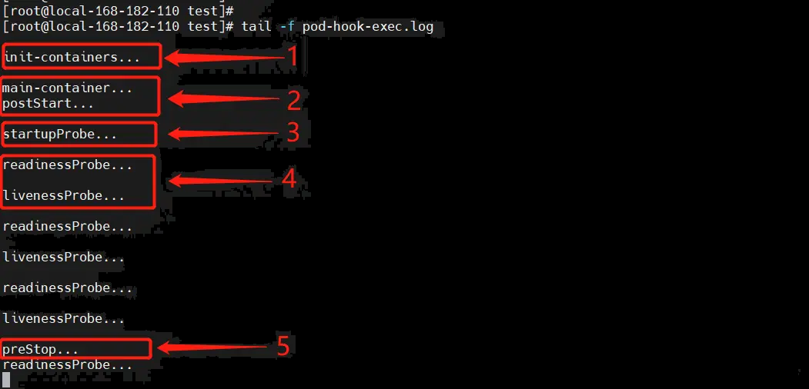  
从上图的日志就可看出,被分为6个执行阶段;执行的先后顺序：   

**<font color=red>initContainers --> mainContainer --> postStart --> startupProbe --> readinessProbe --> livenessProbe --> preStop</font>**       
>main-container和postStart是同时执行,虽然readinessProbe和livenessProbe也是同时执行,但是他们不是真正的并行执行,也有先后顺序的   

[探针-路多辛](https://www.toutiao.com/article/7206670428587164192/)  
[kubernetes官方文档](https://kubernetes.io/docs/tasks/configure-pod-container/configure-liveness-readiness-startup-probes/)   

**健康检测(三种探针)总结**  
通过合理配置三种探针,可以实现   
- 启动保护：避免慢启动应用被误杀StartupProbe  
- 高可用性：快速恢复故障容器livenessProbe  
- 流量控制：确保只有就绪的Pod接收请求readinessProbe 

## 7.8 pod终止过程
**pod终止(删除)过程**  

```bash  
1、用户向apiserver发送删除pod对象的命令
2、apiserver中的pod对象信息会随着时间的推移而更新,在宽限期内(默认30s,spec.terminationGracePeriodSeconds),pod被视为dead
3、将pod标记为terminating(正在删除)状态
4、kubelet在监控到pod对象转为terminating状态的同时就会启动pod关闭过程
5、endpoint控制器监控到pod对象的关闭行为时将其从所有匹配到此endpoint的svc资源endpoint列表中删除
6、如果当前pod对象定义了preStop钩子处理器,则在其被标记为terminating后会意同步的方式启动执行
7、pod对象中的容器进程收到停止信号
8、宽限期结束后,若pod中还存在运行的进程,kubelet向容器发送SIGKILL信号,强制关闭容器进程
9、kubelet请求apiServer将此pod资源的宽限期设置为0,从而完成删除操作,此时pod对用户已不可见

在删除pod时,有两条平行的时间线。一条是改变网络规则,一条是删除pod 
1、网络规则生效
apiserver接收到pod删除请求,将pod在Etcd中的状态更新为Terminating
EndpointController从Endpoint对象中删除pod的IP
kuber-proxy根据Endpoint对象的变化更新iptables的规则,不再将流量路由到被删除的Pod

2、删除pod
apiserver接收到Pod删除请求,将Pod在Etcd中的状态更新为terminating
preStop钩子被执行
kubelet向容器发送SIGTERM 
继续等待,直到容器停止,或者超时spec.terminationGracePeriodSeconds默认30s
如果超过了spec.terminationGracePeriodSeconds容器仍然没有停止,k8s将会发送SIGKILL信号给容器,强制关闭容器进程
Pod被终止,处于terminating状态
k8s删除Pod相关资源:如网络配置、数据卷等
```
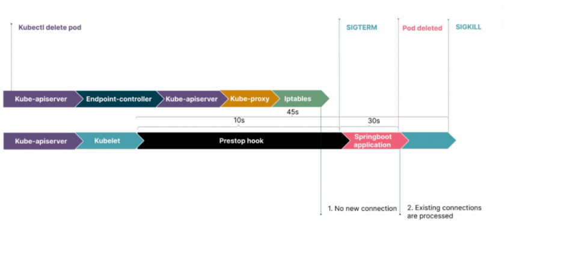  
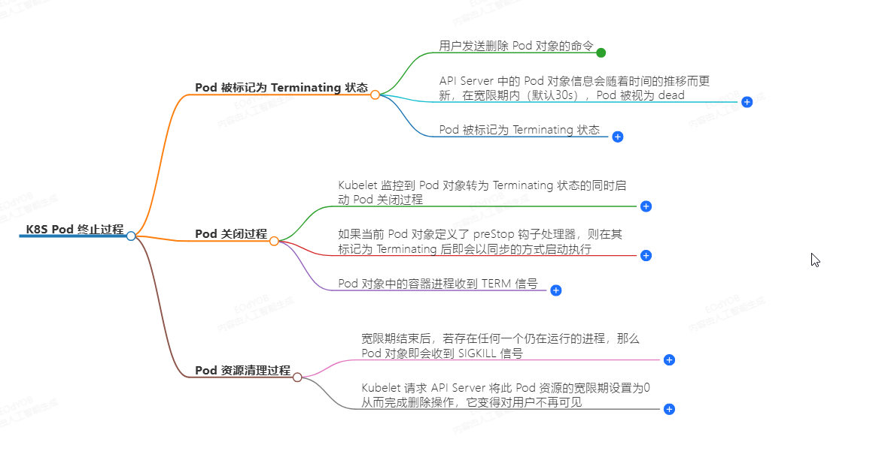  
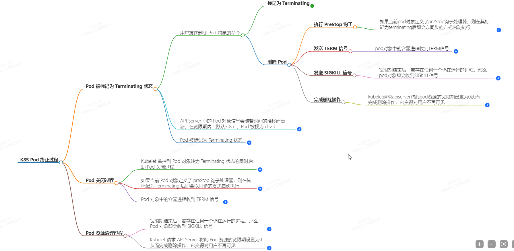  


