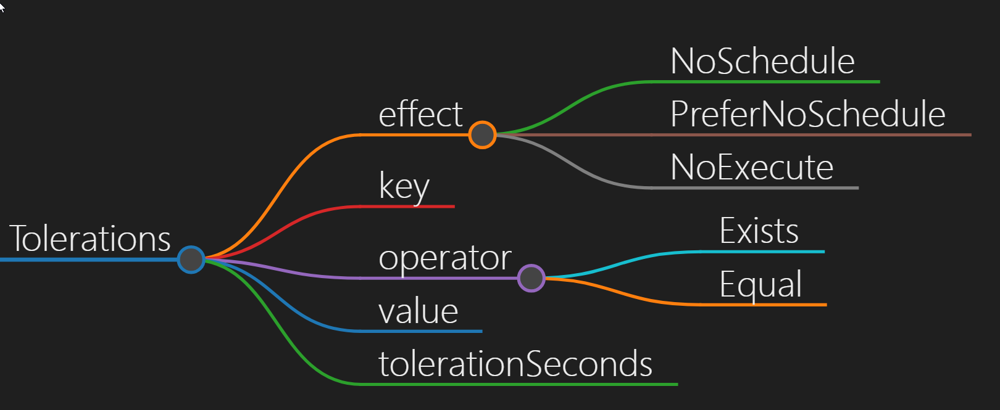
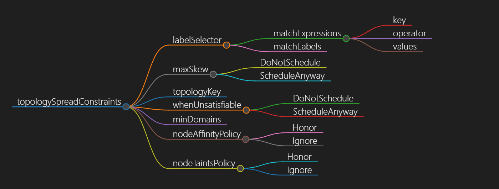
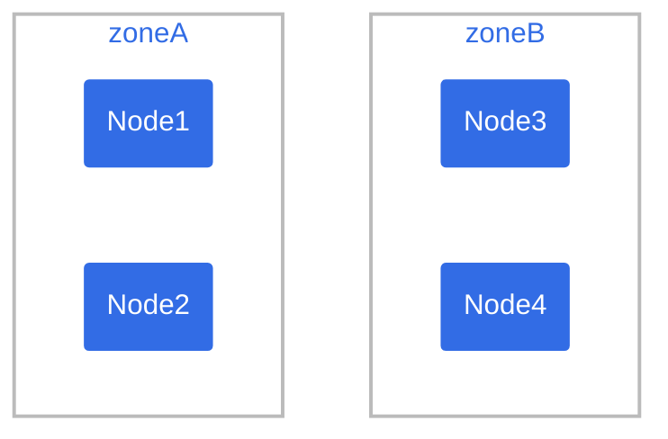
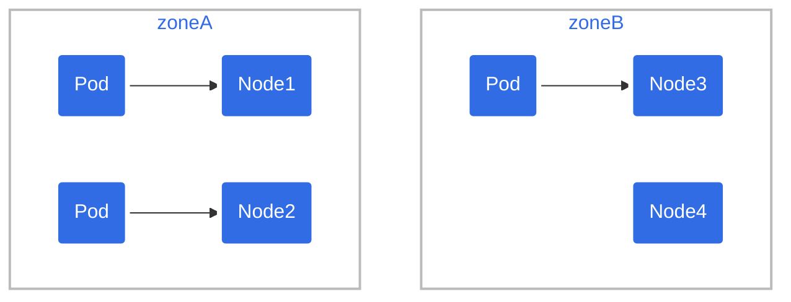
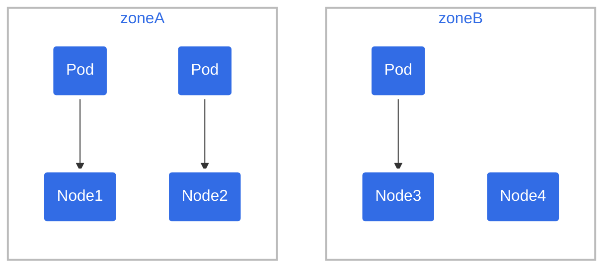
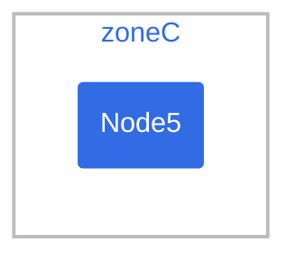

# kube-scheduler调度概述
K8s中调度是指将Pod调度到合适的节点上,以便对应节点上的Kubelet能够运行这些Pod;  
kube-scheduler将Pod分配(调度)到集群内的各个节点,进而创建容器运行进程;Kube-scheduler是K8s集群默认的调度器

scheduler通过k8s的监测(Watch)机制来发现集群中新创建且尚未被调度到Node上的Pod;  
scheduler主要作用是负责资源的调度Pod,通过APIServer的Watch接口监听新建Pod信息, 按照预定的调度策略将Pod调度到相应的Node节点上;

# kube-scheduler工作原理
## kube-scheduler调度流程
 
<details>
  <summary>kube-scheduler调度流程解释</summary>
  <pre><code>
1. scheduler维护待调度的podQueue并监听APIServer;
   >用户提交pod资源请求;可以通过APIServer的RESTAPI,也可用Kubectl命令行工具支持Json和Yaml两种格式  
2. 创建Pod时首先通过APIServer将Pod元数据写入etcd(APIServer处理用户请求,存储Pod数据到Etcd)  
3. scheduler通过Informer监听Pod状态添加新的Pod时,会将Pod添加到podQueue;podQueue中提取Pods并按照一定的算法将节点分配给Pods;  
   >schedule调度pod：schedule通过APIServer的watch机制,实时查看到新的pod,按照预定的调度策略将Pod调度到相应的Node节点上    
   - 过滤主机(节点预选)  
     调度器用一组规则过滤掉不符合要求的主机;比如Pod指定了所需要的资源,么就要过滤掉资源不够的主机从而完成节点的预选  
   - 主机打分(节点优选)  
     对第一步筛选出的符合要求的主机进行打分,在主机打分阶段,调度器会考虑一些整体优化策略;  
     比如把一个RC的副本分布到不同的主机上,使用最低负载的主机等；对预选出的节点进行优先级排序,以便选出最合适运行Pod对象的节点  
   - 选择主机(节点选定)  
     选择打分最高的主机,进行binding操作,结果存储到Etcd中;  
4. node的kubelet也侦听ApiServer如果发现有新的Pod已调度到该节点,则将通过CRI调用高级容器运行时来运行容器;kubelet创建pod
   kubelet根据schedule调度结果执行Pod创建操作: 
   调度成功后,会启动container, docker run, scheduler会调用APIServer的API在etcd中创建一个boundpod对象,描述在一个工作节点上绑定运行的所有pod信息;  
   运行在每个工作节点上的kubelet也会定期与etcd同步boundpod信息,一旦发现应该在该工作节点上运行的boundpod对象没有更新,则调用DockerAPI创建并启动pod内的容器
  </code></pre>
</details>

 ## [工作原理](https://zhuanlan.zhihu.com/p/339762721)
   
   
如上图所示,我们简单介绍一下支持的扩展点：  
- QueueSort: 对队列中的 Pod 进行排序
- PreFilter: 预处理 Pod 的相关信息,或者检查集群或 Pod 必须满足的某些条件。 如果 PreFilter 插件返回错误,则调度周期将终止。
- Filter: 过滤出不能运行该 Pod 的节点。对于每个节点, 调度器将按照其配置顺序调用这些过滤插件。如果任何过滤插件将节点标记为不可行, 则不会为该节点调用剩下的过滤插件。节点可- 以被同时进行评估。
- PostFilter: 在筛选阶段后调用,但仅在该 Pod 没有可行的节点时调用。 插件按其配置的顺序调用。如果任何后过滤器插件标记节点为“可调度”, 则其余的插件不会调用。典型的后筛选实现- 是抢占,试图通过抢占其他 Pod 的资源使该 Pod 可以调度。
- PreScore: 运行评分任务以生成可评分插件的共享状态
- Score: 通过调用每个评分插件对过滤的节点进行排名
- NormalizeScore: 结合分数并计算节点的最终排名
- Reserve: 在绑定周期之前选择保留的节点
- Permit: 批准或拒绝调度周期的结果
- PreBind: 用于执行 Pod 绑定前所需的任何工作。例如,一个预绑定插件可能需要提供网络卷并且在允许 Pod 运行在该节点之前 将其挂载到目标节点上。
- Bind: 用于将 Pod 绑定到节点上。直到所有的 PreBind 插件都完成,Bind 插件才会被调用。
- PostBind: 这是个信息性的扩展点。 绑定后插件在 Pod 成功绑定后被调用。这是绑定周期的结尾,可用于清理相关的资源  

**scheduler调度pod选择包含两个步骤**  
- 预选(过滤)
  >过滤阶段会将所有满足Pod调度需求的Node选出来
  
- 优选(打分)
  >scheduler会为Pod从所有可调度节点中选取一个最合适的Node根据当前启用的打分规则;  
   scheduler会给每一个可调度节点进行打分  
   最后scheduler会将Pod调度到得分最高的Node上;  
   如果存在多个得分最高的Node,scheduler会从中随机选取一个  

**预选策略Predicates**
- PodFitsHostPorts：检查Pod容器所需的HostPort是否已被节点上其它容器或服务占用,如已被占用,则禁止Pod调度到该节点  
- PodFitsHost：检查Pod指定的NodeName是否匹配当前节点  
- PodFitsResources：检查节点是否有足够空闲资源(例如CPU和内存)来满足Pod的要求  
- PodMatchNodeSelector：检查Pod的节点选择器(nodeSelector)是否与节点(Node)的标签匹配  
- NoVolumeZoneConflict：对于给定的某块区域,判断如果在此区域的节点上部署Pod是否存在卷冲突  
- NoDiskConflict：根据节点请求的卷和已经挂载的卷,评估Pod是否适合该节点   
- MaxCSIVolumeCount：决定应该附加多少CSI卷,以及该卷是否超过配置的限制  
- CheckNodeMemoryPressure：如果节点内存压力,并且没有配置异常,那么将不会往那里调度Pod  
- CheckNodePIDPressure：如果节点报告进程id稀缺,并且没有配置异常,那么将不会往那里调度Pod  
- CheckNodeDiskPressure：如果节点报告存储压力(文件系统已满或接近满),并且没有配置异常,那么将不会往那里调度Pod  
- CheckNodeCondition：节点报告的文件系统网络不可用,或者kubelet没有准备好运行Pods,如果为节点设置了这样的条件,并且没有配置异常,那么将不会往那里调度Pod  
- PodToleratesNodeTaints：检查Pod的容忍度是否能容忍节点的污点  
- CheckVolumeBinding：评估Pod是否适合它所请求的容量,这适用于约束和非约束PVC  

>**如果在predicates(预选)过程中没有合适的节点,那么Pod会一直在pending状态,不断重试调度,直到有节点满足条件;  
经过这个步骤,如果有多个节点满足条件,就继续priorities过程,最后按照优先级大小对节点排序** 
 
**优选Priorities**
- SelectorSpreadPriority：对于属于同一服务、有状态集或副本集（Service,StatefulSet or ReplicaSet）的Pods,会将Pods尽量分散到不同主机上。
- InterPodAffinityPriority：策略有podAffinity和podAntiAffinity两种配置方式。简单来说,就说根据Node上运行的Pod的Label来进行调度匹配的规则,匹配的表达式有：In, NotIn, - Exists, DoesNotExist,通过该策略,可以更灵活地对Pod进行调度。
- LeastRequestedPriority：偏向使用较少请求资源的节点。换句话说,放置在节点上的Pod越多,这些Pod使用的资源越多,此策略给出的排名就越低。
- MostRequestedPriority：偏向具有最多请求资源的节点。这个策略将把计划的Pods放到整个工作负载集所需的最小节点上运行。
- RequestedToCapacityRatioPriority：使用默认的资源评分函数模型创建基于ResourceAllocationPriority的requestedToCapacity。
- BalancedResourceAllocation：偏向具有平衡资源使用的节点。
- NodePreferAvoidPodsPriority：根据节点注释scheduler.alpha.kubernet .io/preferAvoidPods为节点划分优先级。可以使用它来示意两个不同的Pod不应在同一Node上运行。
- NodeAffinityPriority：根据preferredduringschedulingignoredingexecution中所示的节点关联调度偏好来对节点排序。
- TaintTolerationPriority：根据节点上无法忍受的污点数量,为所有节点准备优先级列表。此策略将考虑该列表调整节点的排名。
- ImageLocalityPriority：偏向已经拥有本地缓存Pod容器镜像的节点。
- ServiceSpreadingPriority：对于给定的服务,此策略旨在确保Service的Pods运行在不同的节点上。总的结果是,Service对单个节点故障变得更有弹性。
- EqualPriority：赋予所有节点相同的权值1。
- EvenPodsSpreadPriority：实现择优 pod的拓扑扩展约束
>[官网地址](https://kubernetes.io/zh-cn/docs/reference/scheduling/)  
[k8s中kube-scheduler的调度过程](https://www.toutiao.com/article/7345759512613421568/)  
[聊聊kube-scheduler如何完成调度和调整调度权重](https://www.toutiao.com/article/7313829073661739520/)  
[kube-scheduler调度器原理](https://www.toutiao.com/article/7182031810707210807/)  


# k8s调度Pod的主要方式
- 自动调度：运行在哪个节点上完全由Scheduler经过一系列的算法计算得出(默认kube-scheduler)  
- 定向调度:  [NodeName](https://github.com/gitseen/gitOps/blob/main/k8s/k8s-scheduler.md#NodeName)、[NodeSelector](https://github.com/gitseen/gitOps/blob/main/k8s/k8s-scheduler.md#NodeSelector)  
- 亲和性调度： [NodeAffinity](https://github.com/gitseen/gitOps/blob/main/k8s/k8s-scheduler.md#NodeAffinity)、[PodAffinity](https://github.com/gitseen/gitOps/blob/main/k8s/k8s-scheduler.md#PodAffinity)、[PodAntiAffinity](https://github.com/gitseen/gitOps/blob/main/k8s/k8s-scheduler.md#PodAntiAffinity)  
- 污点(容忍)调度： [Taints](https://github.com/gitseen/gitOps/blob/main/k8s/k8s-scheduler.md#Taints)、[Tolerations](https://github.com/gitseen/gitOps/blob/main/k8s/k8s-scheduler.md#Tolerations) 
- [Pod拓扑分布约束](https://github.com/gitseen/gitOps/blob/main/k8s/k8s-scheduler.md#Pod拓扑分布约束)  
- [自定义调度器my-scheduler](https://github.com/gitseen/gitOps/blob/main/k8s/k8s-scheduler.md#自定义调度器my-scheduler)  

# k8s-api-yaml语法示例
```bash
kubectl api-resources
kubectl api-resources -o name --verbs-list --namespaced
kubectl api-resources -o name --verbs-list --namespaced |grep "XX"
kubectl api-resources -o name --verbs-list --namespaced | xargs -n 1 kubectl get --show-kind --ignore-not-found -A
kubectl api-resources -o name --verbs-list --namespaced | xargs -n 1 kubectl get --show-kind --ignore-not-found -n namespaces

---

kubectl explain pod.spec.XXX
kubectl explain deployment.spec.template.spec.XXX
kubectl explain statefulset.spec.template.spec.XXX
kubectl explain daemonset.spec.template.spec.XXX
kubectl explain job.spec.template.spec.XXX
kubectl explain cronjob.spec.XXX
......
```


---

<table><tr><td bgcolor=green>定向调度nodeName、nodeSelector</td></tr></table>  

# NodeName
nodeName属于定向调度(通过nodeName匹配规则是强制匹配);nodeName(直接指定node主机名)   

Pod.spec.nodeName强制约束将Pod调度到指定的Node上,其实指定了nodeName的Pod会直接跳过Scheduler的调度逻辑,直接写入PodList列表  
<details>
  <summary>nodeName调度-指定nodeName调度到指定节点上</summary>
  <pre><code>
apiVersion: apps/v1
kind: Deployment
metadata:
  labels:
    app: springbootweb
  name: springbootweb-deployment
spec:
  replicas: 1
  selector:
    matchLabels:
      app: springbootweb
  template:
    metadata:
      labels:
        app: springbootweb
    spec:
      nodeName: node23.turing.com   #指定调度到node23.turing.com节点上
      containers:
      - image: registry.tuling123.com/springboot:latest
        imagePullPolicy: IfNotPresent
        name: springbootweb
        ports:
        - containerPort: 9081
          hostPort: 9981     
      imagePullSecrets:
      - name: registry-key-secret
  </code></pre>
</details>  

>1 如果指定的节点不存在,则容器将不会运行,并且在某些情况下可能会自动删除  
 2 如果指定的节点没有足够的资源来容纳该Pod,则该Pod将会失败,并且其原因将被指出,例如OutOfmemory或OutOfcpu  
 3 云环境中的节点名称并非总是可预测或稳定的   


# NodeSelector
nodeSelector定向调度(通过标签匹配)  
nodeSelector(节点选择器,为Node打上标签,然后Pod中通过nodeSelector选择打上标签的Node)  
<details>
  <summary>nodeSelector调度</summary>
  <pre><code>
#kubectl label nodes k8s-node-1 zone=north  打标签
#kubectl label node  k8s-node-1 zone-       删除标签
#kubectl get node --show-labels
apiVersion:v1
kind: Pod
metadata:
  name: redis-master
  label:
    name: redis-master
spec:
  replicas: 1
  selector:
    name: redis-master
    template:
      metadata:
        labels:
          name: redis-master
      spec:
        containers:
        - name: redis-master
          images: kubeguide/redis-master
          ports:
          - containerPort: 6379
        nodeSelector:    #匹配zone: north标签的节点K:V  这里指定Node的Label
          zone: north
  </code></pre>
</details>

>如果nodeSelector匹配的标签不存在,则容器将不会运行,一直处于Pending状态  
nodeName、nodeSelector属于定向调度  

---

<table><tr><td bgcolor=green>亲和性调度nodeAffinity、podAffinity、podAntiAffinity</td></tr></table>  

**Affinity亲和性调度分类** 
- nodeAffinity(node亲和性)  
    以node为目标,解决pod可以调度到哪些node的问题 
- podAffinity(pod亲和性)  
    以pod为目标,解决pod可以和哪些已存在的pod部署在同一个拓扑域中的问题   
- podAntiAffinity(pod反亲和性)  
   以pod为目标,解决pod不能和哪些已存在pod部署在同一个拓扑域中的问题   

**新和性视图**  


# NodeAffinity
nodeAffinity用于定义Pod与节点之间的亲和性;控制Pod被调度到具有特定标签或属性的节点上  
nodeAffinity节点亲和性功能类似于nodeSelector(通过Node的Label进行精确匹配)字段,但它的表达能力更强,并且允许你指定软规则;  
nodeAffinity增加了In、NotIn、Exists、DoesNotexist、Gt、Lt等操作符来选择Node;调度侧露更加灵活  

- nodeAffinity的亲和性表达  
  + 硬限制：requiredDuringSchedulingIgnoredDuringExecution  
    ```bash
    必须满足指定的规则才可以调度Pod到node上,相当于硬限制; 
    调度器只有在规则被满足的时候才能执行调度。此功能类似于nodeSelector,但其语法表达能力更强
    
    **requiredDuringSchedulingIgnoredDuringExecution拆解**
    requiredDuringScheduling
      定义的规则必须强制满足Required才会把Pod调度到节点上
    IgnoredDuringExecution
      已经在节点上运行的Pod不需要满足定义的规则,即使去除节点上的某个标签,那些需要节点包含该标签的Pod依旧会在该节点上运行;
      或者这么理解：如Pod所在的节点在Pod运行期间标签被删除了,不再符合该Pod的节点亲和性规则,那也没关系,该Pod还能继续在该节点上运行
    ```
  + 软限制：preferredDuringSchedulingIgnoredDuringExecution  
    ```bash
    强调优先满足指定规则,调度器会尝试调度Pod到Node上,但并不强求,相当于软限制
    调度器会尝试寻找满足对应规则的节点,如果找不到匹配的节点,调度器仍然会调度该Pod
    多个优先级规则还可以设置权重(weight)值,以此来定义执行的先后顺序
    ```
  + 节点亲和性权重  
    ```bash
    preferredDuringSchedulingIgnoredDuringExecution亲和性类别的每个实例设置weight字段,取值范围是1 ~ 100;
    当调度器找到能够满足Pod的其他调度请求的节点时,调度器会遍历节点满足的所有的偏好性规则,并将对应表达式的weight值加和;
    最终的加和值会添加到该节点的其他优先级函数的评分之上;在调度器为Pod做出调度决定时,总分最高的节点的优先级也最高
    ```
  + IgnoredDuringExecution 
    如果在Pod运行期间Node的标签发生变化,导致亲和性策略不能满足,则继续运行当前的Pod   
    如一个Pod所在的节点在Pod运行期间标签发生了变更,不再符合该Pod的节点亲和性需求,则系统将忽略Node上label的变化,该Pod能继续在该节点运行  
    >IgnoredDuringExecution意味着如果节点标签在K8s调度Pod后发生了变更,Pod仍将继续运行  

- nodeAffinity的语法规则  
  nodeAffinity语法支持的操作符包括In,NotIn,Exists,DoesNotExist,Gt,Lt;  
  虽然没有节点排斥功能,但是用NotIn和DoesNotExist就可以实现排斥的功能了  
  **亲和性表达方式可选的操作符operator**  
   ```bash
  In：label的值在某个列表中
  NotIn：label的值不在某个列表中
  Gt：label的值大于某个值(字符串比较)
  Lt：label的值小于某个值(字符串比较)
  Exists：某个label存在
  DoesNotExist：某个label不存在
  ```
  **关系符使用说明: matchExpressions**  
  ```bash
  + key: nodeenv         # 匹配存在标签的key为nodeenv的节点  
    operator: Exists  
  + key: nodeenv         # 匹配标签的key为nodeenv,且value是"k"或"v"的节点  
    operator: In  
    values: "k","v"  
  + key: nodeenv         # 匹配标签的key为nodeenv,且value大于"k"的节点  
    operator: Gt  
    values: "k"   
  ```
- nodeAffinity的注意事项  
>如同时定义了nodeSelector和nodeAffinity那么必须两个条件都得到满足,Pod才能最终运行到指定的Node上  
如nodeAffinity指定了多个nodeSelectorTerms,那么其中一个能够匹配成功即可  
如在nodeSelectorTerms中有多个matchExpressions,则一个节点必须满足所有matchExpressions才能运行该Pod  


- nodeAffinity-API

**nodeAffinity语法展示架构**   
  
  
```bash
preference：节点选择器,与相应的权重相关联
weight：在1-100范围内,与匹配相应的节点选项相关联的权重
nodeSelectorTerms：节点选择列表(比nodeSelector高级一点)
matchExpressions：按照节点label列出节点选择器列表(与matchFields是两种方式,不过结果是一至)
matchFields：按照节点字段列出节点选择器列表(与matchExpressions是两种方式,不过结果是一至)
key：指定要选择节点label的key  
values：指定要选择节点label的value,值必须为数组 [“value”]
        如果操作符为In或者Notin,value则不能为空
        如果操作符为Exists或者DoesNotExist ,value则必须为空[]
        如果操作符为Gt或Lt,则value必须有单个元,该元素将被解释为整数
operator：操作符,指定key与value的关系
In：key与value同时存在,一个key多个value的情况下,value之间就成了逻辑或效果
NotIn：label 的值不在某个列表中
Exists：只判断是否存在key,不用关心value值是什么
DoesNotExist：某个label不存在
Gt：label 的值大于某个值
Lt：label 的值小于某个值
```

**语法**  
```bash
kubectl explain deployment.spec.template.spec.nodeAffinity.requiredDuringSchedulingIgnoredDuringExecution.XX
kubectl explain deployment.spec.template.spec.nodeAffinity.preferredDuringSchedulingIgnoredDuringExecution.XX
```
<details>
  <summary>requiredDuringSchedulingIgnoredDuringExecution-nodeSelectorTerms硬限制</summary>
  <pre><code>
apiVersion: apps/v1
kind: Deployment
metadata:
  name: nginx-deployment
spec:
  replicas: 1
  selector:
    matchLabels:
      app: nginx
  template:
    metadata:
      labels:
        app: nginx
    spec:
      affinity:
        nodeAffinity:
          requiredDuringSchedulingIgnoredDuringExecution:
            nodeSelectorTerms:
              - matchExpressions:
                  - key: disktype
                    operator: In
                    values:
                      - ssd
      containers:
        - name: nginx
          image: nginx
#nodeAffinity调度pod到具有disktype: ssd标签的节点上;硬限制
  </code></pre>
</details>

<details>
  <summary>requiredDuringSchedulingIgnoredDuringExecution-weight-不强制</summary>
  <pre><code>
apiVersion: apps/v1
kind: Deployment
metadata:
  name: nginx-deployment
spec:
  replicas: 1
  selector:
    matchLabels:
      app: nginx
  template:
    metadata:
      labels:
        app: nginx
    spec:
      affinity:
        nodeAffinity:
          preferredDuringSchedulingIgnoredDuringExecution:
          - weight: 1
            preference:
              matchExpressions:
                - key: disktype
                  operator: In
                  values:
                    - ssd
      containers:
        - name: nginx
          image: nginx
#preferredDuringSchedulingIgnoredDuringExecution调度器会尽量但不强制将Pod调度到具有disktype: ssd标签的节点上
  </code></pre>
</details>


<details>
  <summary>preferredDuringSchedulingIgnoredDuringExecution优先调度(32G-->16G-->8G内存节点)</summary>
  <pre><code>
spec:
  containers:
  - name: xxxxx
    image: xxxxx
  affinity:
    nodeAffinity:
      preferredDuringSchedulingIgnoredDuringExecution:
      - weight: 20
        preference:
          matchExpressions:
          - key: mem
            operator: In
            values:
            - memory32
      - weight: 10
        preference:
          matchExpressions:
          - key: mem
            operator: In
            values:
            - memory16
      - weight: 1
        preference:
          matchExpressions:
          - key: mem
            operator: In
            values:
            - memory8
  </code></pre>
</details>

<details>
  <summary>NodeAffinity-->required-->preferred先硬后软</summary>
  <pre><code>
apiVersion: v1
kind: Pod
metadata:
  name: nginx
spec:
  affinity:
    nodeAffinity:
      requiredDuringSchedulingIgnoredDuringExecution:
        nodeSelectorTerms:
        - matchExpressions:
          - key: kubernetes.io/e2e-az-name
            operator: In
            values:
            - e2e-az1
            - e2e-az2
      preferredDuringSchedulingIgnoredDuringExecution:
      - weight: 1               //取值范围1-100
        preference:
          matchExpressions:
          - key: another-node-label-key
            operator: In
            values:
            - another-node-label-value
  containers:
  - name: nginx
    image: docker.io/nginx
#Pod只能被调度到拥有kubernetes.io/e2e-az-name=e2e-az[1-2]标签的节点上;其中在满足之前标签条件的同时更倾向于调度在another-node-label-key=another-node-label-value标签的节点上
---
apiVersion: v1
kind: Pod
metadata:
  name: with-node-affinity
  labels:
    app: node-affinity-pod
spec:
  containers:
  - name: with-node-affinity
    image: nginx
  affinity:
    nodeAffinity:
      requiredDuringSchedulingIgnoredDuringExecution:
        nodeSelectorTerms:
        - matchExpressions:
          - key: kubernetes.io/hostname
            operator: NotIn
            values:
            - 192.168.1.140
            - 192.168.1.161
      preferredDuringSchedulingIgnoredDuringExecution:
      - weight: 1
        preference:
          matchExpressions:
          - key: source
            operator: In
            values:
            - qikqiak
#POD首先是要求POD不能运行在140和161两个节点上;
#如有节点满足source=qikqiak的话就优先调度到这个节点上;
#同样的我们可以使用descirbe命令查看具体的调度情况是否满足我们的要求 

  </code></pre>
</details>


# PodAffinity 
podAffinity是pod亲和性,用于定义Pods之间的亲和性,使得某个Pod被调度到与其他特定标签的Pod相同的节点上  
Pod间亲和性创建的Pod与哪些已存在的Pod倾向于调度到同一节点,与节点亲和性类似;  
Pod的亲和性与反亲和性也有两种类型  
- requiredDuringSchedulingIgnoredDuringExecution：强制  

- preferredDuringSchedulingIgnoredDuringExecution：首选  

**podAffinity语法展示架构**


```bash
podAffinityTerm：Pod亲和性选择器
weight：在1-100范围内,与匹配相应的节点选项相关联的权重 
labelSelector：标签选择器
topologyKey：指定要将当前创建Pod运行在具备什么样的Node标签上,通常指定Node标签的Key
namespaces：指定labelSelector应用于哪个名称空间,null或空列表表示此pod的名称空间
matchExpressions：按照节点label列出节点选择器列表(与matchLabels是两种方式,不过结果是一至)
matchLabels：按照节点字段列出节点选择器列表(与matchExpressions是两种方式,不过结果是一至)
key：指定要选择节点label的key
values：指定要选择节点label的value,值必须为数组 [“value”]
        如果操作符为In或者Notin,value则不能为空
        如果操作符为Exists或者DoesNotExist ,value则必须为空[]
        如果操作符为Gt或Lt,则value必须有单个元,该元素将被解释为整数
operator：操作符,指定key与value的关系
In：key与value同时存在,一个key多个value的情况下,value之间就成了逻辑或效果
NotIn：label 的值不在某个列表中
Exists：只判断是否存在key,不用关心value值是什么
DoesNotExist：某个label不存在
Gt：label 的值大于某个值
Lt：label 的值小于某个值
```
**语法**
```bash
kubectl explain deployment.spec.template.spec.affinity.podAffinity.requiredDuringSchedulingIgnoredDuringExecution.XX
kubectl explain deployment.spec.template.spec.affinity.podAffinity.preferredDuringSchedulingIgnoredDuringExecution.XX
```

<details>
  <summary>podAffinity-required示例</summary>
  <pre><code>
apiVersion: v1
kind: Pod
metadata:
  name: redis
  labels:          #定义一个Pod,包含标签： dbType= v
    dbType: kv
spec:
  containers:
  - name: redis
    image: redis:latest
    imagePullPolicy: IfNotPresent
---
apiVersion: v1
kind: Pod
metadata:
  name: nginx
spec:
  affinity:
    podAffinity:
      requiredDuringSchedulingIgnoredDuringExecution:
      - labelSelector:         #通过labelSeletor匹配Pod;Pod调度时需要满足,部署的Node上有能够满足该条件的Pod
          matchExpressions:    #这里指定的选择器会匹配到Pod:redis,因此该Pod(nginx)与Pod(redis)会运行在同一个Node上
          - key: dbType
            operator: In
            values:
            - kv
        topologyKey: topology.kubernetes.io/zone   #拓扑域,不允许为空
                                                   #这里表示Pod所在节点的标签中包含topology.kubernetes.io/zone这个Key
  containers:
  - name: nginx
    image: nginx:latest
    imagePullPolicy: IfNotPresent
  </code></pre>
</details>


<details>
  <summary>podAffinity-preferred示例</summary>
  <pre><code>
apiVersion: v1
kind: Pod
metadata:
  name: redis
  labels:
    dbType: kv
spec:
  nodeName: k8s-master
  containers:
  - name: redis
    image: redis:latest
    imagePullPolicy: IfNotPresent
---
apiVersion: v1
kind: Pod
metadata:
  name: nginx
spec:
  affinity:
    podAffinity:
      preferredDuringSchedulingIgnoredDuringExecution:
      - weight: 100
        podAffinityTerm:
          labelSelector:
            matchExpressions:
            - key: dbType
              operator: In
              values:
              - kv
          topologyKey: topology.kubernetes.io/zone
  containers:
  - name: nginx
    image: nginx:latest
    imagePullPolicy: IfNotPresent
#preferredDuringSchedulingIgnoredDuringExecution在pod倾向性亲和性用法与node中用法一致;
#表示更倾向于和匹配的Pod部署在同一节点上,但不是必须的
---
apiVersion: apps/v1
kind: Deployment
metadata:
  name: podaffinity-perferred-pod
spec:
  replicas: 3
  selector:
    matchLabels:
      app: myapp
  template:
    metadata:
      name: myapp
      labels:
        app: myapp
    spec:
      affinity:
        podAffinity:
          preferredDuringSchedulingIgnoredDuringExecution:
          - weight: 80
            podAffinityTerm:
              labelSelector:
                matchExpressions:
                - { key: app, operator: In, values: ["cache"] }
              topologyKey: zone
          - weight: 20
            podAffinityTerm:
              labelSelector:
                matchExpressions:
                - { key: app, operator: In, values: ["db"] }
              topologyKey: zone
      containers:
      - name: myapp
        image: busybox:latest
        command: ["/bin/sh", "-c", "tail -f /etc/passwd" ]
#以下三个Node都具备标签键为zone,但是这三个Node上没有Pod标签为app=cache及app=db
#所以上面的调度策略在选择Pod标签的时候进行退步才得以将Pod调度到Node01和Node03

  </code></pre>
</details>


# PodAntiAffinity
podAntiAffinity是Pod反亲和性,反亲和性能够让带有相同标签的副本,部署到不同的节点上  

**podAntiAffinity语法展示架构**


**语法**  
```bash
kubectl explain deployment.spec.template.spec.affinity.podAntiAffinity.requiredDuringSchedulingIgnoredDuringExecution.XX
kubectl explain deployment.spec.template.spec.affinity.podAntiAffinity.preferredDuringSchedulingIgnoredDuringExecution.XX
```

                     
<details>
  <summary>podAntiAffinity示例</summary>
  <pre><code>
apiVersion: apps/v1
kind: Deployment
metadata:
  name: redis-cache
spec:
  selector:
    matchLabels:
      app: store
  replicas: 3         #个副本
  template:
    metadata:
      labels:         #定义标签 app=store
        app: store
    spec:
      affinity:
        podAntiAffinity:    #反亲和性
          requiredDuringSchedulingIgnoredDuringExecution:
          - labelSelector:
              matchExpressions:   #反亲和性会使得3个副本不运行在同一个Node上
              - key: app
                operator: In
                values:
                - store
            topologyKey: "kubernetes.io/hostname"     #只能是"kubernetes.io/hostname"
      containers:
      - name: redis-server
        image: redis:latest
        imagePullPolicy: IfNotPresent
#Pod反亲和性能够让带有相同标签的副本,部署到不同的节点上
#集群只有两个Node,创建deployment后会发现每个Node上运行一个对应的Pod,还有一个Pod处于Pending状态 #实现不在同一节点上部署
---
apiVersion: apps/v1
kind: Deployment
metadata:
  name: podantiaffinity-perferred-pod
spec:
  replicas: 4
  selector:
    matchLabels:
      app: myapp
  template:
    metadata:
      name: myapp
      labels:
        app: myapp
    spec:
      affinity:
        podAntiAffinity:
          requiredDuringSchedulingIgnoredDuringExecution:
          - labelSelector:
              matchExpressions:
              - { key: app, operator: In, values: ["myapp"] }
            topologyKey: zone
      containers:
      - name: myapp
        image: busybox:latest
        command: ["/bin/sh", "-c", "tail -f /etc/passwd" ]
#4个Pod,自身标签为app=myapp
#使用Pod反亲和的硬亲和性,需要运行在具备标签key为zone的Node上,然后不运行在具备标签为app=myapp的Pod同台Node上
#启动了4个Pod,一共有三个node,前三个Pod都会被分别调度到不同的三台node上
#(因为采用的是反亲和性,还是硬性,所以相同标签的Pod不会调度到同一台Node),最后一个Pod将无家可归,最后无法调度 

  </code></pre>
</details>

<details>
  <summary>podAffinity-PodAntAffinity示例</summary>
  <pre><code>
apiVersion: apps/v1
kind: Deployment
metadata:
  name: nginx-anti
spec:
  replicas: 2
  selector:
    matchLabels:
      app: anti-nginx
  template:
    metadata:
      labels:
        app: anti-nginx
    spec:
      affinity:
        podAffinity:
          requiredDuringSchedulingIgnoredDuringExecution:
          - labelSelector:
              matchExpressions:
                - key: a
                  operator: In
                  values:
                    - b
            topologyKey: kubernetes.io/hostname
        podAntiAffinity:
          requiredDuringSchedulingIgnoredDuringExecution:
          - labelSelector:
              matchExpressions:
                - key: app
                  operator: In
                  values:
                    - anti-nginx
            topologyKey: kubernetes.io/hostname
      containers:
        - name: with-pod-affinity
          image: nginx
#PodAffinity：要求调度的Pod必须与具有特定标签(键a,值b)的Pod在相同的节点上 
#PodAntiAffinity：要求调度的Pod不能与具有相同标签(键app,值anti-nginx)的Pod在相同的节点上
  </code></pre>
</details>

<details>
  <summary>podAffinity-podAntAffinity-topologyKey示例</summary>
  <pre><code>
apiVersion: v1
kind: Pod
metadata:
  name: with-pod-affinity
spec:
  affinity:
    podAffinity:
      requiredDuringSchedulingIgnoredDuringExecution:
      - labelSelector:
          matchExpressions:
          - key: security
            operator: In
            values:
            - S1
        topologyKey: failure-domain.beta.kubernetes.io/zone
    podAntiAffinity:
      preferredDuringSchedulingIgnoredDuringExecution:
      - weight: 100
        podAffinityTerm:
          labelSelector:
            matchExpressions:
            - key: security
              operator: In
              values:
              - S2
          topologyKey: kubernetes.io/hostname
  containers:
  - name: with-pod-affinity
    image: k8s.gcr.io/pause:2.0
#pod必须调度在至少运行一个security=S1标签的pod的节点上;如果该节点有标签key为failure-domain.beta.kubernetes.io/zone而且运行着标签为security=S1的实例
#反亲和规则表明最好不要调度到运行有security=S2标签的pod的节点上;如这个节点拥有标签key为failure-domain.beta.kubernetes.io/zone但运行有security=S2标签的pod那么这个节点就不会被优先选择调度  
---
topologyKey很多地方解释为拓扑建,很是费解。实际上就是个作用域的概念。
topologyKey配置了一个label的key,那么存在这个key对应的label的所有Node就在同一个作用域里。
可以使用Topology来指定Pod的亲和性和反亲和性规则。
Topology是指节点的拓扑结构,如拓扑域、区域、机架等。使用Topology可以确保Pod被调度到拓扑结构相似的节点上。
例如,以下是一个使用Topology和亲和性规则的Pod定义：
```bash
apiVersion: v1
kind: Pod
metadata:
  name: my-pod
spec:
  containers:
  - name: my-container
    image: my-image
  affinity:
    podAffinity:
      requiredDuringSchedulingIgnoredDuringExecution:
      - labelSelector:
          matchLabels:
            app: my-app
        topologyKey: rack
#Pod选择器使用matchLabels指定了一个标签选择器,该选择器选择app=my-app的Pod
#然后,使用topologyKey指定了一个亲和性规则,该规则要求Pod被调度到与已经调度了app=my-app的Pod在同一个rack中的节点上
  </code></pre>
</details>

<details>
  <summary>podAntAffinity-podAffinity</summary>
  <pre><code>
apiVersion: apps/v1
kind: Deployment
metadata:
  name: web-server
spec:
  selector:
    matchLabels:
      app: web-store
  replicas: 3
  template:
    metadata:
      labels:
        app: web-store
    spec:
      affinity:
        podAntiAffinity:
          requiredDuringSchedulingIgnoredDuringExecution:
          - labelSelector:
              matchExpressions:
              - key: app
                operator: In
                values:
                - web-store
            topologyKey: "kubernetes.io/hostname"
        podAffinity:
          requiredDuringSchedulingIgnoredDuringExecution:
          - labelSelector:
              matchExpressions:
              - key: app
                operator: In
                values:
                - store
            topologyKey: "kubernetes.io/hostname"
      containers:
      - name: web-app
        image: nginx:1.12-alpine
#pod不被调度在同一个节点上,并且必须调度在运行标签app=store的pod的节点上
  </code></pre>
</details>


>pod亲和性和反亲和性需要大量的计算,会显著降低集群的调度速度,不建议在大于几百个节点的集群中使用;  
pod反亲和性要求集群中的所有节点必须具有topologyKey匹配的标签,否则可能会导致意外情况发生  

**亲和性调度nodeAffinity、podAffinity、podAntiAffinity总结**  
- podAffinity PodAntAffinity关注的是pod间的关系 
- nodeAffinity 更关注Pod与节点特性之间的关系  
- requiredDuringScheduling硬亲和:  强制型调度规则,必须满足亲和性设置,否则不能调度  
- preferredDuringScheduling软亲和: 偏好型调度规则,首先找到满足设置的节点,没有则会调度到其他节点   

Affinity和AntiAffinity的调度: 筛选的条件使用的是Node(Pod)的label字段  
Affinity亲和性调度: 就好像Node(Pod)和Pod是关系很好的闺蜜,Pod说"只要符合这种label的Node(Pod)都是我的好闺蜜,闺蜜在哪儿我就去哪儿"  
AntiAffinity反亲和性调度: 就好像2个Pod是赌气的2个孩子,互相对着干,一个往东,另一个随便去哪个方向就是不往东,不会被调度到同一node  

总之,通过设置亲和性和反亲和性规则,可以让调度器将Pod分配到最合适的节点上,可以使用标签或拓扑域来设置Pod的亲和性和反亲和性规则
>注意,正确的设置亲和性和反亲和性规则需要了解集群的拓扑结构和资源使用情况,否则可能会导致Pod无法正确调度   

---
<table><tr><td bgcolor=green>污点(容忍)调度</td></tr></table>  

在K8S中,如果Pod能容忍某个节点上的污点,那么Pod就可以调度到该节点。如果不能容忍,那就无法调度到该节点    


NodeAffinity节点亲和性,是在Pod上添加属性,使得Pod能够被调度到指定Node上运行(优先选择或强制要求)  
Taint则正好相反,它让Node拒绝Pod的运行(从Node的角度上,通过在Node上添加污点属性,来决定是否允许Pod调度)这种调度策略即污点  

Taints的规则是属于排斥性的机制,用来"排斥"不满足特定条件的Pod   
Taint和Toleration配合使用,让Pod避开不合适的Node;在Node上设置一个或多个Taint之后,除非Pod明确声明能够容忍这些污点,否则无法在Node上运行  

Toleration是Pod的属性,让Pod能够(注意,只是能够,而非必须)运行在标注了Taint的Node上  
Taints和Tolerations是K8s中用于控制Pod调度到特定节点的一种机制,相比Affinity亲和性相似性的机制  

# Taints
Taints污点：定义在节点上,用于拒绝Pod调度到此节点,除非该Pod具有该节点上的污点容忍度;被标记有Taints的节点并不是故障节点  

- Taints排斥等级(有三种效果) 
  + NoSchedule(不会调度新Pod)  
    没有配置此污点容忍度的新Pod不能调度到此节点,节点上现存的Pod不受影响
  + PreferNoSchedule(尽量避免调度新Pod)  
    没有配置此污点容忍度的新Pod尽量不要调度到此节点,如果找不到合适的节点,依然会调度到此节点  
  + NoExecute(新Pod不会调度且已存在Pod可能会被迁移)  
    没有配置此污点容忍度的新Pod对象不能调度到此节点,节点上现存的Pod会被驱逐  

- Taints常见的应用场景
  + 集群不想共享Node,可以加上Taints标签表示独享
  + 用于多租户K8s计算资源隔离
  + K8s本身使用Taints机制驱除不可用的Node(pod驱除)  

- 内置污点  
node如果定义的排斥等级是NoExecute,那么没有配置该污点容忍度的Pod会被驱逐  
K8S也会使用污点自动标识有问题的节点,比如节点在内存不足,节点控制器会自动为该节点打上污点信息,并且使用NoExecute作为排斥等级,此时没有设置此类污点容忍度的Pod会被驱逐  
>DaemonSet控制器会无视此类污点,以便能在节点上部署重要的Pod  
目前,内置的污点也比较多
```bash
kubectl describe pods kube-flannel-ds-xxx -n kube-system
node.kubernetes.io/disk-pressure:NoSchedule节点磁盘空间已满
node.kubernetes.io/memory-pressure:NoSchedule节点内存空间已满
node.kubernetes.io/network-unavailable:NoSchedule节点网络不可用
node.kubernetes.io/not-ready:NoExecute节点未就绪
node.kubernetes.io/pid-pressure:NoSchedule
node.kubernetes.io/unreachable:NoExecute节点不可触达
node.kubernetes.io/unschedulable:NoSchedule
kubectl describe pods kube-flannel-ds-xx -n kube-system | grep 'Tolerations' #查看系统级别Pod的容忍度
```
- Taints语法格式
```bash
kubectl taint nodes node-name key[:effect]-             #删除污点
kubectl taint nodes <node-name> <key>=<value>:<effect>  #打污点
node-name: 指定需要打污点的node主机名;
key=value: 指定污点的键值型数据;
effect:    指定污点的等级
#key名称长度上线为253个字符,可以字母或者数字开头,支持字母、数字、连接符、点号、下划线作为key或者value.value最长是63个字符
#污点通常用于描述具体的部署规划,它们的键名形式如node-type、node-role、node-project、node-geo等
eg:
kubectl taint node k8s-node02 type=calculate:NoSchedule #添加污点为k8s-node02添加污点,污点等级为NoSchedule,type=calculate为标签
kubectl describe nodes k8s-node02 | grep Taints         #Pod不会被调度到我们打上污点的k8s-node02的节点上
kubectl taint node k8s-node02 type:NoSchedule-          #删除污点
kubectl taint nodes node-name1 key1=value1:NoSchedule
kubectl taint nodes node-name2 key1=value1:PreferNoSchedule
kubectl taint nodes node-name3 key1=value1:NoExecute 
```

# Tolerations
Tolerations容忍度：定义在Pod上,用于配置Pod可容忍的节点污点,K8S调度器只能将Pod调度到该Pod能够容忍的污点的节点上  
**语法架构** 

```bash
operator此值被称为运算符,值可以为[Equal|Exists]
  Equal表示污点的key是否等于value(默认参数)
  Exists只判断污点的key是否存在,使用该参数时,不需要定义value。
effect：指定匹配的污点程度,为空表示匹配所有等级的污点,值可以为
  NoSchedule
  PreferNoSchedule
  NoExecut
key：指定Node上污点的键key
value：指定Node上污点的值value
tolerationSeconds：用于定于延迟驱赶当前Pod对象的时长,如果设置为0或者负值系统将立即驱赶当前Pod(单位为秒)
```
**Tolerations语法** 
```bash
kubectl explain deployment.spec.template.spec.tolerations.XX
```
**Tolerations容忍度操作符(Pod定义容忍度时,它支持两种操作符)**  
- Equal： 容忍度与污点必须在key、value、effect三者完全匹配 (容忍度与污点信息完全匹配的等值关系)  
- Exists：容忍度与污点必须在key和effect二者完全匹配,容忍度中的value字段要使用空值 (判断污点是否存在的匹配)  


<details>
  <summary>tolerations-NoSchedule</summary>
  <pre><code>
#kubectl taint nodes docker-desktop for-special-user=cadmin:NoSchedule   #打污点
#kubectl taint nodes docker-desktop for-special-user=cadmin:NoSchedule-  #删除污点
apiVersion: apps/v1
kind: Deployment
metadata:
  name: nginx-deployment
spec:
  replicas: 1
  selector:
    matchLabels:
      app: nginx
  template:
    metadata:
      labels:
        app: nginx
    spec:
      containers:
        - name: nginx
          image: nginx
#将它应用到集群,查看Pod状态会一直处于Pending;因为有污点所以不能调度
#日志信息nodes are available: 1 node(s) had untolerated taint {for-special-user: cadmin}. preemption: 0/1 nodes are available: 1 Preemption is not helpful for scheduling..
---
apiVersion: apps/v1
kind: Deployment
metadata:
  name: nginx-deployment
spec:
  replicas: 1
  selector:
    matchLabels:
      app: nginx
  template:
    metadata:
      labels:
        app: nginx
    spec:
      containers:
        - name: nginx
          image: nginx
      tolerations:
        - key: "for-special-user"
          operator: "Equal"
          value: "docker-desktop"
          effect: "NoSchedule"
#容忍度Tolerations规则：允许Pod被调度到标记为for-special-user=docker-desktop并且具有NoSchedule效果的节点上
  </code></pre>
</details>


                     
<details>
  <summary>Taints三排斥+notolerations</summary>
  <pre><code>
#为Node打上不同的等级污点
kubectl taint nodes k8s-node01 nodes=gpu:NoSchedule
kubectl taint nodes k8s-node02 data=ssd:PreferNoSchedule
kubectl taint nodes k8s-node03 traffic=proxy:NoExecute
#查看三个Node被打上的污点
kubectl describe nodes k8s-node01 k8s-node02 k8s-node03 | grep Taint
Taints:             nodes=gpu:NoSchedule
Taints:             data=ssd:PreferNoSchedule
Taints:             traffic=proxy:NoExecute
---
#调度到k8s-node01上
apiVersion: v1
kind: Pod
metadata:
  name: pod-noschedule
spec:
  containers:
  - name: gpu-container
    image: busybox:latest
    command: [ "/bin/sh", "-c", "tail -f /etc/passwd" ]
  tolerations:
  - key: "nodes"                #指定污点的key
    operator: "Equal"           #Equal值表示我们指定的key必须要等于value
    value: "gpu"                #指定value
    effect: "NoSchedule"        #指定污点级别
#kubectl get pods -o wide | grep pod-noschedule
---
#调度到k8s-node02上
apiVersion: v1
kind: Pod
metadata:
  name: pod-prefernoschedule
spec:
  containers:
  - name: ssd-container
    image: busybox:latest
    command: [ "/bin/sh", "-c", "tail -f /etc/passwd" ]
  tolerations:
  - key: "data"
    operator: "Exists"      #Exists参数,只判断key等于data是否存在,不需要关心value是什么
    effect: "PreferNoSchedule"
#kubectl get pods -o wide | grep pod-prefer
---
#调度到k8s-node03上
apiVersion: v1
kind: Pod
metadata:
  name: pod-noexecute
spec:
  containers:
  - name: proxy-container
    image: busybox:latest
    command: [ "/bin/sh", "-c", "tail -f /etc/passwd" ]
  tolerations:
  - key: "traffic"
    operator: "Equal"
    value: "proxy"
    effect: "NoExecute"                        #指定污点级别
    tolerationSeconds: 300                     #指定驱赶当前Node上Pod的延迟时间
#kubectl get pods -o wide | grep pod-noexecute
---
#创建没有容忍度的Pod并查看调度结果
apiVersion: v1
kind: Pod
metadata:
  name: pod-notolerations
spec:
  containers:
  - name: notolerations-container
    image: busybox:latest
    command: [ "/bin/sh", "-c", "tail -f /etc/passwd" ]
#kubectl get pods -o wide | grep pod-notolerations 
#调度到k8s-node2节点上了

  </code></pre>
</details>

---
<table><tr><td bgcolor=green>Pod拓扑分布约束</td></tr></table>  

# Pod拓扑分布约束
[官方文档1](https://kubernetes.io/blog/2020/05/introducing-podtopologyspread/)  [官方文档2](https://kubernetes.io/zh-cn/docs/concepts/scheduling-eviction/topology-spread-constraints/)   
  

Pod拓扑分布约束。在区域(Region)、可用区(Zone)、节点和其他用户自定义拓扑域中较为均匀的分布Pod  
拓扑分布约束(TopologySpreadConstraints)来控制Pod在集群内的分布   

例如区域(Region)、可用区(Zone)、节点和其他用户自定义拓扑域,能够让应用的多个实例趋于均匀的分布在不同的域内  
这样做有助于实现高可用并提升资源利用率;拓扑分布约束适用于比较大的集群  

# opologySpreadConstraints指定拓扑分布约束
- 语法架构及说明
  
```bash
maxSkew #不均匀分布的程度
描述这些Pod可能被不均匀分布的程度;通过labelSelector匹配到的Pod的数量,在不同拓扑域中,假定最小的数量为N,则skew表示当前域Pod的数量M-N的值,maxSkew表示所有域中,M-N的最大值 
如果配置 whenUnsatisfiable: DoNotSchedule,当新添加的的Pod无论放在哪个拓扑域,都会导致skew操作配置的maxSkew时,该pod不会被调度
如果配置 whenUnsatisfiable: ScheduleAnyway,则该调度器会更为偏向将Pod调度到能够降低偏差值的拓扑域

minDomains  #域的最小数量
如果域的最小数量小于minDomains,则在计算skew时,会将Pod数量全局最小值当做0;必须和whenUnsatisfiable: DoNotSchedule一起使用 

topologyKey #拓扑域的key
Node标签的key。如果节点使用key标记,并且具有相同的value, 则将这些节点视为处于同一拓扑域中,我们将拓扑域中(即键值对)的每个实例称为一个域,调度器将尝试在每个拓扑域中放置数量均衡的Pod

whenUnsatisfiable #不满足分布约束时处理方式
表示示如果Pod不满足分布约束时如何处理：
DoNotSchedule(默认)：不要调度
ScheduleAnyway：继续调度,只是根据如何能将偏差最小化来对节点进行排序

labelSelector #匹配Pod的标签
用于查找匹配的Pod,匹配此标签的Pod将被统计,以确定相应拓扑域中Pod的数量

matchLabelKeys #Pod标签键的列表
Pod标签键的列表,用于选择需要计算分布方式的Pod集合。 
这些键用于从Pod标签中查找值,这些键值标签与labelSelector进行逻辑与运算,以选择一组已有的Pod, 通过这些Pod计算新来Pod的分布方式
matchLabelKeys和labelSelector中禁止存在相同的键。 未设置labelSelector时无法设置matchLabelKeys。Pod标签中不存在的键将被忽略
null或空列表意味着仅与labelSelector匹配借助matchLabelKeys,你无需在变更Pod修订版本时更新pod.spec。
控制器或Operator只需要将不同修订版的标签键设为不同的值。 调度器将根据matchLabelKeys自动确定取值
例如,如果你正在配置一个Deployment, 则你可以使用由Deployment控制器自动添加的、以pod-template-hash为键的标签来区分同一个Deployment的不同修订版

nodeAffinityPolicy #计算Pod拓扑分布偏差时将如何处理Pod的nodeAffinity/nodeSelector
Honor：只有与 nodeAffinity/nodeSelector 匹配的节点才会包括到计算中
Ignore：nodeAffinity/nodeSelector 被忽略。所有节点均包括到计算中

nodeTaintsPolicy #计算Pod拓扑分布偏差时将如何处理Taint节点
Honor：包括不带污点的节点以及污点被新Pod所容忍的节点
Ignore：节点污点被忽略,包括所有节点

当Pod定义了不止一个topologySpreadConstraint,这些约束之间是逻辑AND的关系,kube-scheduler会为新的Pod寻找一个能够满足所有约束的节点
---
说明：
apiVersion: v1
kind: Pod
metadata:
  name: example-pod
spec:
  # 配置一个拓扑分布约束
  topologySpreadConstraints:
    - maxSkew: <integer>  ##描述这些Pod可能被不均匀分布的程度。取值>0
      minDomains: <integer> ##可选;符合条件的域的最小数量
      topologyKey: <string>  ##拓扑域的key,匹配Node的标签Key
      whenUnsatisfiable: <string>  ##指示如果Pod不满足分布约束时如何处理
      labelSelector: <object>  ##pod标签
      matchLabelKeys: <list> #可选;是一个Pod标签键的列表,用于选择需要计算分布方式的Pod集合
      nodeAffinityPolicy: [Honor|Ignore] #可选;表示计算Pod拓扑分布偏差时将如何处理Pod的nodeAffinity/nodeSelector
      nodeTaintsPolicy: [Honor|Ignore] #可选;表示在计算Pod拓扑分布偏差时将如何处理节点污点
  ###其他Pod字段
```
- API语法
  ```bash
  kubectl explain Pod.spec.topologySpreadConstraints.XX
  kubectl explain deployment.spec.template.spec.topologySpreadConstraints.XX
  ```

- topologySpreadConstraints示例





<details>
  <summary>一个拓扑分布约束</summary>
  <pre><code>
apiVersion: apps/v1
kind: Deployment
metadata:
  labels:
    app: topo-eg
  name: topo-eg
spec:
  replicas: 3
  selector:
    matchLabels:
      app: topo-eg
  template:
    metadata:
      labels:
        app: topo-eg
        foo: bar
    spec:
      topologySpreadConstraints:
      - maxSkew: 1
        topologyKey: zone
        whenUnsatisfiable: DoNotSchedule
        labelSelector:
          matchLabels:
            foo: bar
      containers:
      - image: nginx:latest
        name: nginx
        imagePullPolicy: IfNotPresent
#包含3个副本的deployment希望Pod较为均匀的分布在不同的zone
  </code></pre>
</details>

                     
<details>
  <summary>多个拓扑分布约束</summary>
  <pre><code>
kind: Pod
apiVersion: v1
metadata:
  name: mypod
  labels:
    foo: bar
spec:
  topologySpreadConstraints:
  - maxSkew: 1
    topologyKey: zone
    whenUnsatisfiable: DoNotSchedule
    labelSelector:
      matchLabels:
        foo: bar
  - maxSkew: 1
    topologyKey: node
    whenUnsatisfiable: DoNotSchedule
    labelSelector:
      matchLabels:
        foo: bar
  containers:
  - name: pause
    image: registry.k8s.io/pause:3.1
#可以组合使用2个拓扑分布约束来控制Pod在节点和可用区两个维度上的分布
  </code></pre>
</details>





<details>
  <summary>带节点亲和性的拓扑分布约束</summary>
  <pre><code>
kind: Pod
apiVersion: v1
metadata:
  name: mypod
  labels:
    foo: bar
spec:
  topologySpreadConstraints:
  - maxSkew: 1
    topologyKey: zone
    whenUnsatisfiable: DoNotSchedule
    labelSelector:
      matchLabels:
        foo: bar
  affinity:
    nodeAffinity:
      requiredDuringSchedulingIgnoredDuringExecution:
        nodeSelectorTerms:
        - matchExpressions:
          - key: zone
            operator: NotIn
            values:
            - zoneC
  containers:
  - name: pause
    image: registry.k8s.io/pause:3.1
#假设你有一个跨可用区A到C的5节点集群;而且你知道可用区C必须被排除在外
#在这种情况下,可以按如下方式编写清单,以便将Pod mypod放置在可用区B上,而不是可用区C上;同样K8s也会一样处理spec.nodeSelector
  </code></pre>
</details>

---

<table><tr><td bgcolor=green>自定义调度器CustomScheduler、PriorityClass调度优先级、扩展调度器ExtendedScheduler</td></tr></table>  

# 自定义调度器CustomScheduler
如果K8s调度器的众多特性还无法满足我们的独特调度需求,则还可以用自己开发的调度器进行调度  
一般情况下,每个新Pod都会由默认的调度器进行调度;如果在Pod中提供了自定义的调度器名称,那么默认的调度器会忽略该Pod,转由指定的调度器完成Pod的调度   
是一种自定义的调度器实现,可以根据实际需求来定义调度策略和规则,以实现更灵活和多样化的调度功能  

1、创建自定义的调度器(my-scheduler.sh)   
可以用任何语言来实现简单或复杂的自定义调度器。下面的简单例子使用Bash脚本进行实现,调度策略为随机选择一个Node(注意,这个调度器需要通过kubectl proxy来运行)
```bash
#!/bin/bash
SERVER='localhost:8001'
while true;
do
    for PODNAME in $(kubectl --server $SERVER get pods -o json | jq '.items[] | select(.spec.schedulerName == "my-scheduler") | select(.spec.nodeName == null) | .metadata.name' | tr -d '"');
    do
        NODES=($(kubectl --server $SERVER get nodes -o json | jq '.items[].metadata.name' | tr -d '"'))
        NUMNODES=${#NODES[@]}
        CHOSEN=${NODES[$[ $RANDOM % $NUMNODES ]]}
        curl --header "Content-Type:application/json" --request POST --data '{"apiVersion":"v1", "kind": "Binding", "metadata": {"name": "'$PODNAME'"}, "target": {"apiVersion": "v1", "kind": "Node", "name":"'$CHOSEN'"}}' http://$SERVER/api/v1/namespaces/default/pods/$PODNAME/binding/
        echo "Assigned $PODNAME to $CHOSEN"
    done
    sleep 1
done
kubectl proxy  &&  my-scheduler.sh 
```
2、pod指定调度器  
在下面的例子中为Pod指定了一个名为my-scheduler的自定义调度器  
```bash
apiVersion: v1
kind: Pod
metadata:
  name: nginx
  labels:
    app: nginx
spec:
  schedulerName: my-scheduler
  containers:
  - name: nginx
    image: nginx
#如果自定义的调度器还未在系统中部署,则默认的调度器会忽略这个Pod,这个Pod将会永远处于Pending状态
#一旦这个自定义调度器成功启动,前面的Pod就会被正确调度到某个Node上
```

# [PriorityClass调度优先级](https://github.com/gitseen/gitOps/blob/main/k8s/k8s-namespaces.md#priorityclass)  

#  扩展调度器(Extended Scheduler) 
是一种支持调度器扩展器的调度器实现,可以通过调度器扩展器来添加自定义的调度规则和策略,以实现更灵活和多样化的调度功能


总之,K8s的调度组件是K8s集群中的一个核心组件,可以实现负载均衡和资源利用率最大化的目的
在实际使用中,需要根据实际情况和需求来选择合适的调度器实现和调度策略,以确保K8s集群的资源利用率最大化


