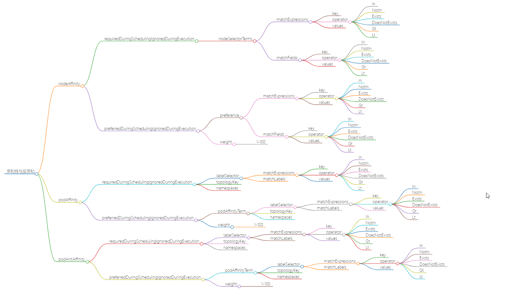
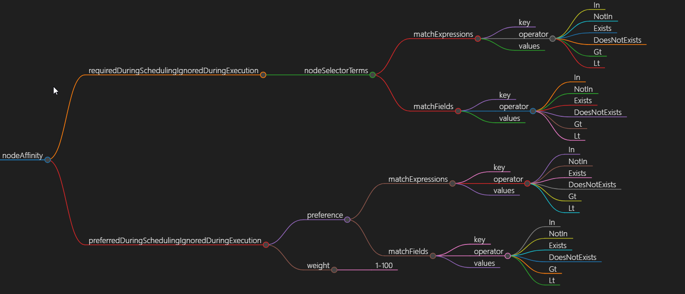
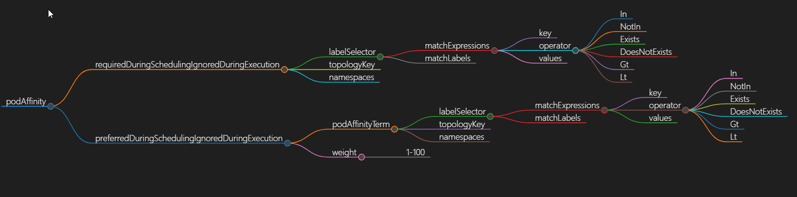
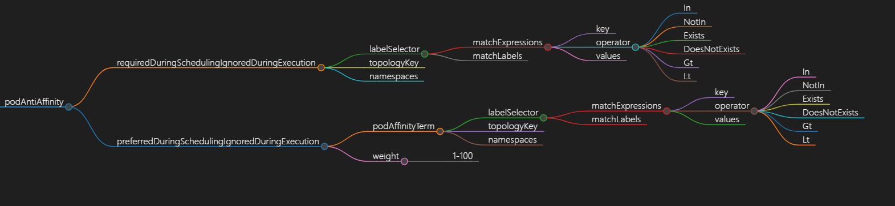

# kube-scheduler调度概述
K8s中调度是指将Pod调度到合适的节点上,以便对应节点上的Kubelet能够运行这些Pod;  
kube-scheduler将Pod分配(调度)到集群内的各个节点,进而创建容器运行进程;Kube-scheduler是K8s集群默认的调度器

scheduler通过k8s的监测(Watch)机制来发现集群中新创建且尚未被调度到Node上的Pod;  
scheduler主要作用是负责资源的调度Pod,通过APIServer的Watch接口监听新建Pod信息, 按照预定的调度策略将Pod调度到相应的Node节点上;

# kube-scheduler工作原理
## kube-scheduler调度流程
 

1. scheduler维护待调度的podQueue并监听APIServer;
   >用户提交pod资源请求;可以通过APIServer的RESTAPI,也可用Kubectl命令行工具支持Json和Yaml两种格式  
2. 创建Pod时首先通过APIServer将Pod元数据写入etcd(APIServer处理用户请求,存储Pod数据到Etcd)  
3. scheduler通过Informer监听Pod状态添加新的Pod时,会将Pod添加到podQueue;podQueue中提取Pods并按照一定的算法将节点分配给Pods;  
   >schedule调度pod：schedule通过APIServer的watch机制,实时查看到新的pod,按照预定的调度策略将Pod调度到相应的Node节点上    
   - 过滤主机(节点预选)  
     调度器用一组规则过滤掉不符合要求的主机;比如Pod指定了所需要的资源,么就要过滤掉资源不够的主机从而完成节点的预选  
   - 主机打分(节点优选)  
     对第一步筛选出的符合要求的主机进行打分,在主机打分阶段,调度器会考虑一些整体优化策略;  
     比如把一个RC的副本分布到不同的主机上,使用最低负载的主机等；对预选出的节点进行优先级排序,以便选出最合适运行Pod对象的节点  
   - 选择主机(节点选定)  
     选择打分最高的主机,进行binding操作,结果存储到Etcd中;  
4. node的kubelet也侦听ApiServer如果发现有新的Pod已调度到该节点,则将通过CRI调用高级容器运行时来运行容器;kubelet创建pod
   >kubelet根据schedule调度结果执行Pod创建操作: 
   调度成功后,会启动container, docker run, scheduler会调用APIServer的API在etcd中创建一个boundpod对象,描述在一个工作节点上绑定运行的所有pod信息;  
     运行在每个工作节点上的kubelet也会定期与etcd同步boundpod信息,一旦发现应该在该工作节点上运行的boundpod对象没有更新,则调用DockerAPI创建并启动pod内的容器
 ## [工作原理](https://zhuanlan.zhihu.com/p/339762721)
   
   
如上图所示,我们简单介绍一下支持的扩展点：  
- QueueSort: 对队列中的 Pod 进行排序
- PreFilter: 预处理 Pod 的相关信息,或者检查集群或 Pod 必须满足的某些条件。 如果 PreFilter 插件返回错误,则调度周期将终止。
- Filter: 过滤出不能运行该 Pod 的节点。对于每个节点, 调度器将按照其配置顺序调用这些过滤插件。如果任何过滤插件将节点标记为不可行, 则不会为该节点调用剩下的过滤插件。节点可- 以被同时进行评估。
- PostFilter: 在筛选阶段后调用,但仅在该 Pod 没有可行的节点时调用。 插件按其配置的顺序调用。如果任何后过滤器插件标记节点为“可调度”, 则其余的插件不会调用。典型的后筛选实现- 是抢占,试图通过抢占其他 Pod 的资源使该 Pod 可以调度。
- PreScore: 运行评分任务以生成可评分插件的共享状态
- Score: 通过调用每个评分插件对过滤的节点进行排名
- NormalizeScore: 结合分数并计算节点的最终排名
- Reserve: 在绑定周期之前选择保留的节点
- Permit: 批准或拒绝调度周期的结果
- PreBind: 用于执行 Pod 绑定前所需的任何工作。例如,一个预绑定插件可能需要提供网络卷并且在允许 Pod 运行在该节点之前 将其挂载到目标节点上。
- Bind: 用于将 Pod 绑定到节点上。直到所有的 PreBind 插件都完成,Bind 插件才会被调用。
- PostBind: 这是个信息性的扩展点。 绑定后插件在 Pod 成功绑定后被调用。这是绑定周期的结尾,可用于清理相关的资源  

**scheduler调度pod选择包含两个步骤**  
- 预选(过滤)
  >过滤阶段会将所有满足Pod调度需求的Node选出来
  
- 优选(打分)
  >scheduler会为Pod从所有可调度节点中选取一个最合适的Node根据当前启用的打分规则,scheduler会给每一个可调度节点进行打分  
  最后scheduler会将Pod调度到得分最高的Node上;如果存在多个得分最高的Node,scheduler会从中随机选取一个  

**预选策略Predicates**
- PodFitsHostPorts：检查Pod容器所需的HostPort是否已被节点上其它容器或服务占用,如已被占用,则禁止Pod调度到该节点  
- PodFitsHost：检查Pod指定的NodeName是否匹配当前节点  
- PodFitsResources：检查节点是否有足够空闲资源(例如CPU和内存)来满足Pod的要求  
- PodMatchNodeSelector：检查Pod的节点选择器(nodeSelector)是否与节点(Node)的标签匹配  
- NoVolumeZoneConflict：对于给定的某块区域,判断如果在此区域的节点上部署Pod是否存在卷冲突  
- NoDiskConflict：根据节点请求的卷和已经挂载的卷,评估Pod是否适合该节点   
- MaxCSIVolumeCount：决定应该附加多少CSI卷,以及该卷是否超过配置的限制  
- CheckNodeMemoryPressure：如果节点内存压力,并且没有配置异常,那么将不会往那里调度Pod  
- CheckNodePIDPressure：如果节点报告进程id稀缺,并且没有配置异常,那么将不会往那里调度Pod  
- CheckNodeDiskPressure：如果节点报告存储压力(文件系统已满或接近满),并且没有配置异常,那么将不会往那里调度Pod  
- CheckNodeCondition：节点报告的文件系统网络不可用,或者kubelet没有准备好运行Pods,如果为节点设置了这样的条件,并且没有配置异常,那么将不会往那里调度Pod  
- PodToleratesNodeTaints：检查Pod的容忍度是否能容忍节点的污点  
- CheckVolumeBinding：评估Pod是否适合它所请求的容量,这适用于约束和非约束PVC  

>**如果在predicates(预选)过程中没有合适的节点,那么Pod会一直在pending状态,不断重试调度,直到有节点满足条件;  
经过这个步骤,如果有多个节点满足条件,就继续priorities过程,最后按照优先级大小对节点排序** 
 
**优选Priorities**
- SelectorSpreadPriority：对于属于同一服务、有状态集或副本集（Service,StatefulSet or ReplicaSet）的Pods,会将Pods尽量分散到不同主机上。
- InterPodAffinityPriority：策略有podAffinity和podAntiAffinity两种配置方式。简单来说,就说根据Node上运行的Pod的Label来进行调度匹配的规则,匹配的表达式有：In, NotIn, - Exists, DoesNotExist,通过该策略,可以更灵活地对Pod进行调度。
- LeastRequestedPriority：偏向使用较少请求资源的节点。换句话说,放置在节点上的Pod越多,这些Pod使用的资源越多,此策略给出的排名就越低。
- MostRequestedPriority：偏向具有最多请求资源的节点。这个策略将把计划的Pods放到整个工作负载集所需的最小节点上运行。
- RequestedToCapacityRatioPriority：使用默认的资源评分函数模型创建基于ResourceAllocationPriority的requestedToCapacity。
- BalancedResourceAllocation：偏向具有平衡资源使用的节点。
- NodePreferAvoidPodsPriority：根据节点注释scheduler.alpha.kubernet .io/preferAvoidPods为节点划分优先级。可以使用它来示意两个不同的Pod不应在同一Node上运行。
- NodeAffinityPriority：根据preferredduringschedulingignoredingexecution中所示的节点关联调度偏好来对节点排序。
- TaintTolerationPriority：根据节点上无法忍受的污点数量,为所有节点准备优先级列表。此策略将考虑该列表调整节点的排名。
- ImageLocalityPriority：偏向已经拥有本地缓存Pod容器镜像的节点。
- ServiceSpreadingPriority：对于给定的服务,此策略旨在确保Service的Pods运行在不同的节点上。总的结果是,Service对单个节点故障变得更有弹性。
- EqualPriority：赋予所有节点相同的权值1。
- EvenPodsSpreadPriority：实现择优 pod的拓扑扩展约束
>[官网地址](https://kubernetes.io/zh-cn/docs/reference/scheduling/)  
[k8s中kube-scheduler的调度过程](https://www.toutiao.com/article/7345759512613421568/)  
[聊聊kube-scheduler如何完成调度和调整调度权重](https://www.toutiao.com/article/7313829073661739520/)  
[kube-scheduler调度器原理](https://www.toutiao.com/article/7182031810707210807/)  


# k8s调度Pod的主要方式
- 自动调度：运行在哪个节点上完全由Scheduler经过一系列的算法计算得出(默认kube-scheduler)  
- 定向调度:  [NodeName](https://github.com/gitseen/gitOps/blob/main/k8s/k8s-scheduler.md#NodeName)、[NodeSelector](https://github.com/gitseen/gitOps/blob/main/k8s/k8s-scheduler.md#NodeSelector)  
- 亲和性调度： [NodeAffinity](https://github.com/gitseen/gitOps/blob/main/k8s/k8s-scheduler.md#NodeAffinity)、[PodAffinity](https://github.com/gitseen/gitOps/blob/main/k8s/k8s-scheduler.md#PodAffinity)、[PodAntiAffinity](https://github.com/gitseen/gitOps/blob/main/k8s/k8s-scheduler.md#PodAntiAffinity)  
- 污点(容忍)调度： [Taints](https://github.com/gitseen/gitOps/blob/main/k8s/k8s-scheduler.md#Taints)、[Toleration](https://github.com/gitseen/gitOps/blob/main/k8s/k8s-scheduler.md#Toleration) 
- [Pod拓扑分布约束](https://github.com/gitseen/gitOps/blob/main/k8s/k8s-scheduler.md#Pod拓扑分布约束)  
- [自定义调度器my-scheduler](https://github.com/gitseen/gitOps/blob/main/k8s/k8s-scheduler.md#自定义调度器my-scheduler)  

# k8s-api-yaml语法示例
```bash
kubectl api-resources
kubectl api-resources -o name --verbs-list --namespaced
kubectl api-resources -o name --verbs-list --namespaced |grep "XX"
kubectl api-resources -o name --verbs-list --namespaced | xargs -n 1 kubectl get --show-kind --ignore-not-found -A
kubectl api-resources -o name --verbs-list --namespaced | xargs -n 1 kubectl get --show-kind --ignore-not-found -n namespaces

---

kubectl explain pod.spec.XXX
kubectl explain deployment.spec.template.spec.XXX
kubectl explain statefulset.spec.template.spec.XXX
kubectl explain daemonset.spec.template.spec.XXX
kubectl explain job.spec.template.spec.XXX
kubectl explain cronjob.spec.XXX
......
```


---

<table><tr><td bgcolor=green>定向调度nodeName、nodeSelector</td></tr></table>  

# NodeName
nodeName属于定向调度(通过nodeName匹配规则是强制匹配);nodeName(直接指定node主机名)   

Pod.spec.nodeName强制约束将Pod调度到指定的Node上,其实指定了nodeName的Pod会直接跳过Scheduler的调度逻辑,直接写入PodList列表  
<details>
  <summary>nodeName调度-指定nodeName调度到指定节点上</summary>
  <pre><code>
apiVersion: apps/v1
kind: Deployment
metadata:
  labels:
    app: springbootweb
  name: springbootweb-deployment
spec:
  replicas: 1
  selector:
    matchLabels:
      app: springbootweb
  template:
    metadata:
      labels:
        app: springbootweb
    spec:
      nodeName: node23.turing.com   #指定调度到node23.turing.com节点上
      containers:
      - image: registry.tuling123.com/springboot:latest
        imagePullPolicy: IfNotPresent
        name: springbootweb
        ports:
        - containerPort: 9081
          hostPort: 9981     
      imagePullSecrets:
      - name: registry-key-secret
  </code></pre>
</details>  

>1 如果指定的节点不存在,则容器将不会运行,并且在某些情况下可能会自动删除  
 2 如果指定的节点没有足够的资源来容纳该Pod,则该Pod将会失败,并且其原因将被指出,例如OutOfmemory或OutOfcpu  
 3 云环境中的节点名称并非总是可预测或稳定的   


# NodeSelector
nodeSelector定向调度(通过标签匹配)  
nodeSelector(节点选择器,为Node打上标签,然后Pod中通过nodeSelector选择打上标签的Node)  
<details>
  <summary>nodeSelector调度</summary>
  <pre><code>
#kubectl label nodes k8s-node-1 zone=north  打标签
#kubectl label node  k8s-node-1 zone-       删除标签
#kubectl get node --show-labels
apiVersion:v1
kind: Pod
metadata:
  name: redis-master
  label:
    name: redis-master
spec:
  replicas: 1
  selector:
    name: redis-master
    template:
      metadata:
        labels:
          name: redis-master
      spec:
        containers:
        - name: redis-master
          images: kubeguide/redis-master
          ports:
          - containerPort: 6379
        nodeSelector:    #匹配zone: north标签的节点K:V  这里指定Node的Label
          zone: north
  </code></pre>
</details>

>如果nodeSelector匹配的标签不存在,则容器将不会运行,一直处于Pending状态  
nodeName、nodeSelector属于定向调度  

---

<table><tr><td bgcolor=green>亲和性调度nodeAffinity、podAffinity、podAntiAffinity</td></tr></table>  

**Affinity亲和性调度分类** 
- nodeAffinity(node亲和性)  
    以node为目标,解决pod可以调度到哪些node的问题 
- podAffinity(pod亲和性)  
    以pod为目标,解决pod可以和哪些已存在的pod部署在同一个拓扑域中的问题   
- podAntiAffinity(pod反亲和性)  
   以pod为目标,解决pod不能和哪些已存在pod部署在同一个拓扑域中的问题   

**新和性视图**  


# NodeAffinity
nodeAffinity用于定义Pod与节点之间的亲和性;控制Pod被调度到具有特定标签或属性的节点上  
nodeAffinity节点亲和性功能类似于nodeSelector(通过Node的Label进行精确匹配)字段,但它的表达能力更强,并且允许你指定软规则;  
nodeAffinity增加了In、NotIn、Exists、DoesNotexist、Gt、Lt等操作符来选择Node;调度侧露更加灵活  

- nodeAffinity的亲和性表达  
  + 硬限制：requiredDuringSchedulingIgnoredDuringExecution  
    ```bash
    必须满足指定的规则才可以调度Pod到node上,相当于硬限制; 
    调度器只有在规则被满足的时候才能执行调度。此功能类似于nodeSelector,但其语法表达能力更强
    
    **requiredDuringSchedulingIgnoredDuringExecution拆解**
    requiredDuringScheduling
      定义的规则必须强制满足Required才会把Pod调度到节点上
    IgnoredDuringExecution
      已经在节点上运行的Pod不需要满足定义的规则,即使去除节点上的某个标签,那些需要节点包含该标签的Pod依旧会在该节点上运行;
      或者这么理解：如Pod所在的节点在Pod运行期间标签被删除了,不再符合该Pod的节点亲和性规则,那也没关系,该Pod还能继续在该节点上运行
    ```
  + 软限制：preferredDuringSchedulingIgnoredDuringExecution  
    ```bash
    强调优先满足指定规则,调度器会尝试调度Pod到Node上,但并不强求,相当于软限制
    调度器会尝试寻找满足对应规则的节点,如果找不到匹配的节点,调度器仍然会调度该Pod
    多个优先级规则还可以设置权重(weight)值,以此来定义执行的先后顺序
    ```
  + 节点亲和性权重  
    ```bash
    preferredDuringSchedulingIgnoredDuringExecution亲和性类别的每个实例设置weight字段,取值范围是1 ~ 100;
    当调度器找到能够满足Pod的其他调度请求的节点时,调度器会遍历节点满足的所有的偏好性规则,并将对应表达式的weight值加和;
    最终的加和值会添加到该节点的其他优先级函数的评分之上;在调度器为Pod做出调度决定时,总分最高的节点的优先级也最高
    ```
  + IgnoredDuringExecution 
    如果在Pod运行期间Node的标签发生变化,导致亲和性策略不能满足,则继续运行当前的Pod   
    如一个Pod所在的节点在Pod运行期间标签发生了变更,不再符合该Pod的节点亲和性需求,则系统将忽略Node上label的变化,该Pod能继续在该节点运行  
    >IgnoredDuringExecution意味着如果节点标签在K8s调度Pod后发生了变更,Pod仍将继续运行  

- nodeAffinity的语法规则  
  nodeAffinity语法支持的操作符包括In,NotIn,Exists,DoesNotExist,Gt,Lt;  
  虽然没有节点排斥功能,但是用NotIn和DoesNotExist就可以实现排斥的功能了  
  **亲和性表达方式可选的操作符operator**  
   ```bash
  In：label的值在某个列表中
  NotIn：label的值不在某个列表中
  Gt：label的值大于某个值(字符串比较)
  Lt：label的值小于某个值(字符串比较)
  Exists：某个label存在
  DoesNotExist：某个label不存在
  ```
  **关系符使用说明: matchExpressions**  
  ```bash
  + key: nodeenv         # 匹配存在标签的key为nodeenv的节点  
    operator: Exists  
  + key: nodeenv         # 匹配标签的key为nodeenv,且value是"k"或"v"的节点  
    operator: In  
    values: "k","v"  
  + key: nodeenv         # 匹配标签的key为nodeenv,且value大于"k"的节点  
    operator: Gt  
    values: "k"   
  ```
- nodeAffinity的注意事项  
>如同时定义了nodeSelector和nodeAffinity那么必须两个条件都得到满足,Pod才能最终运行到指定的Node上  
如nodeAffinity指定了多个nodeSelectorTerms,那么其中一个能够匹配成功即可  
如在nodeSelectorTerms中有多个matchExpressions,则一个节点必须满足所有matchExpressions才能运行该Pod  


- nodeAffinity-API

**nodeAffinity语法展示架构**   
  
  
```bash
preference：节点选择器,与相应的权重相关联
weight：在1-100范围内,与匹配相应的节点选项相关联的权重
nodeSelectorTerms：节点选择列表(比nodeSelector高级一点)
matchExpressions：按照节点label列出节点选择器列表(与matchFields是两种方式,不过结果是一至)
matchFields：按照节点字段列出节点选择器列表(与matchExpressions是两种方式,不过结果是一至)
key：指定要选择节点label的key  
values：指定要选择节点label的value,值必须为数组 [“value”]
        如果操作符为In或者Notin,value则不能为空
        如果操作符为Exists或者DoesNotExist ,value则必须为空[]
        如果操作符为Gt或Lt,则value必须有单个元,该元素将被解释为整数
operator：操作符,指定key与value的关系
In：key与value同时存在,一个key多个value的情况下,value之间就成了逻辑或效果
NotIn：label 的值不在某个列表中
Exists：只判断是否存在key,不用关心value值是什么
DoesNotExist：某个label不存在
Gt：label 的值大于某个值
Lt：label 的值小于某个值
```

**语法**  
```bash
kubectl explain deployment.spec.template.spec.nodeAffinity.requiredDuringSchedulingIgnoredDuringExecution.XX
kubectl explain deployment.spec.template.spec.nodeAffinity.preferredDuringSchedulingIgnoredDuringExecution.XX
```
<details>
  <summary>requiredDuringSchedulingIgnoredDuringExecution-nodeSelectorTerms硬限制</summary>
  <pre><code>
apiVersion: apps/v1
kind: Deployment
metadata:
  name: nginx-deployment
spec:
  replicas: 1
  selector:
    matchLabels:
      app: nginx
  template:
    metadata:
      labels:
        app: nginx
    spec:
      affinity:
        nodeAffinity:
          requiredDuringSchedulingIgnoredDuringExecution:
            nodeSelectorTerms:
              - matchExpressions:
                  - key: disktype
                    operator: In
                    values:
                      - ssd
      containers:
        - name: nginx
          image: nginx
#nodeAffinity调度pod到具有disktype: ssd标签的节点上;硬限制
  </code></pre>
</details>

<details>
  <summary>requiredDuringSchedulingIgnoredDuringExecution-weight-不强制</summary>
  <pre><code>
apiVersion: apps/v1
kind: Deployment
metadata:
  name: nginx-deployment
spec:
  replicas: 1
  selector:
    matchLabels:
      app: nginx
  template:
    metadata:
      labels:
        app: nginx
    spec:
      affinity:
        nodeAffinity:
          preferredDuringSchedulingIgnoredDuringExecution:
          - weight: 1
            preference:
              matchExpressions:
                - key: disktype
                  operator: In
                  values:
                    - ssd
      containers:
        - name: nginx
          image: nginx
#preferredDuringSchedulingIgnoredDuringExecution调度器会尽量但不强制将Pod调度到具有disktype: ssd标签的节点上
  </code></pre>
</details>


<details>
  <summary>preferredDuringSchedulingIgnoredDuringExecution优先调度(32G-->16G-->8G内存节点)</summary>
  <pre><code>
spec:
  containers:
  - name: xxxxx
    image: xxxxx
  affinity:
    nodeAffinity:
      preferredDuringSchedulingIgnoredDuringExecution:
      - weight: 20
        preference:
          matchExpressions:
          - key: mem
            operator: In
            values:
            - memory32
      - weight: 10
        preference:
          matchExpressions:
          - key: mem
            operator: In
            values:
            - memory16
      - weight: 1
        preference:
          matchExpressions:
          - key: mem
            operator: In
            values:
            - memory8
  </code></pre>
</details>

<details>
  <summary>NodeAffinity-->required-->preferred先硬后软</summary>
  <pre><code>
apiVersion: v1
kind: Pod
metadata:
  name: nginx
spec:
  affinity:
    nodeAffinity:
      requiredDuringSchedulingIgnoredDuringExecution:
        nodeSelectorTerms:
        - matchExpressions:
          - key: kubernetes.io/e2e-az-name
            operator: In
            values:
            - e2e-az1
            - e2e-az2
      preferredDuringSchedulingIgnoredDuringExecution:
      - weight: 1               //取值范围1-100
        preference:
          matchExpressions:
          - key: another-node-label-key
            operator: In
            values:
            - another-node-label-value
  containers:
  - name: nginx
    image: docker.io/nginx
#Pod只能被调度到拥有kubernetes.io/e2e-az-name=e2e-az[1-2]标签的节点上;其中在满足之前标签条件的同时更倾向于调度在another-node-label-key=another-node-label-value标签的节点上
  </code></pre>
</details>


# PodAffinity 
podAffinity是pod亲和性,用于定义Pods之间的亲和性,使得某个Pod被调度到与其他特定标签的Pod相同的节点上  
Pod间亲和性创建的Pod与哪些已存在的Pod倾向于调度到同一节点,与节点亲和性类似;  
Pod的亲和性与反亲和性也有两种类型  
- requiredDuringSchedulingIgnoredDuringExecution：强制  

- preferredDuringSchedulingIgnoredDuringExecution：首选  

**podAffinity语法展示架构**


```bash
podAffinityTerm：Pod亲和性选择器
weight：在1-100范围内,与匹配相应的节点选项相关联的权重 
labelSelector：标签选择器
topologyKey：指定要将当前创建Pod运行在具备什么样的Node标签上,通常指定Node标签的Key
namespaces：指定labelSelector应用于哪个名称空间,null或空列表表示此pod的名称空间
matchExpressions：按照节点label列出节点选择器列表(与matchLabels是两种方式,不过结果是一至)
matchLabels：按照节点字段列出节点选择器列表(与matchExpressions是两种方式,不过结果是一至)
key：指定要选择节点label的key
values：指定要选择节点label的value,值必须为数组 [“value”]
        如果操作符为In或者Notin,value则不能为空
        如果操作符为Exists或者DoesNotExist ,value则必须为空[]
        如果操作符为Gt或Lt,则value必须有单个元,该元素将被解释为整数
operator：操作符,指定key与value的关系
In：key与value同时存在,一个key多个value的情况下,value之间就成了逻辑或效果
NotIn：label 的值不在某个列表中
Exists：只判断是否存在key,不用关心value值是什么
DoesNotExist：某个label不存在
Gt：label 的值大于某个值
Lt：label 的值小于某个值
```
**语法**
```bash
kubectl explain deployment.spec.template.spec.affinity.podAffinity.requiredDuringSchedulingIgnoredDuringExecution.XX
kubectl explain deployment.spec.template.spec.affinity.podAffinity.preferredDuringSchedulingIgnoredDuringExecution.XX
```

<details>
  <summary>podAffinity-required示例</summary>
  <pre><code>
apiVersion: v1
kind: Pod
metadata:
  name: redis
  labels:          #定义一个Pod,包含标签： dbType= v
    dbType: kv
spec:
  containers:
  - name: redis
    image: redis:latest
    imagePullPolicy: IfNotPresent
---
apiVersion: v1
kind: Pod
metadata:
  name: nginx
spec:
  affinity:
    podAffinity:
      requiredDuringSchedulingIgnoredDuringExecution:
      - labelSelector:         #通过labelSeletor匹配Pod;Pod调度时需要满足,部署的Node上有能够满足该条件的Pod
          matchExpressions:    #这里指定的选择器会匹配到Pod:redis,因此该Pod(nginx)与Pod(redis)会运行在同一个Node上
          - key: dbType
            operator: In
            values:
            - kv
        topologyKey: topology.kubernetes.io/zone   #拓扑域,不允许为空
                                                   #这里表示Pod所在节点的标签中包含topology.kubernetes.io/zone这个Key
  containers:
  - name: nginx
    image: nginx:latest
    imagePullPolicy: IfNotPresent
  </code></pre>
</details>


<details>
  <summary>podAffinity-preferred示例</summary>
  <pre><code>
apiVersion: v1
kind: Pod
metadata:
  name: redis
  labels:
    dbType: kv
spec:
  nodeName: k8s-master
  containers:
  - name: redis
    image: redis:latest
    imagePullPolicy: IfNotPresent
---
apiVersion: v1
kind: Pod
metadata:
  name: nginx
spec:
  affinity:
    podAffinity:
      preferredDuringSchedulingIgnoredDuringExecution:
      - weight: 100
        podAffinityTerm:
          labelSelector:
            matchExpressions:
            - key: dbType
              operator: In
              values:
              - kv
          topologyKey: topology.kubernetes.io/zone
  containers:
  - name: nginx
    image: nginx:latest
    imagePullPolicy: IfNotPresent
#preferredDuringSchedulingIgnoredDuringExecution在pod倾向性亲和性用法与node中用法一致;
#表示更倾向于和匹配的Pod部署在同一节点上,但不是必须的

---
apiVersion: apps/v1
kind: Deployment
metadata:
  name: podaffinity-perferred-pod
spec:
  replicas: 3
  selector:
    matchLabels:
      app: myapp
  template:
    metadata:
      name: myapp
      labels:
        app: myapp
    spec:
      affinity:
        podAffinity:
          preferredDuringSchedulingIgnoredDuringExecution:
          - weight: 80
            podAffinityTerm:
              labelSelector:
                matchExpressions:
                - { key: app, operator: In, values: ["cache"] }
              topologyKey: zone
          - weight: 20
            podAffinityTerm:
              labelSelector:
                matchExpressions:
                - { key: app, operator: In, values: ["db"] }
              topologyKey: zone
      containers:
      - name: myapp
        image: busybox:latest
        command: ["/bin/sh", "-c", "tail -f /etc/passwd" ]
#以下三个Node都具备标签键为zone,但是这三个Node上没有Pod标签为app=cache及app=db
#所以上面的调度策略在选择Pod标签的时候进行退步才得以将Pod调度到Node01和Node03
  </code></pre>
</details>


# PodAntiAffinity
podAntiAffinity是Pod反亲和性,反亲和性能够让带有相同标签的副本,部署到不同的节点上  

**podAntiAffinity语法展示架构**


**语法**  
```bash
kubectl explain deployment.spec.template.spec.affinity.podAntiAffinity.requiredDuringSchedulingIgnoredDuringExecution.XX
kubectl explain deployment.spec.template.spec.affinity.podAntiAffinity.preferredDuringSchedulingIgnoredDuringExecution.XX
```

                     
<details>
  <summary>podAntiAffinity示例</summary>
  <pre><code>
apiVersion: apps/v1
kind: Deployment
metadata:
  name: redis-cache
spec:
  selector:
    matchLabels:
      app: store
  replicas: 3         #个副本
  template:
    metadata:
      labels:         #定义标签 app=store
        app: store
    spec:
      affinity:
        podAntiAffinity:    #反亲和性
          requiredDuringSchedulingIgnoredDuringExecution:
          - labelSelector:
              matchExpressions:   #反亲和性会使得3个副本不运行在同一个Node上
              - key: app
                operator: In
                values:
                - store
            topologyKey: "kubernetes.io/hostname"     #只能是"kubernetes.io/hostname"
      containers:
      - name: redis-server
        image: redis:latest
        imagePullPolicy: IfNotPresent
#Pod反亲和性能够让带有相同标签的副本,部署到不同的节点上
#集群只有两个Node,创建deployment后会发现每个Node上运行一个对应的Pod,还有一个Pod处于Pending状态 #实现不在同一节点上部署

---

apiVersion: apps/v1
kind: Deployment
metadata:
  name: podantiaffinity-perferred-pod
spec:
  replicas: 4
  selector:
    matchLabels:
      app: myapp
  template:
    metadata:
      name: myapp
      labels:
        app: myapp
    spec:
      affinity:
        podAntiAffinity:
          requiredDuringSchedulingIgnoredDuringExecution:
          - labelSelector:
              matchExpressions:
              - { key: app, operator: In, values: ["myapp"] }
            topologyKey: zone
      containers:
      - name: myapp
        image: busybox:latest
        command: ["/bin/sh", "-c", "tail -f /etc/passwd" ]
#4个Pod,自身标签为app=myapp
#使用Pod反亲和的硬亲和性,需要运行在具备标签key为zone的Node上,然后不运行在具备标签为app=myapp的Pod同台Node上
#启动了4个Pod,一共有三个node,前三个Pod都会被分别调度到不同的三台node上
#(因为采用的是反亲和性,还是硬性,所以相同标签的Pod不会调度到同一台Node),最后一个Pod将无家可归,最后无法调度 
  </code></pre>
</details>

<details>
  <summary>podAffinity-PodAntAffinity示例</summary>
  <pre><code>
apiVersion: apps/v1
kind: Deployment
metadata:
  name: nginx-anti
spec:
  replicas: 2
  selector:
    matchLabels:
      app: anti-nginx
  template:
    metadata:
      labels:
        app: anti-nginx
    spec:
      affinity:
        podAffinity:
          requiredDuringSchedulingIgnoredDuringExecution:
          - labelSelector:
              matchExpressions:
                - key: a
                  operator: In
                  values:
                    - b
            topologyKey: kubernetes.io/hostname
        podAntiAffinity:
          requiredDuringSchedulingIgnoredDuringExecution:
          - labelSelector:
              matchExpressions:
                - key: app
                  operator: In
                  values:
                    - anti-nginx
            topologyKey: kubernetes.io/hostname
      containers:
        - name: with-pod-affinity
          image: nginx
#PodAffinity：要求调度的Pod必须与具有特定标签(键a,值b)的Pod在相同的节点上 
#PodAntiAffinity：要求调度的Pod不能与具有相同标签(键app,值anti-nginx)的Pod在相同的节点上
  </code></pre>
</details>

<details>
  <summary>podAffinity-podAntAffinity-topologyKey示例</summary>
  <pre><code>
apiVersion: v1
kind: Pod
metadata:
  name: with-pod-affinity
spec:
  affinity:
    podAffinity:
      requiredDuringSchedulingIgnoredDuringExecution:
      - labelSelector:
          matchExpressions:
          - key: security
            operator: In
            values:
            - S1
        topologyKey: failure-domain.beta.kubernetes.io/zone
    podAntiAffinity:
      preferredDuringSchedulingIgnoredDuringExecution:
      - weight: 100
        podAffinityTerm:
          labelSelector:
            matchExpressions:
            - key: security
              operator: In
              values:
              - S2
          topologyKey: kubernetes.io/hostname
  containers:
  - name: with-pod-affinity
    image: k8s.gcr.io/pause:2.0
#pod必须调度在至少运行一个security=S1标签的pod的节点上;如果该节点有标签key为failure-domain.beta.kubernetes.io/zone而且运行着标签为security=S1的实例
#反亲和规则表明最好不要调度到运行有security=S2标签的pod的节点上;如这个节点拥有标签key为failure-domain.beta.kubernetes.io/zone但运行有security=S2标签的pod那么这个节点就不会被优先选择调度  
  </code></pre>
</details>

<details>
  <summary>podAntAffinity-podAffinity</summary>
  <pre><code>
apiVersion: apps/v1
kind: Deployment
metadata:
  name: web-server
spec:
  selector:
    matchLabels:
      app: web-store
  replicas: 3
  template:
    metadata:
      labels:
        app: web-store
    spec:
      affinity:
        podAntiAffinity:
          requiredDuringSchedulingIgnoredDuringExecution:
          - labelSelector:
              matchExpressions:
              - key: app
                operator: In
                values:
                - web-store
            topologyKey: "kubernetes.io/hostname"
        podAffinity:
          requiredDuringSchedulingIgnoredDuringExecution:
          - labelSelector:
              matchExpressions:
              - key: app
                operator: In
                values:
                - store
            topologyKey: "kubernetes.io/hostname"
      containers:
      - name: web-app
        image: nginx:1.12-alpine
#pod不被调度在同一个节点上,并且必须调度在运行标签app=store的pod的节点上
  </code></pre>
</details>


>pod亲和性和反亲和性需要大量的计算,会显著降低集群的调度速度,不建议在大于几百个节点的集群中使用;  
pod反亲和性要求集群中的所有节点必须具有topologyKey匹配的标签,否则可能会导致意外情况发生  

**亲和性调度nodeAffinity、podAffinity、podAntiAffinity总结**
- podAffinity PodAntAffinity关注的是pod间的关系 
- nodeAffinity 更关注Pod与节点特性之间的关系  
- requiredDuringScheduling硬亲和:  强制型调度规则,必须满足亲和性设置,否则不能调度  
- preferredDuringScheduling软亲和: 偏好型调度规则,首先找到满足设置的节点,没有则会调度到其他节点   

Affinity和AntiAffinity的调度: 筛选的条件使用的是Node(Pod)的label字段  
Affinity亲和性调度: 就好像Node(Pod)和Pod是关系很好的闺蜜,Pod说"只要符合这种label的Node(Pod)都是我的好闺蜜,闺蜜在哪儿我就去哪儿"  
AntiAffinity反亲和性调度: 就好像2个Pod是赌气的2个孩子,互相对着干,一个往东,另一个随便去哪个方向就是不往东,不会被调度到同一node**  

---
<table><tr><td bgcolor=green>污点(容忍)调度</td></tr></table>  


<table><tr><td bgcolor=green>Pod拓扑分布约束</td></tr></table>  

<table><tr><td bgcolor=green>自定义调度器my-scheduler</td></tr></table>  


