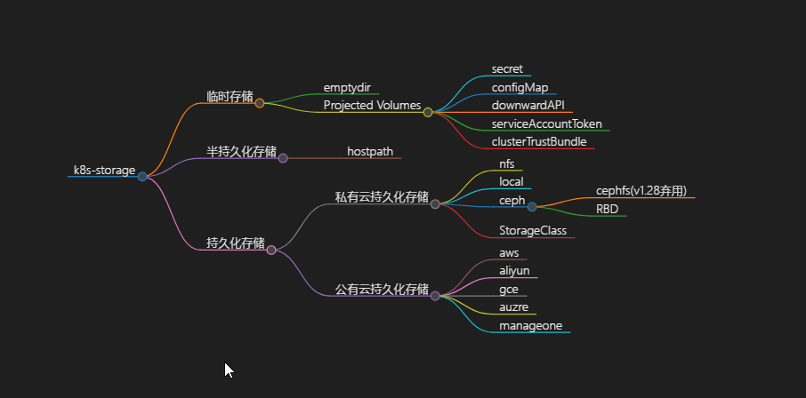
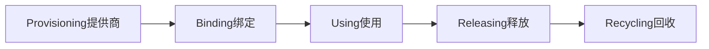

# [k8s-storage-DOC](https://kubernetes.io/zh-cn/docs/concepts/storage)
# k8s-Volume-listings
- [1-k8s-EphemeralVolumes临时卷](https://github.com/gitseen/gitOps/blob/main/k8s/k8s-storage.md#1-k8s-EphemeralVolumes临时卷)
  + [emptyDir](https://github.com/gitseen/gitOps/blob/main/k8s/k8s-storage.md#emptyDir)
  + [configMap](https://github.com/gitseen/gitOps/blob/main/k8s/k8s-storage.md#configMap)
  + [secret](https://github.com/gitseen/gitOps/blob/main/k8s/k8s-storage.md#secret)
  + [downwardAPI](https://github.com/gitseen/gitOps/blob/main/k8s/k8s-storage.md#downwardAPI)
  + [CSI临时卷](https://github.com/gitseen/gitOps/blob/main/k8s/k8s-storage.md#CSI临时卷)
  + [通用临时卷](https://github.com/gitseen/gitOps/blob/main/k8s/k8s-storage.md#CSI临时卷)
  + [hostPath](https://github.com/gitseen/gitOps/blob/main/k8s/k8s-storage.md#hostPath)
  + [subPath](https://github.com/gitseen/gitOps/blob/main/k8s/k8s-storage.md#subPath)
- [2-k8s-ProjectedVolumes投射卷](https://github.com/gitseen/gitOps/blob/main/k8s/k8s-storage.md#2-k8s-ProjectedVolumes投射卷)
- [3-k8s-PersistentVolumes持久卷](https://github.com/gitseen/gitOps/blob/main/k8s/k8s-storage.md#3-k8s-PersistentVolumes持久卷)
- [4-k8s-StoageClasses存储类](https://github.com/gitseen/gitOps/blob/main/k8s/k8s-storage.md#4-k8s-StoageClasses存储类)

# k8s-Volume卷
1. 概念  
  K8s的卷是pod的一个组成部分,因此像容器一样在pod的规范中就定义了。它们不是独立的K8s对象,也不能单独创建或删除。  
pod中的所有容器都可以使用卷,但必须先将它挂载在每个需要访问它的容器中。在每个容器中,都可以在其文件系统的任意位置挂>载卷。  

2. 为什么需要Volume  
   容器磁盘上的文件的生命周期是短暂的,这就使得在容器中运行重要应用时会遇到问题。当容器崩溃时,kubelet会重启它,但是容器中的文件将丢失——容器以干净的状态(镜像最初的状态)重新启动。  
其次,在Pod中同时运行多个容器时,这些容器之间通常需要共享文件。K8s中的Volume抽象就很好的解决了这些问题。  

3. Volume类型  
  

  

# 1-k8s-EphemeralVolumes临时卷
k8s为了不同的用途,支持几种不同类型的临时卷 
- emptyDir： Pod启动时为空,存储空间来自本地的kubelet根目录(通常是根磁盘)或内存
- configMap、 downwardAPI、 secret： 将不同类型的K8s数据注入到Pod中
- CSI临时卷： 类似于前面的卷类型,但由专门支持此特性的指定CSI驱动程序提供
- 通用临时卷： 它可以由所有支持持久卷的存储驱动程序提供
- hostPath:  将node主机中一目录挂在到Pod中供容器使用(半持久化)
>emptyDir、configMap、downwardAPI、secret是作为本地临时存储提供的。它们由各个节点上的kubelet管理

# emptyDir
1. 概念
emptyDir是在Pod被分配到Node时创建的,它的初始为空,且无须指定host上对应的目录文件,因为k8s会自动分配目录,当Pod销毁时,EmptyDir中的数据也会被永久删除。用途如下：
   - 临时空间,例如用于某些应用程序运行时所需的临时目录,且无须永久保留
   - 一个容器需要从另一个容器中获取数据的目录(多容器共享目录)

2. ymal清单
**emptyDir卷实现在同一pod中两个容器之间的文件共享**  
  
<details>
  <summary>emptyDir-pod示例清单</summary>
  <pre><code>
```
apiVersion: v1
kind: Pod
metadata:
  labels:
    app: prod                           #pod标签 
  name: emptydir-fortune
spec:
  containers:
  - image: loong576/fortune
    name: html-generator
    volumeMounts:                       #名为html的卷挂载至容器的/var/htdocs目录
    - name: html
      mountPath: /var/htdocs
  - image: nginx:alpine
    name: web-server
    volumeMounts:                       #挂载相同的卷至容器/usr/share/nginx/html目录且设置为只读
    - name: html
      mountPath: /usr/share/nginx/html 
      readOnly: true
    ports:
    - containerPort: 80
      protocol: TCP
  volumes:
  - name: html                          #卷名为html的emptyDir卷同时挂载至以上两个容器
    emptyDir: {} 
```
  </code></pre>
</details>


# configMap
Configmap是Kubernetes集群中非常重要的一种配置管理资源对象。借助于ConfigMap API向pod中的容器中注入配置信息的机制  

ConfigMap不仅仅可以保存环境变量或命令行参数等属性，也可以用来保存整个配置文件或者JSON格式的文件  

各种配置属性和数据以k/v或嵌套k/v样式存在到Configmap中  
>所有的配置信息都是以明文的方式来进行传递，实现资源配置的快速获取或者更新。 

<details>
  <summary>configMap清单</summary>
  <pre><code>
```
#kind: Namespace
#apiVersion: v1
#metadata:
#  name: zzjz
---
apiVersion: v1
kind: ConfigMap
metadata:
  name: mysql-config2
  namespace: zzjz
data:
  mysqld.cnf: |
    [client]
    port = 3306
    socket = /var/run/mysqld/mysqld.sock
    [mysql]
    no-auto-rehash
    [mysqld]
    user = mysql
    port = 3306
    socket = /var/run/mysqld/mysqld.sock
    datadir = /var/lib/mysql
    bind-address = 0.0.0.0
    symbolic-links=0
    max_connections=10000
    sql_mode=STRICT_TRANS_TABLES,NO_ZERO_IN_DATE,NO_ZERO_DATE,ERROR_FOR_DIVISION_BY_ZERO,NO_AUTO_CREATE_USER,NO_ENGINE_SUBSTITUTION
    skip-ssl
    max_allowed_packet=64M
    [mysqld_safe]
    log-error= /var/log/mysql/mysql_oldboy.err
    pid-file = /var/run/mysqld/mysqld.pid
---
apiVersion: apps/v1
kind: Deployment
metadata:
  namespace: zzjz
  name: zzjz-mysql
  labels:
    app: zzjz-mysql
spec:
  replicas: 1
  selector:
    matchLabels:
      app: zzjz-mysql
  template:
    metadata:
      name: zzjz-mysql 
      labels:
        app: zzjz-mysql
    spec:
      nodeSelector:
        role: di-node2
      containers:
      - name: zzjz-mysql
        #image: mysql:5.7
        image: myshare.io:5000/zzjz-mysql:latest
        #image: registry.cn-hangzhou.aliyuncs.com/iot-private-caicaiju/mysql:latest
        #image: mysql:latest
        env:
        - name: MYSQL_ROOT_PASSWORD
          value: password
        ports:
        - containerPort: 3306
          name: zzjz-mysql
        volumeMounts:
        - name: mysql-persistent-storage
          mountPath: /var/lib/mysql
        - name: mysql-t1
          mountPath: /etc/mysql/mysql.conf.d
      volumes:
      - name: mysql-persistent-storage
        hostPath:
          path: /home/DeepInsight/zzjz-mysql
      - name: mysql-t1
        configMap:
          name: mysql-config2
      #imagePullSecrets:
      #- name: myregistrykey
---
apiVersion: v1
kind: Service
metadata:
  name: zzjz-mysql
  namespace: zzjz
  labels:
    app: zzjz-mysql
spec:
  type: NodePort
  selector:
    app: zzjz-mysql
  ports:
  - protocol: TCP
    port: 3306
    targetPort: 3306
    nodePort: 32306
  #externalIPs:
  #  - 192.168.32.240
```
  </code></pre>
</details>

# secret
在k8s集群中,有一些配置属性信息是非常敏感的,所以这些信息在传递的过程中,是不希望外人能够看到的,所以K8s提供了一种加密场景中的配置管理资源对象Secret  

它在进行数据传输之前,会对数据进行编码,在数据获取的时候,会对数据进行解码。从而保证整个数据传输过程的安全  

>这些数据是根据不同的应用场景,采用不同的加密机制 

<details>
  <summary>secret清单</summary>
  <pre><code>
```
apiVersion: v1
kind: Secret
metadata:
  name: mysql-ex-secret
  namespace: default
type: Opaque
data:
  password: password
---
apiVersion: apps/v1
kind: Deployment
metadata:
  name: mysqld-exporter
spec:
  selector:
    matchLabels:
      app: mysqld-exporter
  replicas: 1
  template:
    metadata:
      annotations:
        prometheus.io/scrape: "true"
        prometheus.io/port: "9104"
      labels:
        app: mysqld-exporter
    spec:
      containers:
      - name: mysqld-exporter
        image: prom/mysqld-exporter:latest
        env:
        - name: DATA_SOURCE_NAME
          valueFrom:
            secretKeyRef:
              name: mysql-ex-secret
              key: password
        ports:
        - containerPort: 9104
```
  </code></pre>
</details>

# downwardAPI
downwardAPI 为运行在pod中的应用容器提供了一种反向引用。让容器中的应用程序了解所处pod或Node的一些基础属性信息  

从严格意义上来说,downwardAPI不是存储卷,它自身就存在。相较于configmap、secret等资源对象需要创建后才能使用;  
而downwardAPI引用的是Pod自身的运行环境信息,这些信息在Pod启动的时候就存在  

<details>
  <summary>downwardAPI清单</summary>
  <pre><code>
```
watting...........................
```
  </code></pre>
</details>

# CSI临时卷
<details>
  <summary>CSI临时卷-Pod的示例清单</summary>
  <pre><code>
```
kind: Pod
apiVersion: v1
metadata:
  name: my-csi-app
spec:
  containers:
    - name: my-frontend
      image: busybox:1.28
      volumeMounts:
      - mountPath: "/data"
        name: my-csi-inline-vol
      command: [ "sleep", "1000000" ]
  volumes:
    - name: my-csi-inline-vol
      csi:
        driver: inline.storage.kubernetes.io  #CSI提供驱动程序
        volumeAttributes:
          foo: bar
```
  </code></pre>
</details>

# 通用临时卷
<details>
  <summary>通用临时卷-Pod的示例清单</summary>
  <pre><code>
```
kind: Pod
apiVersion: v1
metadata:
  name: my-app
spec:
  containers:
    - name: my-frontend
      image: busybox:1.28
      volumeMounts:
      - mountPath: "/scratch"
        name: scratch-volume
      command: [ "sleep", "1000000" ]
  volumes:
    - name: scratch-volume
      ephemeral:  #属性
        volumeClaimTemplate:
          metadata:
            labels:
              type: my-frontend-volume
          spec:
            accessModes: [ "ReadWriteOnce" ]
            storageClassName: "scratch-storage-class"  #所提供的持久卷存储
            resources:
              requests:
                storage: 1Gi
```
  </code></pre>
</details>

# hostPath

由于emptyDir中数据不会被持久化,它会随着Pod的结束而销毁,如果想简单的将数据持久化到主机中,可以选择HostPath  

hostPath就是将Node主机中一个实际目录挂在到Pod供容器使用,这样的设计就可以保证Pod销毁了,但是数据依据可以存在于Node主机上  

<details>
  <summary>hostPath清单</summary>
  <pre><code>
```
apiVersion: v1
kind: Pod
metadata:
  name: volume-hostpath
  namespace: dev
spec:
  containers:
  - name: nginx
    image: nginx:1.17.1
    ports:
    - containerPort: 80
    volumeMounts:
    - name: logs-volume
      mountPath: /var/log/nginx
  - name: busybox
    image: busybox:1.30
    command: ["/bin/sh","-c","tail -f /logs/access.log"]
    volumeMounts:
    - name: logs-volume
      mountPath: /logs
  volumes:
  - name: logs-volume
    hostPath: 
      path: /root/logs
      type: DirectoryOrCreate  # 目录存在就使用，不存在就先创建后使用
关于type的值的一点说明：
    DirectoryOrCreate 目录存在就使用，不存在就先创建后使用
    Directory   目录必须存在
    FileOrCreate  文件存在就使用，不存在就先创建后使用
    File 文件必须存在 
    Socket  unix套接字必须存在
    CharDevice  字符设备必须存在
    BlockDevice 块设备必须存在
```
  </code></pre>
</details>


<details>
  <summary>hostPath-FileOrCreate清单</summary>
  <pre><code>
```
apiVersion: v1
kind: Pod
metadata:
  name: test-webserver
spec:
  containers:
  - name: test-webserver
    image: registry.k8s.io/test-webserver:latest
    volumeMounts:
    - mountPath: /var/local/aaa
      name: mydir
    - mountPath: /var/local/aaa/1.txt
      name: myfile
  volumes:
  - name: mydir
    hostPath:
      # 确保文件所在目录成功创建。
      path: /var/local/aaa
      type: DirectoryOrCreate
  - name: myfile
    hostPath:
      path: /var/local/aaa/1.txt
      type: FileOrCreate
```
  </code></pre>
</details>


**emptyDir与hostPath区别**
```bash
emptyDir和hostPath在功能上的异同分,二者都是node节点的本地存储卷方式

  emptyDir可以选择把数据存到tmpfs类型的本地文件系统中去,hostPath并不支持这一点;
  emptyDir是临时存储空间,完全不提供持久化支持;
  hostPath的卷数据是持久化在node节点的文件系统中的,即便pod已经被删除了,volume卷中的数据还会留存在node节点上;
  hostPath除了支持挂载目录外,还支持File、Socket、CharDevice、BlockDevice,既支持把已有的文件和目录挂载到容器中,也提供了“如果文件或目录不存在,就创建一个”的功能;  
```

>警告：
HostPath卷存在许多安全风险，最佳做法是尽可能避免使用HostPath。当必须使用HostPath卷时，它的范围应仅限于所需的文件或目录,并以只读方式挂载  
如果通过AdmissionPolicy限制HostPath对特定目录的访问,则必须要求volumeMounts使用readOnly挂载以使策略生效  

# subPath
有时，在单个Pod中共享卷以供多方使用是很有用;volumeMounts.subPath属性可用于指定所引用的卷内的子路径,而不是其根路径  

<details>
  <summary>subPath-LAMP清单</summary>
  <pre><code>
```
apiVersion: v1
kind: Pod
metadata:
  name: my-lamp-site
spec:
    containers:
    - name: mysql
      image: mysql
      env:
      - name: MYSQL_ROOT_PASSWORD
        value: "rootpasswd"
      volumeMounts:
      - mountPath: /var/lib/mysql
        name: site-data
        subPath: mysql
    - name: php
      image: php:7.0-apache
      volumeMounts:
      - mountPath: /var/www/html
        name: site-data
        subPath: html
    volumes:
    - name: site-data
      persistentVolumeClaim:
        claimName: my-lamp-site-data
```
  </code></pre>
</details>

使用带有扩展环境变量的subPath;使用subPathExpr字段可以基于downwardAPI环境变量来构造subPath目录名;subPatht和subPathExpr属性是互斥  

<details>
  <summary>subPath-subPathExpr</summary>
  <pre><code>
```
apiVersion: v1
kind: Pod
metadata:
  name: pod1
spec:
  containers:
  - name: container1
    env:
    - name: POD_NAME
      valueFrom:
        fieldRef:
          apiVersion: v1
          fieldPath: metadata.name
    image: busybox:1.28
    command: [ "sh", "-c", "while [ true ]; do echo 'Hello'; sleep 10; done | tee -a /logs/hello.txt" ]
    volumeMounts:
    - name: workdir1
      mountPath: /logs
      # 包裹变量名的是小括号,而不是大括号
      subPathExpr: $(POD_NAME)
  restartPolicy: Never
  volumes:
  - name: workdir1
    hostPath:
      path: /var/log/pods
```
  </code></pre>
</details>


# [2-k8s-ProjectedVolumes投射卷](https://kubernetes.io/zh-cn/docs/concepts/storage/projected-volumes/)
一个projected卷可以将若干现有的卷源映射到同一个目录之上;目前，以下类型的卷源可以被投射  
 + [emptyDir](https://github.com/gitseen/gitOps/blob/main/k8s/k8s-storage.md#emptyDir)
 + [configMap](https://github.com/gitseen/gitOps/blob/main/k8s/k8s-storage.md#configMap)
 + [secret](https://github.com/gitseen/gitOps/blob/main/k8s/k8s-storage.md#secret)
 + [downwardAPI](https://github.com/gitseen/gitOps/blob/main/k8s/k8s-storage.md#downwardAPI)
 + [serviceAccountToken](https://github.com/gitseen/gitOps/blob/main/k8s/k8s-storage.md#serviceAccountToken)
 + [clusterTrustBundle](https://github.com/gitseen/gitOps/blob/main/k8s/k8s-storage.md#clusterTrustBundle) 
<details>
  <summary>带有Secret、DownwardAPI和ConfigMap的配置示例</summary>
  <pre><code>
```
apiVersion: v1
kind: Pod
metadata:
  name: volume-test
spec:
  containers:
  - name: container-test
    image: busybox:1.28
    volumeMounts:
    - name: all-in-one
      mountPath: "/projected-volume"
      readOnly: true
  volumes:
  - name: all-in-one
    projected:
      sources:
      - secret:
          name: mysecret
          items:
            - key: username
              path: my-group/my-username
      - downwardAPI:
          items:
            - path: "labels"
              fieldRef:
                fieldPath: metadata.labels
            - path: "cpu_limit"
              resourceFieldRef:
                containerName: container-test
                resource: limits.cpu
      - configMap:
          name: myconfigmap
          items:
            - key: config
              path: my-group/my-config
```
  </code></pre>
</details>


<details>
  <summary>带有非默认权限模式设置的Secret的配置示例</summary>
  <pre><code>
```
apiVersion: v1
kind: Pod
metadata:
  name: volume-test
spec:
  containers:
  - name: container-test
    image: busybox:1.28
    volumeMounts:
    - name: all-in-one
      mountPath: "/projected-volume"
      readOnly: true
  volumes:
  - name: all-in-one
    projected:
      sources:
      - secret:
          name: mysecret
          items:
            - key: username
              path: my-group/my-username
      - secret:
          name: mysecret2
          items:
            - key: password
              path: my-group/my-password
              mode: 511
```
  </code></pre>
</details>


# serviceAccountToken
将当前服务账号的令牌注入到Pod中特定路径下  
<details>
  <summary>serviceAccountToken清单</summary>
  <pre><code>
```
#serviceAccountToken投射卷
apiVersion: v1
kind: Pod
metadata:
  name: sa-token-test
spec:
  containers:
  - name: container-test
    image: busybox:1.28
    volumeMounts:
    - name: token-vol
      mountPath: "/service-account"
      readOnly: true
  serviceAccountName: default
  volumes:
  - name: token-vol
    projected:
      sources:
      - serviceAccountToken:
          audience: api
          expirationSeconds: 3600
          path: token
```
  </code></pre>
</details>

# clusterTrustBundle
clusterTrustBundle投射卷源将一个或多个ClusterTrustBundle对象的内容作为一个自动更新的文件注入到容器文件系统中  
clusterTrustBundle可以通过名称或签名者名称被选中;要按名称选择可以使用name字段指定单个ClusterTrustBundle对象  
<details>
  <summary>clusterTrustBundle清单</summary>
  <pre><code>
```
#clusterTrustBundle投射卷
apiVersion: v1
kind: Pod
metadata:
  name: sa-ctb-name-test
spec:
  containers:
  - name: container-test
    image: busybox
    command: ["sleep", "3600"]
    volumeMounts:
    - name: token-vol
      mountPath: "/root-certificates"
      readOnly: true
  serviceAccountName: default
  volumes:
  - name: root-certificates-vol
    projected:
      sources:
      - clusterTrustBundle:
          name: example
          path: example-roots.pem
      - clusterTrustBundle:
          signerName: "example.com/mysigner"
          labelSelector:
            matchLabels:
              version: live
          path: mysigner-roots.pem
          optional: true
```
  </code></pre>
</details>

# [3-k8s-PersistentVolumes持久卷](https://kubernetes.io/zh-cn/docs/concepts/storage/persistent-volumes)
持久卷存储的管理是一个与计算实例的管理完全不同的问题  
PersistentVolume子系统为用户和管理员提供了一组API,该API从如何使用存储中抽象出如何提供存储的详细信息,为此引入两个新的API资源  
  - PersistentVolume(PV)
  - PersistentVolumeClaim(PVC)

# PV概述
PersistentVolume(PV)是集群中由管理员提供或使用存储类动态提供的一块存储。它是集群中的资源,就像节点是集群资源一样   

PV是对K8S存储资源的抽象,PV由运维人员创建和配置,供容器申请使用;PV是与Volumes类似的卷插件但其生命周期与使用PV的任何单个Pod无关,由API对象捕获存储的实现细节,不管是NFS、iSCSI还是特定于云提供商的存储系统  

PV作为存储资源主要包括存储能力、访问模式、存储类型、回收策略、后端存储类型等关键信息的设置   

# PVC概述
PersistentVolumeClaim(PVC)是用户对存储资源的申请。就像Pod消费Node资源一样,PVC能够消费PV资源,PVC可申请特定的存储空间和访问模式  

PVC是Pod对存储资源的一个申请,主要包括存储空间申请、访问模式等;创建PV后,Pod就可以通过PVC向PV申请磁盘空间  

PVC作为用户对存储资源的需求申请,主要包括存储空间请求、访问模式、PV选择条件和存储类别等信息的设置  

 
# PV和PVC生命周期
PV和PVC之间的相互作用遵循这个生命周期,资源周期使用过程如图所示：  
  

- Provisioning即pv的创建.资源供应的结果就是创建好的PV  
  - 静态模式：集群管理员手工创建许多PV,在定义PV时需要将后端存储的特性进行设置    
     
  - 动态模式：集群管理员无需手工创建PV
      
    通过StorageClass的设置对后端存储进行描述,标记为某种类型。此时要求PVC对存储的类型进行声明,系统将自动完成PV的创建及与PVC的绑定。PVC可以声明Class为"",说明该PVC禁止使用动态模式。
- Binding将pv分配给pvc
- Using Pod通过pvc使用该Volume
- Releasing Pod释放volume并删除PVC
- Reclaiming回收PV,可以保留PV以便下次使用,也可以直接从云存储中删除

# PV/PVC生命周期阶段状态
+ Available 可用状态,还未与某个PVC绑定
+ Bound 该卷已与某个PVC绑定
+ Released 绑定的PVC已经删除,资源已释放,但没有被集群回收
+ Failed 自动资源回收失败
>说明：
1、一个PV创建完后状态会变成Available,等待被PPV绑定
2、一旦被PVC邦定,PV的状态会变成Bound,就可以被定义了相应PVC的Pod使用
3、Pod使用完后会释放PV,Pv的状态变成Released
4、变成Released的PVC会根据定义的回收策略做相应的回收工作

# PV/PVC关键配置参数
+ capacity存储能力 描述存储设备具备的能力,支持对存储空间的设置storage=xx
+ volumeModes存储卷模式
  - Filesystem  文件系统,默认值
  - Block  块设备
+ accessModes访问模式
  - ReadwriteOnce         #(RWO）卷可以被一个节点以读写方式挂载
  - ReadonlyMany          #(ROX）卷可以被多个节点以只读方式挂载
  - ReadwriteMany         #(RWX）卷可以被多个节点以读写方式挂载
  - ReadWriteOncePod      #(RWO) 卷可以被单个Pod以读写方式挂载
+ ReclaimPolicy回收策略(persistentVolumeReclaimPolicy)
  - Retain  -- (保留)保留数据需手工处理;当删除与之绑定的PVC时PV被标记为released数据依然保存在PV上,但该PV不可用,需要手动来处理这些数据并删除该PV  
  - Recycle -- (回收)删除数据,简单清除文件的操作rm -rf /thevolume/*  
  - Delete  -- (删除)删除存储卷;删除与PV相连的后端存储资源(只有AWS,EBS,GCE PD,Azure Disk和,Cinder、cee等支持) 
>对于Kubernetes1.30来说,只有nfs和hostPath卷类型支持回收Recycle


一句话总结：PV、PVC是K8S用来做存储管理的资源对象，它们让存储资源的使用变得可控，从而保障系统的稳定性、可靠性。StorageClass则是为了减少人工的工作量而去自动化创建PV的组件。所有Pod使用存储只有一个原则：先规划 → 后申请 → 再使用。


# 4-k8s-StoageClasses存储类


